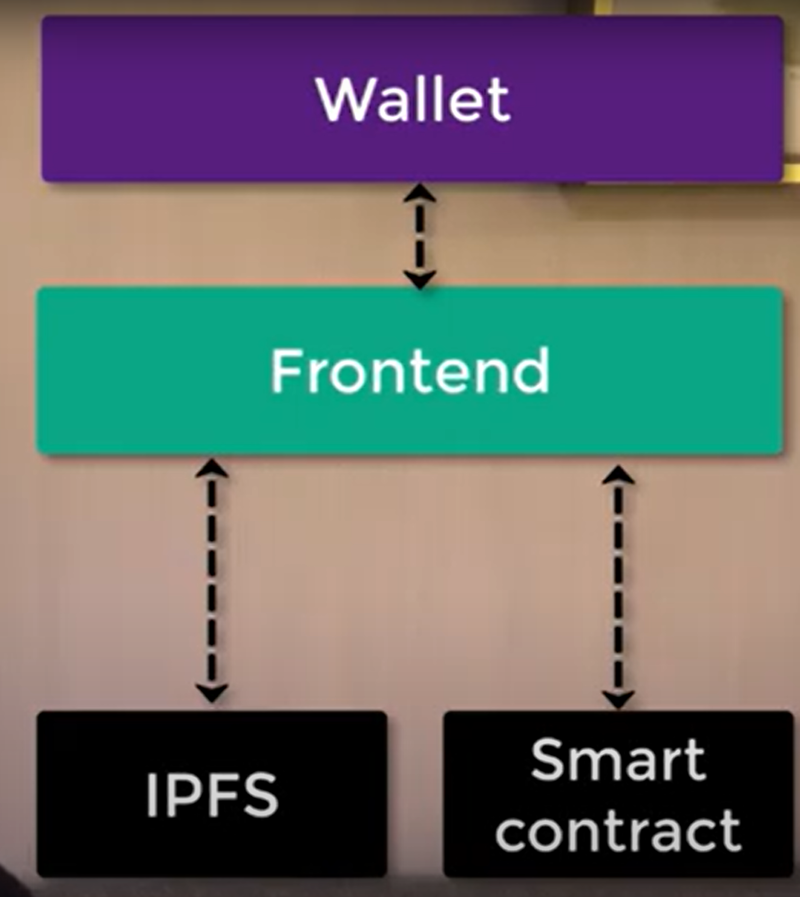
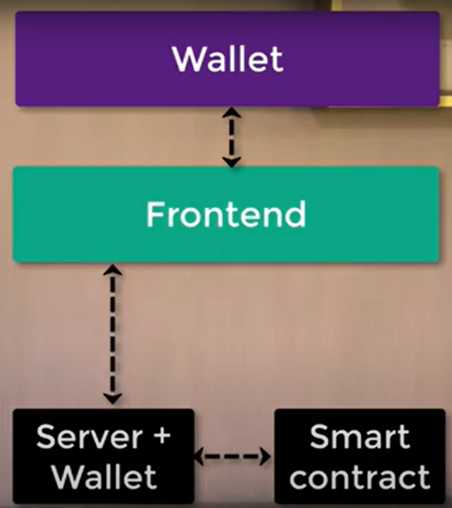
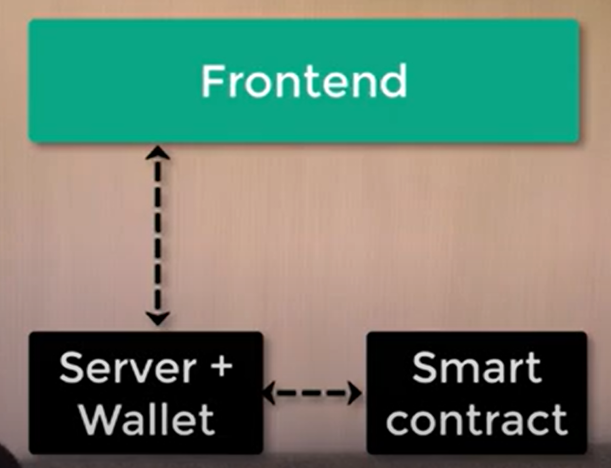

# How to set blockchain dapp architecture

This documentation is for a group of developers and teams who develop an advanced blockchain application.

Contact me if you have any inquiries.

```
nellow1102@gmail.com
```

## Architecture

Types of blockchain application are as follows:

### Pure dapp

Fully decentalized.

1. Wallet: send user transaction to blockchain network
1. Front end: serve user, hosted in IPFS
1. IPFS: serve NPF media and front end website
1. Smart contract: serve business logic to blockchain network, hosted in EVM(Ethereum virtual machine)
1. Blockchain network: serve wallet tx, holds smart contracts



### Common dapp

1. Wallet: send user transaction to blockchain network
1. Front end: serve user, hosted in server
1. Backend: server NFT media and front end website
1. Smart contract: serve business logic to blockchain network, hosted in EVM(Ethereum virtual machine)
1. Blockchain network: serve wallet tx, holds smart contracts


### Backend with transaction

Somewhat centralized. If backend side is compromised, dapp is broken.

1. Wallet: send user transaction to backend
1. Front end: serve user, hosted in server
1. Backend: server NFT media and front end website, send user transaction to blockchain network
1. Smart contract: serve business logic to blockchain network, hosted in EVM(Ethereum virtual machine)
1. Blockchain network: serve wallet tx, holds smart contracts

### Backend with signature

Somewhat centralized. User create a message and signs a transaction and send it to backend side. Backend will send a transaction with the signature to blockchain network.
Common example of this architecture is a decentralized exchange. In this case, users do not have to pay transaction cost and just sign messages.
Backend side wallet will support this transaction and send it to network.

Smart contract needs to confirm the transaction is coming from the backend wallet and got a correct signature.



### Backend with centralized wallet

Quite centralized.
This architecture has no wallet in front end side. User will interact with server just like normal application and pay some transaction. The backend does not use user's private key,
rather use backend wallet private key. UX will be improved since there is no need to install wallet and such.



1. Smart contract contains NFT metadata URL and toss it to front end. Note that the metadata itself is not stored in blockchain.
1. Front end sends a request to the backend to get the metadata.
1. Backend sends a response to the frontend with token metadata and token image. Note that the metadata and image can be stored anywhere you want.
1. Front end displays the token image.

## Reference

- [Create a Complete NFT App - Smart contract, Backend, Frontend](https://youtu.be/WsZyb2T83lo)
