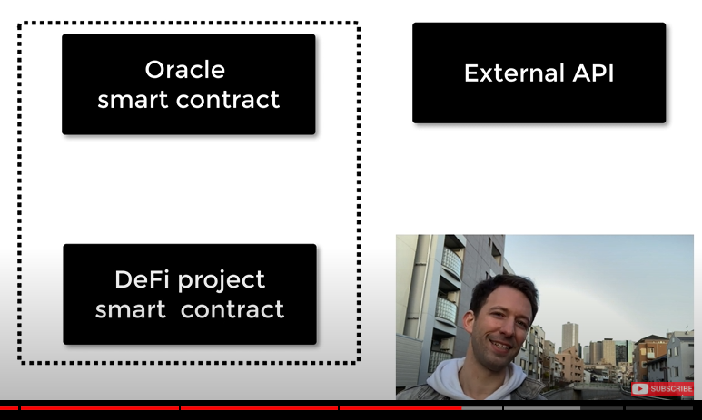

# Learning Blockchain essentials
## Blockchain basics
> Blockchains as a concept are not too hard to understand for programmers. The reason is that most of the complications (mining, hashing, elliptic-curve cryptography, peer-to-peer networks, etc.) are just there to provide a certain set of features and promises for the platform. Once you accept these features as given, you do not have to worry about the underlying technology - or do you have to know how Amazon’s AWS works internally in order to use it?

### Transaction
> A blockchain is a globally shared, transactional database. This means that everyone can read entries in the database just by participating in the network. If you want to change something in the database, you have to create a so-called transaction which has to be accepted by all others. The word transaction implies that the change you want to make (assume you want to change two values at the same time) is either not done at all or completely applied. Furthermore, while your transaction is being applied to the database, no other transaction can alter it.

### Block 
> One major obstacle to overcome is what (in Bitcoin terms) is called a “double-spend attack”: What happens if two transactions exist in the network that both want to empty an account? Only one of the transactions can be valid, typically the one that is accepted first. The problem is that “first” is not an objective term in a peer-to-peer network.

> The abstract answer to this is that you do not have to care. A globally accepted order of the transactions will be selected for you, solving the conflict. The transactions will be bundled into what is called a “block” and then they will be executed and distributed among all participating nodes. If two transactions contradict each other, the one that ends up being second will be rejected and not become part of the block.

## Ethereum token standard 
> Ethereum tokens are smart contracts that can represent assets or services. The first token standard was ERC20, used in ICO in 2017-2018. Since then, a lot of other token standards have popped up, like ERC721 for crypto-collectible games, or ERC1155 for DeFi.

### ERC-20
ERC-20 is a fungible token. 

> One of the most significant Ethereum tokens is known as ERC-20. ERC-20 has emerged as the technical standard; it is used for all smart contracts on the Ethereum blockchain for token implementation and provides a list of rules that all Ethereum-based tokens must follow.

> The ERC-20 commands vital importance; it defines a common list of rules that all Ethereum tokens must adhere to. Some of these rules include how the tokens can be transferred, how transactions are approved, how users can access data about a token, and the total supply of tokens.

> In terms of implementation coding for ERC-20 tokens, the six basic coding functions are:

1. total supply
1. balance of
1. allowance
1. transfer
1. approve
1. transfer from

The example of ERC20 tokens are as follows :

1. Tether
1. Chainlink 
1. Huobi Token
1. USD coin 

ERC20 are fungible tokens. Read [ERC20 interface docs](https://github.com/ethereum/EIPs/blob/master/EIPS/eip-20.md) from Ethereum github. 

#### Weakness
Tokens in smart contract following ERC20 can be lost if transfer function is not presented in the contract. Smart contract interacts with users only by functions in the contract. For example, 

```solidity 
pragma ^0.8.10;

contract MyContract {
    function transfer(address _to, uint256 _amount) external {
        // now tokens can be moved
    }
} 
```

And recipient smart contract cannot react to incoming ERC20 token trasnfers, which led to creating ERC223.

### ERC-721
ERC-721 is a non-fungible token standard. ERC721 requires address and token id(integer) to identify an unique asset in smart contract while ERC20 only needs address.

|Type|ERC20                   |ERC721                        |
|:--:|:----------------------:|:----------------------------:|
|Identify|by address     |identify by address + token id| 
|Asset|store only one asset    |store multiple assets         |  
|balanceOf| amount of the asset    |number of assets in contract   |  
|approve| specify address, amount    |specify address, token id   |  

### ERC1155
ERC1155 is a multi token standard, including fungible/non-fungible token. Smart contract following ERC-1155 can manage different types of assets. 

## Oracle 
content will be added


## Decentralized autonomous organization : DAO
content will be added

## What is JSON-RPC?
> JSON-RPC is a remote procedure call protocol encoded in JSON. It is similar to the XML-RPC protocol, defining only a few data types and commands. JSON-RPC allows for notifications (data sent to the server that does not require a response) and for multiple calls to be sent to the server which may be answered asynchronously.

```json
// JSON-RPC Version 2.0
// request 
{"jsonrpc": "2.0", "method": "subtract", "params": {"minuend": 42, "subtrahend": 23}, "id": 3}

// response
{"jsonrpc": "2.0", "result": 19, "id": 3}
```

## Gas
> Gas refers to the unit that measures the amount of computational effort required to execute specific operations on the Ethereum network.

> Since each Ethereum transaction requires computational resources to execute, each transaction requires a fee. Gas refers to the fee required to conduct a transaction on Ethereum successfully.

> Gas limit refers to the maximum amount of gas you are willing to consume on a transaction. More complicated transactions involving smart contracts require more computational work, so they require a higher gas limit than a simple payment. A standard ETH transfer requires a gas limit of 21,000 units of gas.

> For example, if you put a gas limit of 50,000 for a simple ETH transfer, the EVM would consume 21,000, and you would get back the remaining 29,000. However, if you specify too little gas, for example, a gas limit of 20,000 for a simple ETH transfer, the EVM will consume your 20,000 gas units attempting to fulfill the transaction, but it will not complete. The EVM then reverts any changes, but since the miner has already done 20k gas units worth of work, that gas is consumed

Gas is a transaction fee, caused by your signed transaction. The gas fee is a reward for Ethereum miner in return of their efforts to confirm the trasaction and add it to blockchain. Note that only read-only function in smart contract does not cost any gas. 

Once you sign your transaction, Ethereum network will broadcast the transaction and trasnfer gas fee from your account at the same time.

### Why gas
Gas is a way to protect scam in Ethereum network and to make Ethereum network active. 

1. If there is no gas fee, scammers in network can mess with transactions making network not working properly. 
1. If gas fee is constant and fixed, miner will only choose contracts that are relatively easier to confirm.
1. Gas helps to decouple Ethereum currency price from the difficulty of transaction confirmation task. It provides a representation of relative price of Ethereum. 
1. When network is congested, gas price is going up. When not, going down. 

### Gas unit 
Gas price is estimated in Gwei unit, which is 10^(-9) ether. 

- Ether : Ethereuem currency.
- Gwei : Gas unit, 10^(-9) ether. The word 'gwei' itself means 'giga-wei' and it is equal to 1,000,000,000 wei.
- Wei : the smallest unit in smart contract. 10^(-18) ether.

Total gas cost of your transaction is calculated like below. 

- total gas cost (ether) = gas price(set by transaction sender) * min(gas cost, gas limit)

## Reference
- [Wikipedia : JSON-RPC](https://en.wikipedia.org/wiki/JSON-RPC#:~:text=JSON%2DRPC%20is%20a%20remote%20procedure%20call%20protocol%20encoded%20in%20JSON.&text=JSON%2DRPC%20allows%20for%20notifications,which%20may%20be%20answered%20asynchronously.)
- [Eat the block : DeFi programming course](https://www.youtube.com/watch?v=PflQRS9oiHw&list=PLbbtODcOYIoGC8c5-gs0EYzpYVUPdmqO3&index=2)
- [Ethereum tokens - Eat the block](https://www.youtube.com/watch?v=ryeFqc64Dog&list=PLbbtODcOYIoGOvl0KH57_nfvEKOYV6qdT&index=1)
- [What Is ERC-20 and What Does It Mean for Ethereum?](https://www.investopedia.com/news/what-erc20-and-what-does-it-mean-ethereum/)