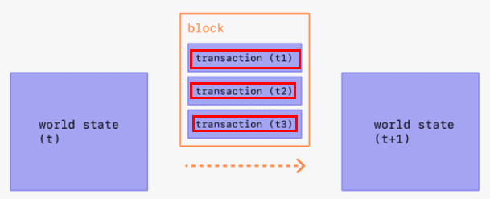
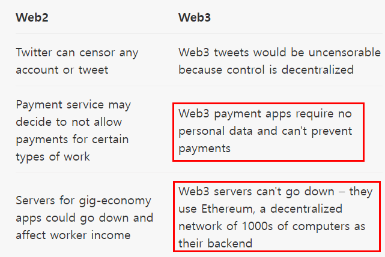
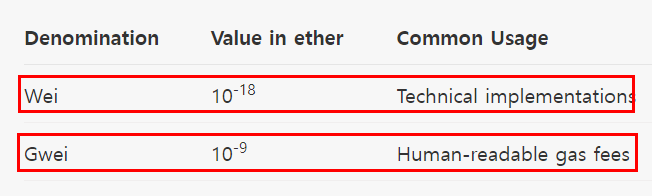

# Learning Ethereum essetials

## WHAT IS A BLOCKCHAIN?

> A blockchain is a public database that is updated and shared across many computers in a network. **"Block" refers to data and state being stored** in consecutive groups known as "blocks". If you send ETH to someone else, the transaction data needs to be added to a block to be successful.

> **"Chain" refers to the fact that each block cryptographically references its parent**. In other words, blocks get chained together. The data in a block cannot change without changing all subsequent blocks, which would require the consensus of the entire network.

> **Every computer in the network must agree upon each new block and the chain** as a whole. These computers are known as "nodes". Nodes ensure everyone interacting with the blockchain has the same data. To accomplish this distributed agreement, blockchains need a consensus mechanism.

> Ethereum currently uses a proof-of-work consensus mechanism. This means that anyone who wants to add new blocks to the chain must solve a difficult puzzle that requires a lot of computing power. Solving the puzzle "proves" that you have done the "work" by using computational resources. Doing this is known as mining. Mining is typically brute force trial and error, but successfully adding a block is rewarded in ETH.

> New blocks are broadcast to the nodes in the network, checked and verified, thus updating the state of the blockchain for everyone.

> So to summarize, when you send ETH to someone, the transaction must be mined and included in a new block. The updated state is then shared with the entire network.

## WHAT IS ETHEREUM?

> In the Ethereum universe, there is **a single, canonical computer** (called the Ethereum Virtual Machine, or **EVM**) whose state everyone on the Ethereum network agrees on. Everyone who participates in the Ethereum network (every Ethereum node) keeps a copy of the state of this computer. Additionally, **any participant can broadcast a request** for this computer to perform arbitrary computation. Whenever such a request is broadcast, **other participants on the network verify**, validate, and carry out ("execute") the computation. This execution causes a state change in the EVM, which is committed and propagated throughout the entire network.

> Requests for computation are called transaction requests; the record of all transactions and the EVM's present state gets stored on the blockchain, which in turn is stored and agreed upon by all nodes.

> Cryptographic mechanisms ensure that once transactions are verified as valid and added to the blockchain, they can't be tampered with later. The same mechanisms also ensure that **all transactions are signed and executed with appropriate "permissions"** (no one should be able to send digital assets from Alice's account, except for Alice herself).


## WHAT IS ETHER?

> Ether (ETH) is **the native cryptocurrency of Ethereum**. The purpose of ether is to allow for a market for computation. Such **a market provides an economic incentive for participants to verify and execute transaction** requests and provide computational resources to the network.

> **Any participant who broadcasts a transaction request must also offer some amount of ether to the network as a bounty**. This bounty will be awarded to whoever eventually does **the work of verifying the transaction**, executing it, committing it to the blockchain, and broadcasting it to the network.

> The amount of ether paid corresponds to the time required to do the computation. These bounties also prevent malicious participants from intentionally clogging the network by requesting the execution of infinite computation or other resource-intensive scripts, as these participants must pay for computation time.

## WHAT ARE SMART CONTRACTS?

> In practice, participants don't write new code every time they want **to request a computation on the EVM**. Rather, **application developers upload programs into EVM** state, and **users make requests to execute** these code snippets with varying parameters. We call the programs uploaded to and executed by the network smart contracts.

> At a very basic level, you can think of **a smart contract like a sort of vending machine**: a script that, when called with certain parameters, performs some actions or computation if certain conditions are satisfied. For example, a simple vendor smart contract could create and assign ownership of a digital asset if the caller sends ether to a specific recipient.

> Any developer can create a smart contract and make it public to the network, using the blockchain as its data layer, for a fee paid to the network. **Any user can then call the smart contract to execute** its code, again for a fee paid to the network.

> Thus, with smart contracts, developers can build and deploy arbitrarily complex user-facing apps and services such as: marketplaces, financial instruments, games, etc

## TERMINOLOGY

### Blockchain

> **The sequence of all blocks** that have been committed to the Ethereum network in the history of the network. So-named because each block contains a reference to the previous block, which helps us maintain an ordering over all blocks (and thus over the precise history)

### EVM

> The Ethereum Virtual Machine is **the global virtual computer whose state every participant on the Ethereum network stores and agrees on**. Any participant can request the execution of arbitrary code on the EVM; code execution changes the state of the EVM.

### Nodes

> **The real-life machines which are storing the EVM state**. Nodes communicate with each other to propagate information about the EVM state and new state changes. Any user can also request the execution of code by broadcasting a code execution request from a node. **The Ethereum network** itself is **the aggregate of all Ethereum nodes** and their communications.

### Accounts

> **Where ether is stored**. Users can initialize accounts, deposit ether into the accounts, and transfer ether from their accounts to other users. Accounts and account balances are stored in a big table in the EVM; they are a **part of the overall EVM state**.

### Transactions

> A "transaction request" is the formal term for **a request for code execution on the EVM**, and a "transaction" is a fulfilled transaction request and the associated change in the EVM state. Any user can broadcast a transaction request to the network from a node. For the transaction request to affect the agreed-upon EVM state, it must be validated, executed, and "committed to the network" by another node. **Execution of any code causes a state change in the EVM; upon commitment, this state change is broadcast to all nodes in the network**. Some examples of transactions:

1. Send X ether from my account to Alice's account.
1. Publish some smart contract code into EVM state.
1. Execute the code of the smart contract at address X in the EVM, with arguments Y.

### Blocks

> **The volume of transactions** is very high, so transactions are "committed" in **batches**, or blocks. Blocks generally **contain** dozens to hundreds of **transactions**.

### Smart contracts

> A reusable snippet of code (a program) which a developer publishes into EVM state. Anyone can request that the smart contract code be executed by making a transaction request. Because **developers can write arbitrary executable applications** into the EVM (games, marketplaces, financial instruments, etc.) by publishing smart contracts, these are often also **called dapps**, or Decentralized Apps.

## Introduction to DAPP

> A decentralized application (dapp) is **an application built on a decentralized network** that combines a smart contract and a frontend user interface. 

- dapp = smart contract + front end 

On Ethereum, smart contracts are accessible and transparent – **like open APIs** – so your dapp can even include a smart contract that someone else has written. 

### DEFINITION OF A DAPP
> **A dapp has its backend code running on a decentralized peer-to-peer network**. Contrast this with an app where the backend code is running on centralized servers.

> A dapp can have frontend code and user interfaces written in any language (just like an app) to make calls to its backend. Furthermore, its frontend can get hosted on **decentralized storage** such as **IPFS**.

1. Decentralized - dapps operate on Ethereum, an open public decentralized platform where no one person or group has control

1. Deterministic - dapps perform the same function irrespective of the environment in which they get executed

1. Turing complete - dapps can perform any action given the required resources

1. Isolated - **dapps are executed in a virtual environment** known as Ethereum Virtual Machine so that **if the smart contract has a bug, it won’t hamper the normal functioning of the blockchain network**.

### On smart contracts

> To introduce dapps, we need to introduce smart contracts – a dapp's backend for lack of a better term. For a detailed overview, head to our section on smart contracts.

> **A smart contract is code that lives on the Ethereum blockchain** and runs exactly as programmed. Once smart contracts are deployed on the network you can't change them. Dapps can be decentralized because **they are controlled by the logic written into the contract**, not an individual or company. This also means you need to **design your contracts very carefully** and test them thoroughly.

## Blocks

> **Blocks are batches of transactions with a hash of the previous block** in the chain. This links blocks together (in a chain) because hashes are cryptographically derived from the block data. This prevents fraud, because **one change in any block** in history would **invalidate all the following blocks** as all subsequent hashes would change and everyone running the blockchain would notice.

> To ensure that all participants on the Ethereum network maintain a synchronized state and agree on the precise history of transactions, we **batch transactions into blocks**. This means dozens (or **hundreds) of transactions are committed**, agreed on, and synchronized on all at once.

- batching transactions to one block == grouping commits to one pull request



> By spacing out commits, we give all network participants enough time to come to consensus: even though transaction requests occur dozens of times per second, blocks on Ethereum are committed approximately once every fifteen seconds. 

### HOW BLOCKS WORK

> To preserve the transaction history, **blocks are strictly ordered** (every new block created contains a reference to its parent block), and transactions within blocks are strictly ordered as well. Except in rare cases, at any given time, all participants on the network are in agreement on the exact number and history of blocks, and are working to batch the current live transaction requests into the next block.

> **Once a block is put together** (mined) by some miner on the network, it is propagated to the rest of the network; **all nodes add this block to the end of their blockchain**, and mining continues. The exact block-assembly (mining) process and commitment/consensus process is currently specified by Ethereum’s “proof-of-work” protocol.

### PROOF-OF-WORK PROTOCOL

> **Mining nodes** have to spend a variable but substantial amount of energy, time, and computational power to **produce a “certificate of legitimacy” for a block they propose to the network**. This helps protect the network from spam/denial-of-service attacks, among other things, since certificates are expensive to produce.

> Other miners who hear about a new block with a valid certificate of legitimacy must accept the new block as the canonical next block on the blockchain.

> The exact amount of time needed for any given miner to produce this certificate is a random variable with high variance. This ensures that it is unlikely that two miners produce validations for a proposed next block simultaneously; when a miner produces and propagates a certified new block, they can be almost certain that the block will be accepted by the network as the canonical next block on the blockchain, without conflict (though there is a protocol for dealing with conflicts as well in the case that two chains of certified blocks are produced almost simultaneously).

### WHAT'S IN A BLOCK?

1. **timestamp** – the time when the block **was mined**.
1. **blockNumber** – **the length of the blockchain** in blocks.
1. baseFeePerGas - the minimum fee per gas required for a transaction to be included in the block.
1. difficulty – the effort required to mine the block.

1. **mixHash** – **a unique identifier** for that block.
1. **nonce** – a hash that, when **combined with the mixHash**, proves that the block has gone through proof-of-work
1. parentHash – the unique identifier for the block that came before (this is how blocks are linked in a chain).

1. transactions – the transactions included in the block.
1. stateRoot – the entire state of the system: account balances, contract storage, contract code and account nonces are inside.

### BLOCK TIME

> **Block time refers to the time it takes to mine a new block**. In **Ethereum, the average block time is between 12 to 14 seconds** and is evaluated after each block. The expected block time is set as a constant at the protocol level and is used to protect the network's security when the miners add more computational power. 

> **The average block time gets compared with the expected block time**, and if the average block time is higher, then the difficulty is decreased in the block header. If the average block time is smaller, then the difficulty in the block header will be increased.

### BLOCK SIZE

> A final important note is that **blocks themselves are bounded in size**. **Each block has a target size of 15 million gas** but the size of blocks will increase or decrease in accordance with network demands, up until the **block limit of 30 million gas** (2x target block size). 

> **The total amount of gas expended by all transactions in the block must be less than the block gas limit**. This is important because it ensures that blocks can’t be arbitrarily large. **If blocks could be arbitrarily large, then less performant full nodes would gradually stop** being able to keep up with the network due to space and speed requirements.

### BENEFITS OF DAPP DEVELOPMENT

> Zero downtime – Once the smart contract is deployed and on the blockchain, the **network as a whole will always be able to serve clients** looking to interact with the contract. Malicious actors, therefore, cannot launch denial-of-service attacks targeted towards individual dapps.

> Privacy – You don’t need to provide real-world identity to deploy or interact with a dapp.

> Resistance to censorship – **No single entity on the network can block users** from submitting transactions, deploying dapps, or reading data from the blockchain.

> Complete **data integrity** – Data stored on the blockchain is immutable and indisputable, thanks to **cryptographic primitives**. Malicious actors cannot forge transactions or other data that has already been made public.

> Trustless computation/verifiable behavior – smart contracts can be analyzed and are guaranteed to execute in predictable ways, without the need to trust a central authority. This is not true in traditional models; for example, when we use online banking systems, we must trust that financial institutions will not misuse our financial data, tamper with records, or get hacked.

### DRAWBACKS OF DAPP DEVELOPMENT

> Maintenance – Dapps can be harder to maintain because **the code and data published to the blockchain are harder to modify**. It’s hard for developers to make updates to their dapps (or the underlying data stored by a dapp) once they are deployed - even if bugs or security risks are identified in an old version.

> Performance overhead – **There is a huge performance overhead**, and scaling is really hard. To achieve the level of security, integrity, transparency, and reliability that Ethereum aspires to, **every node runs and stores every transaction**. On top of this, proof-of-work takes time as well. A back-of-the-envelope calculation puts the overhead at something like 1,000,000x that of standard computation currently.

> Network congestion – When one dapp uses too many computational resources, the entire network gets backed up. **Currently, the network can only process about 10-15 transactions per second**; if transactions are being sent in faster than this, the pool of unconfirmed transactions can quickly balloon.

> User experience – It may be **harder to engineer user-friendly experiences** because the average end-user might find it **too difficult to set up** a tool stack necessary to interact with the blockchain in a truly secure fashion.

> Centralization – User-friendly and developer-friendly solutions built on top of the base layer of **Ethereum might end up looking like centralized services anyways**. For example, such services may store keys or other sensitive information server-side, serve a frontend using a centralized server, or run important business logic on a centralized server before writing to the blockchain. Centralization eliminates many (if not all) of the advantages of blockchain over the traditional model.

## Web2 vs Web3

> Web2 refers to the version of the internet most of us know today. An internet dominated by companies that provide services in exchange for your personal data. **Web3, in the context of Ethereum, refers to decentralized apps that run on the blockchain**. These are apps that allow anyone to participate without monetising their personal data.

### WEB3 BENEFITS

> Many Web3 developers have chosen to build dapps because of Ethereum's inherent decentralization:

1. Anyone who is on the network has permission to use the service – or in other words, permission isn't required.
1. No one can block you or deny you access to the service.
1. Payments are built in via the native token, ether (ETH).
1. Ethereum is turing-complete, meaning you can pretty much program anything



### WEB3 LIMITATIONS

> Web3 has some limitations right now:

1. Scalability – transactions are slower on web3 because they're decentralized. Changes to state, like a payment, need to be processed by a miner and propagated throughout the network.

1. UX – interacting with web3 applications can require extra steps, software, and education. This can be a hurdle to adoption.

1. Accessibility – the lack of integration in modern web browsers makes web3 less accessible to most users.

1. Cost – most successful dapps put very small portions of their code on the blockchain as it's expensive.

## SPIN UP YOUR OWN ETHEREUM NODE

> Running your own node provides you various benefits, opens new possibilities, and helps to support the ecosystem. This page will guide you through spinning up your own node and **taking part in validating Ethereum transactions**.

### CHOOSING AN APPROACH

> The first step in spinning up your node is choosing your approach. You have to choose the client (the software), the environment, and the parameters you want to start with. See all the available Mainnet clients.

#### Client settings

> Client implementations enable **different sync modes** and various other options. Sync modes represent different methods of downloading and validating **blockchain data**. Before starting the node, you should decide what network and sync mode to use. The **most important** things to consider is the **disk space** and sync time client will need.

> All features and options can be found in the client's documentation. Various client configurations can be set by executing the client with the corresponding flags. You can get more information on flags from EthHub or the client documentation. For testing purposes, you might prefer running a client on one of testnet networks. See overview of supported networks

#### Environment and hardware

> Ethereum clients are able to run on consumer grade computers and don't require special hardware, like mining for example. Therefore, you have various options for deploying based on your needs. To simplify, let's think about running a node on both a local physical machine and a cloud server:

##### Cloud

1. Providers offer high server uptime, static public IP addresses
1. Getting dedicated or virtual server can be more comfortable than building your own
1. Trade off is trusting a third party - server provider
1. Because of required storage size for full node, price of a rented server might get high

##### Own hardware

1. More trustless and sovereign approach
1. One time investment
1. An option to buy preconfigured machines
1. You have to physically prepare, maintain, and potentially troubleshoot the machine

> Check the minimum and recommended disk space requirements for each client and sync mod. Generally, modest computing power should be enough. The problem is usually drive speed. During initial sync, Ethereum clients perform a lot of read/write operations. **Therefore SSD is strongly recommended**. 

<details>
<summary>Client software requirement</summary>

> Before installing any client, please ensure your computer has enough resources to run it. Minimum and recommended requirements can be found below, however the key part is the disk space. **Syncing the Ethereum blockchain is very input/output intensive**. It is best to have a solid-state drive (SSD). To run an Ethereum client on HDD, you will need at least 8GB of RAM to use as a cache.

## Minimum requirements

1. CPU with 2+ cores
1. 4 GB RAM minimum with an SSD, 8 GB+ if you have an HDD
1. 8 MBit/s bandwidth

## Recommended specification

1. Fast CPU with 4+ cores
1. 16 GB+ RAM
1. Fast SSD with at least 500 GB free space
1. 25+ MBit/s bandwidth
</details>

> A client might not even be able to sync current state on HDD and get stuck a few blocks behind Mainnet. You can run most of the clients on a single board computer with ARM. You can also use the Ethbian operating system for Raspberry Pi 4. This lets you run a client by flashing the SD card. Based on your software and the hardware choices, the initial synchronization time and storage requirements may vary.

> Be sure to check sync times and storage requirements. Also make sure your internet connection is not limited by a bandwidth cap. It's recommended to use an unmetered connection since initial sync and data broadcasted to the network could exceed your limit.

## INTRO TO ETHER

> A cryptocurrency is a medium of exchange secured by a blockchain-based ledger. A medium of exchange is anything widely accepted as payment for goods and services, and **a ledger is a data store that keeps track of transactions**. Blockchain technology **allows users to make transactions on the ledger** without reliance upon a trusted third party to maintain the ledger.

> The first cryptocurrency was Bitcoin, created by Satoshi Nakamoto. Since **Bitcoin's release in 2009**, people have made thousands of cryptocurrencies across many different blockchains.

> Ethereum allows developers to create decentralized applications (dapps), which all share a pool of computing power. This shared pool is finite, so Ethereum needs a mechanism to determine who gets to use it. Otherwise, a dapp could accidentally or maliciously consume all network resources, which would block others from accessing it.

> The ether cryptocurrency supports a pricing mechanism for Ethereum's computing power. When users want to make a transaction, they must pay ether to have their transaction recognized on the blockchain. These usage costs are known as gas fees, and the **gas fee depends on the amount of computing power required** to execute the transaction and the network-wide demand for computing power at the time.

> Therefore, even if a malicious dapp submitted an infinite loop, the transaction would eventually run out of ether and terminate, allowing the network to return to normal.

### MINTING ETHER

> **Minting is the process in which new ether gets created on the Ethereum ledger**. The underlying Ethereum protocol creates the new ether, and it is not possible for a user to create ether.

> **Ether is minted when a miner creates a block on the Ethereum** blockchain. As an incentive to miners, the protocol grants a reward in each block, incrementing the balance of an address set by the block's miner. The block reward has changed over time, and today it is **2 ETH per block**

### BURNING ETHER

> As well as creating ether through block rewards, ether can get destroyed by a process called 'burning'. When ether gets burned, it gets removed from circulation permanently.

> **Ether burn occurs in every transaction on Ethereum**. When users pay for their transactions, **a base gas fee**, set by the network according to transactional demand, **gets destroyed**. This, coupled with variable block sizes and a maximum gas fee, simplifies transaction fee estimation on Ethereum. **When network demand is high, blocks can burn more ether than they mint, effectively offsetting ether issuance**.

> **Burning the base fee prevents various ways the miners could manipulate it otherwise**. For example, if miners got the base fee, they could include their own transactions for free and raise the base fee for everyone else. Alternatively, they could refund the base fee to some users off-chain, leading to a more opaque and complex transaction fee market.

### DENOMINATIONS OF ETHER

> **Since many transactions on Ethereum are small, ether has several denominations** which may be referenced for smaller amounts. Of these denominations, **Wei and gwei are particularly important**.

> **Wei is the smallest possible amount of ether**, and as a result, many technical implementations, such as the Ethereum Yellowpaper, will base all calculations in Wei.

> **Gwei, short for giga-wei**, is often used to describe **gas costs** on Ethereum.



### TRANSFERRING ETHER

> Each transaction on Ethereum contains a value field, which specifies the amount of ether to be transferred, denominated in wei, to send from the sender's address to the recipient address.

> When the recipient address is a smart contract, this transferred ether may be used to pay for gas when the smart contract executes its code.

### QUERYING ETHER

> Users can **query the ether balance of any account** by inspecting the account's **balance field**, which shows ether holdings denominated in wei.

> **Etherscan** is a popular tool to inspect **address balances** via a web-based application. For example, this Etherscan page shows the balance for the Ethereum Foundation.

## ETHEREUM ACCOUNTS

> An Ethereum account is an entity with an ether (ETH) balance that can send transactions on Ethereum. Accounts can be user-controlled or deployed as smart contracts.

### ACCOUNT TYPES
> Ethereum has two account types:

1. Externally-owned – controlled by anyone with the private keys
1. Contract – a smart contract deployed to the network, controlled by code. Learn about smart contracts

> Both account types have the ability to:

1. Receive, hold and send ETH and tokens
1. Interact with deployed smart contracts

#### Key differences

Externally-owned

1. Creating an account **costs nothing**
1. Can **initiate transactions**
1. Transactions between externally-owned accounts can only be ETH/token transfers

Contract

1. Creating a **contract has a cost** because you're **using network storage**
1. Can only send transactions in response to receiving a transaction
1. Transactions from an external account to a contract account **can trigger code** which can execute many different actions, such as transferring tokens or even creating a new contract

### AN ACCOUNT EXAMINED

> Ethereum accounts have four fields:

1. nonce – A counter that indicates the number of transactions sent from the account. This ensures transactions are only processed once.

1. balance – The number of wei owned by this address. Wei is a denomination of ETH and there are 1e+18 wei per ETH.

1. codeHash – **This hash refers to the code of an account on the Ethereum virtual machine (EVM).** Contract accounts have code fragments programmed in that can perform different operations. **This EVM code gets executed if the account gets a message call**. It cannot be changed, unlike the other account fields. All such code fragments are contained in the state database under their corresponding hashes for later retrieval. This hash value is known as a codeHash. For externally owned accounts, the codeHash field is the hash of an empty string.

1. storageRoot – Sometimes known as a storage hash. A 256-bit hash of the root node of a Merkle Patricia trie that encodes the storage contents of the account (a mapping between 256-bit integer values), encoded into the trie as a mapping from the Keccak 256-bit hash of the 256-bit integer keys to the RLP-encoded 256-bit integer values. This trie encodes the hash of the storage contents of this account, and is empty by default.

### EXTERNALLY-OWNED ACCOUNTS AND KEY PAIRS

> An account is made up of a cryptographic pair of keys: public and private. They help prove that a transaction was actually signed by the sender and **prevent forgeries(nonrepudiation)**. **Your private key is what you use to sign transactions**, so it grants you custody over the funds associated with your account. **You never really hold cryptocurrency, you hold private keys** – the **funds** are always **on Ethereum's ledger**.

> This prevents malicious actors from broadcasting fake transactions because you **can always verify the sender of a transaction**.

> If Alice wants to send ether from her own account to Bob’s account, Alice needs to create **a transaction request** and send it out to the network for **verification**. Ethereum’s usage of public-key cryptography ensures that Alice can prove that she originally initiated the transaction request. Without cryptographic mechanisms, a malicious adversary Eve could simply publicly broadcast a request that looks something like “send 5 ETH from Alice’s account to Eve’s account,” and no one would be able to verify that it didn’t come from Alice.

### ACCOUNT CREATION

> When you want to create an account most libraries will generate you a random private key. **A private key is made up of 64 hex characters** and can be encrypted with a password.

```
# private key length: 64
fffffffffffffffffffffffffffffffebaaedce6af48a03bbfd25e8cd036415f
```

> The **public key is generated from the private key** using the Elliptic Curve Digital Signature Algorithm. You get a public address for your account by taking the last 20 bytes of the Keccak-256 hash of the public key and adding 0x to the beginning.

- public key = private key + ECDS algorithm
- public address = public key + Keccak-256 function + 0x

> Here's an example of creating an account in the console using GETH's personal_newAccount

```shell
> personal.newAccount()
Passphrase:
Repeat passphrase:
"0x5e97870f263700f46aa00d967821199b9bc5a120" # length : 42

> personal.newAccount("h4ck3r")
"0x3d80b31a78c30fc628f20b2c89d7ddbf6e53cedc"
```

> It is **possible to derive new public keys from your private key** but you cannot derive a private key from public keys. This means it's **vital to keep a private key safe** and, as the name suggests, PRIVATE.

- public key <=====(create)==== private key
- public key ======(can't create)====> private key

> You **need a private key to sign messages and transactions which output a signature**. Others can then take the signature to derive your public key, proving the author of the message. In your application, you can use a javascript library to send transactions to the network.

- private key ====(create)====> public key
- private key ====(sign)====> transaction & message ====(becomes)====> signature
- signature ====(derive)====> public key ====(prove)====> checking tx sender

### CONTRACT ACCOUNTS

> **Contract** accounts also have **a 42 character hexadecimal** address:

```
0x06012c8cf97bead5deae237070f9587f8e7a266d
```

> The contract address is usually given when a contract is deployed to the Ethereum Blockchain. The address comes from the creator's address and the number of transactions sent from that address (the “nonce”).

- private key: 64 hex characters
- account: 42 hex characters
- contract: 42 hex characters

## Blockchain client

> To follow and verify current data in the network, **the Ethereum client needs to sync with the latest network state**. This is done by downloading data from peers, cryptographically verifying their integrity, and building a local blockchain database.

> Synchronization modes represent different approaches to this process with various trade-offs. Clients also vary in their implementation of sync algorithms. Always refer to the official documentation of your chosen client for specifics on implementation.

### Full sync {#full-sync}

> Full sync downloads all blocks (including headers, transactions, and receipts) and generates the state of the blockchain incrementally by executing every block from genesis.

> Minimizes trust and offers the highest security by verifying every transaction.
With an increasing number of transactions, it can take days to weeks to process all transactions.

### Fast sync

> Fast sync downloads all blocks (including headers, transactions, and receipts), verifies all headers, downloads the state and verifies it against the headers. Relies on the security of the consensus mechanism. Synchronization takes only a few hours.

### Light sync

> Light client mode downloads all block headers, block data, and verifies some randomly. Only syncs tip of the chain from the trusted checkpoint. Gets only the latest state while relying on trust in developers and consensus mechanism. Client ready to use with current network state in a few minutes.

### Snap sync

> Implemented by **Geth**. Using **dynamic snapshots** served by peers retrieves all the account and storage data **without downloading intermediate trieI** nodes and then reconstructs the Merkle trie locally. Fastest sync strategy developed by Geth, currently its default. It **saves a lot of disk usage and network bandwidth** without sacrificing security.

### Warp sync

> Implemented by OpenEthereum. Nodes regularly generate a consensus-critical state snapshot and any peer can fetch these snapshots over the network, enabling a fast sync from this point. Fastest and default sync mode of OpenEthereum relies on static snapshots served by peers. Similar strategy as snap sync but without certain security benefits.

### Beam sync

> Implemented by Nethermind and Trinity. Works like fast sync but also downloads the data needed to execute latest blocks, which allows you to query the chain within the first few minutes from starting. Syncs state first and enables you to query RPC in a few minutes. Still in development and not fully reliable, background sync is slowed down and RPC responses might fail

## Ethereum security and scam prevention

> With interest in cryptocurrencies growing, **learning best practices when using cryptocurrency is essential**. Crypto can be fun and exciting, but there are also serious risks. If you put in this small amount of upfront work, you can mitigate these risks.

> Over 80% of account hacks are a result of weak or stolen passwords. A long combination of characters, numbers and symbols is best to keep your accounts secure.

> A common mistake individuals make is using a combination of two to three common, related dictionary words. Passwords like this are insecure because they are prone to a simple hacking technique known as a dictionary attack.

> Another common mistake is using passwords that can be easily guessed or found out through social engineering. Including your mother's maiden name, the names of your children or pets, or dates of birth in your password is not secure and will increase the risk of your password getting hacked.

## Network

> Since **Ethereum is a protocol**, this means there can be **multiple independent "networks"** conforming to this protocol that do not interact with each other.

> Networks are different Ethereum environments you can access for development, testing, or production use cases. Your Ethereum account will work across the different networks but your account balance and transaction history won't carry over from the main Ethereum network. For testing purposes, it's useful to know which networks are available and how to get testnet ETH so you can play around with it.

### Mainnet

> Mainnet is the primary public Ethereum production blockchain, where actual-value transactions occur on the distributed ledger. When people and exchanges discuss ETH prices, they're talking about Mainnet ETH.

### Testnet

> In addition to Mainnet, there are public testnets. These are networks used by protocol developers or smart contract developers to test both protocol upgrades as well as potential smart contracts in a production-like environment before deployment to Mainnet. Think of this as an analog to production versus staging servers.

> It’s **generally important to test any contract code** you write on a testnet **before deploying to the Mainnet**. If you're building a dapp that integrates with existing smart contracts, most projects have copies deployed to testnets that you can interact with.

> **Most testnets** use a proof-of-authority consensus mechanism. This means **a small number of nodes** are chosen to **validate transactions** and create new blocks – staking their identity in the process. It's hard to incentivise mining on a proof-of-work testnet which can leave it vulnerable.

> ETH on testnets has no real value; therefore, there are no markets for testnet ETH. Since you need ETH to actually interact with Ethereum, most people get testnet ETH from faucets. **Most faucets are webapps where you can input an address** which you request ETH to be sent to.

### PRIVATE NETWORKS

> An Ethereum network is a private network if its nodes are not connected to a public network (i.e. Mainnet or a testnet). In this context, **private only means reserved or isolated**, rather than protected or secure.

> To develop an Ethereum application, you'll want to run it on a private network to see how it works before deploying it. Similar to how you create a local server on your computer for web development, **you can create a local blockchain instance to test your dapp**. This allows for much faster iteration than a public testnet.

### DEVELOPMENT NETWORKS

> When building an Ethereum application with smart contracts, you'll want to run it on a local network to see how it works before deploying it.

> Similar to how you might run a local server on your computer for web development, you can use a development network to create a local blockchain instance to test your dapp. These Ethereum development networks provide features that allow for much faster iteration than a public testnet (for instance you don’t need to deal with acquiring ETH from a testnet faucet).

> **Development networks are essentially Ethereum clients** (implementations of Ethereum) designed specifically **for local development**.

### Consortium networks

> The consensus process is controlled by a pre-defined set of nodes that are trusted. For example, a private network of known academic institutions that each govern a single node, and blocks are validated by a threshold of signatories within the network.

> If a public Ethereum network is like the public internet, you can think of a consortium network as a private intranet.

## CONSENSUS MECHANISMS

> When it comes to **blockchains like Ethereum, which are, in essence, distributed databases**, the network's nodes **must reach an agreement on the network's current state**. This agreement is achieved using consensus mechanisms.

> Although consensus mechanisms aren't directly related to building a dapp, understanding them will illuminate concepts relevant to you and your users' experience, like gas prices and transaction times.

### WHAT IS CONSENSUS?

> By consensus, we mean that a general agreement has been reached. Consider a group of people going to the cinema. If there is not a disagreement on a proposed choice of film, then a consensus is achieved. In the extreme case the group will eventually split.

> In regards to **blockchain**, the process is formalized, and **reaching consensus means that at least 51% of the nodes on the network agree** on the next global state of the network.

### WHAT IS A CONSENSUS MECHANISM?

> Consensus mechanisms (also known as consensus protocols or consensus algorithms) allow distributed systems (networks of computers) to work together and stay secure.

> For decades, these mechanisms have been used to establish consensus among database nodes, application servers, and other enterprise infrastructure. In recent years, new consensus mechanisms have been invented to allow cryptoeconomic systems, such as Ethereum, **to agree on the state of the network**.

> A consensus mechanism in a cryptoeconomic system also helps prevent certain kinds of economic attacks. **In theory, an attacker can compromise consensus by controlling 51% of the network. Consensus mechanisms are designed to make this "51% attack" unfeasible**. Different mechanisms are engineered to solve this security problem in different ways.

## TYPES OF CONSENSUS MECHANISMS
### Proof-of-work
> Ethereum, like Bitcoin, currently uses a proof-of-work (PoW) consensus protocol.

- Block creation
> **Proof-of-work is done by miners**, who compete to create new blocks full of processed transactions. **The winner shares the new block with the rest of the network and earns some freshly minted ETH**. The race is won by whosever computer can solve a math puzzle fastest – this produces the cryptographic link between the current block and the block that went before. Solving this puzzle is the work in "proof-of-work".

- Security
> The network is kept secure by the fact that you'd need 51% of the network's computing power to defraud the chain. This would require such huge investments in equipment and energy; you're likely to spend more than you'd gain.

### Proof-of-stake

> Ethereum has plans to upgrade to a proof-of-stake (PoS) consensus protocol.

- Block creation
> **Proof-of-stake is done by validators who have staked ETH** to participate in the system. A validator is **chosen at random** to create new blocks**, share them with the network and earn rewards. Instead of needing to do intense computational work, you **simply need to have staked your ETH** in the network. This is what incentivises healthy network behaviour.

- Security
> A proof-of-stake system is kept secure by the fact that you'd **need 51% of the total staked ETH** to defraud the chain. And that your stake is slashed for malicious behaviour.

- PoW: needs 51% of whole network's computing power to hack 
- PoS: needs 51% of whole network's a staked ETH to hack

### Sybil resistance & chain selection

> Now technically, **proof-of-work** and **proof-of-stake** are not consensus protocols by themselves, but they are often referred to as such for simplicity. **They are actually Sybil resistance mechanisms and block author selectors**; they are a way to decide who is the author of the latest block. It's this Sybil resistance mechanism combined with a chain selection rule that makes up a true consensus mechanism.

- **PoW, PoS => Sybil resistance mechanisms and block author(creator) selector**

> Sybil resistance measures how a protocol fares against a **Sybil attack**. Sybil attacks are when one user or group **pretends to be many users**. Resistance to this type of attack is essential for a decentralized blockchain and enables miners and validators to be rewarded equally based on resources put in. Proof-of-work and proof-of-stake protect against this by making users expend a lot of energy or put up a lot of collateral. These protections are an economic deterrent to Sybil attacks.

> A chain selection rule is used to decide which chain is the "correct" chain. **Ethereum and Bitcoin currently use the "longest chain" rule**, which means that whichever blockchain is the longest will be the one the rest of the nodes accept as valid and work with. For proof-of-work chains, the longest chain is determined by the chain's total cumulative proof-of-work difficulty.

> The combination of proof-of-work and longest chain rule is known as "**Nakamoto Consensus**."

## INTRODUCTION TO SMART CONTRACTS

### WHAT IS A SMART CONTRACT?

> A "smart contract" is simply a program that runs on the Ethereum blockchain. It's a collection of code (its functions) and data (its state) that resides at a specific address on the Ethereum blockchain.

> Smart contracts are a type of **Ethereum account**. This means **they have a balance** and they can **send transactions** over the network. However they're not controlled by a user, instead they are deployed to the network and run as programmed. 

> User accounts can then interact with a smart contract by submitting transactions that execute a function defined on the smart contract. Smart contracts can define rules, like a regular contract, and automatically **enforce them via the code. Smart contracts cannot be deleted by default, and interactions with them are irreversible**.

### A DIGITAL VENDING MACHINE

> Perhaps the best metaphor for a smart contract is a vending machine, as described by Nick Szabo. With the right inputs, a certain output is guaranteed.

> A smart contract, like a vending machine, has logic programmed into it. Here's a simple example of how this vending machine might look like as a smart contract:

```solidity
pragma solidity 0.8.7;

contract VendingMachine {

    // Declare state variables of the contract
    address public owner;
    mapping (address => uint) public cupcakeBalances;

    // When 'VendingMachine' contract is deployed:
    // 1. set the deploying address as the owner of the contract
    // 2. set the deployed smart contract's cupcake balance to 100
    constructor() {
        owner = msg.sender;
        cupcakeBalances[address(this)] = 100;
    }

    // Allow the owner to increase the smart contract's cupcake balance
    function refill(uint amount) public {
        require(msg.sender == owner, "Only the owner can refill.");
        cupcakeBalances[address(this)] += amount;
    }

    // Allow anyone to purchase cupcakes
    function purchase(uint amount) public payable {
        require(msg.value >= amount * 1 ether, "You must pay at least 1 ETH per cupcake");
        require(cupcakeBalances[address(this)] >= amount, "Not enough cupcakes in stock to complete this purchase");
        cupcakeBalances[address(this)] -= amount;
        cupcakeBalances[msg.sender] += amount;
    }
}

```

### PERMISSIONLESS

> Anyone can write a smart contract and deploy it to the network. You just need to learn how to code in a smart contract language, and have enough ETH to deploy your contract. **Deploying a smart contract is technically a transaction**, so you need to pay your Gas in the same way that you need to pay gas for a simple ETH transfer. Gas **costs** for **contract deployment** are far **higher**, however.

> Ethereum has developer-friendly languages for writing smart contracts: 1) Solidity 2) Vyper

### COMPOSABILITY

> Smart contracts are public on Ethereum and can be thought of as open APIs. That means you can **call other smart contracts in your own smart contract** to greatly extend what's possible. Contracts can even deploy other contracts.

### LIMITATIONS

> Smart contracts alone cannot get information about "real-world" events because **they can't send HTTP requests**. This is by design. Relying on external information could jeopardise consensus, which is important for security and decentralization.

> There are ways to get around this using oracles. Another limitation of smart contracts is the maximum contract size. **A smart contract can be a maximum of 24KB or it will run out of gas**. This can be circumnavigated by using The Diamond Pattern.

## ANATOMY OF SMART CONTRACTS

> A smart contract is a program that runs at an address on Ethereum. They're made up of data and functions that can execute upon receiving a transaction. Here's an overview of what makes up a smart contract.

> Make sure you've read about smart contracts first. This document assumes you're already familiar with programming languages such as JavaScript or Python.

### DATA
> **Any contract data must be assigned to a location: either to storage or memory**. It's costly to modify storage in a smart contract so you need to consider where your data should live.

#### Storage
> **Persistent data is referred to as storage** and is represented by state variables. These values get stored permanently on the blockchain. You need to declare the type so that the contract can keep track of how much storage on the blockchain it needs when it compiles.

> Persistent data is referred to as storage and is represented by state variables. These values get stored permanently on the blockchain. You need to declare the type so that the contract can keep track of how much storage on the blockchain it needs when it compiles.

```solidity
// Solidity example
contract SimpleStorage {
    uint storedData; // State variable
    // ...
}
```

> If you've already programmed object-oriented languages, you'll likely be familiar with most types. However address should be new to you if you're new to Ethereum development.

> An address type can hold an Ethereum address which equates to 20 bytes or 160 bits. It returns in hexadecimal notation with a leading 0x.

#### Memory
> Values that are only stored for the lifetime of a contract function's execution are called memory variables. Since these are not stored permanently on the blockchain, they are much cheaper to use.

#### Environment variables
> In addition to the variables you define on your contract, there are some special global variables. They are primarily used to provide information about the blockchain or current transaction.

### FUNCTIONS
> In the most simplistic terms, functions can get information or set information in response to incoming transactions.

> There are two types of function calls:

1. internal – these don't create an EVM call
> Internal functions and state variables can only be accessed internally (i.e. **from within the current contract or contracts deriving from it**)

1. external – these do create an EVM call
> External functions are part of the contract interface, which means they can be called from other contracts and via transactions. **An external function f cannot be called internally** (i.e. f() does not work, but **this.f() works**).

#### View functions
> These functions promise **not to modify the state of the contract's data**. Common examples are "getter" functions – you might use this to receive a user's balance for example.

#### Constructor functions
> constructor functions are only executed once when the contract is first deployed. Like constructor in many class-based programming languages, these functions often initialize state variables to their specified values.

#### Built-in functions
> In addition to the variables and functions you define on your contract, there are some special built-in functions. The most obvious example is:

1. address.send() – Solidity
1. send(address) – Vyper

## COMPILING SMART CONTRACTS
> You need to compile your contract so that your web app and the Ethereum virtual machine (EVM) can understand it.

> For the EVM to be able **to run your contract** it needs to be **in bytecode**. Compilation turns this:

```solidity
pragma solidity 0.4.24;

contract Greeter {

    function greet() public constant returns (string) {
        return "Hello";
    }

}
```
> into this

```
PUSH1 0x80 PUSH1 0x40 MSTORE PUSH1 0x4 CALLDATASIZE LT PUSH2 0x41 JUMPI PUSH1 0x0 CALLDATALOAD PUSH29 0x100000000000000000000000000000000000000000000000000000000 SWAP1 DIV PUSH4 0xFFFFFFFF AND DUP1 PUSH4 0xCFAE3217 EQ PUSH2 0x46 JUMPI JUMPDEST PUSH1 0x0 DUP1 REVERT JUMPDEST CALLVALUE DUP1 ISZERO PUSH2 0x52 JUMPI PUSH1 0x0 DUP1 REVERT JUMPDEST POP PUSH2 0x5B PUSH2 0xD6 JUMP JUMPDEST PUSH1 0x40 MLOAD DUP1 DUP1 PUSH1 0x20 ADD DUP3 DUP2 SUB DUP3 MSTORE DUP4 DUP2 DUP2 MLOAD DUP2 MSTORE PUSH1 0x20 ADD SWAP2 POP DUP1 MLOAD SWAP1 PUSH1 0x20 ADD SWAP1 DUP1 DUP4 DUP4 PUSH1 0x0 JUMPDEST DUP4 DUP2 LT ISZERO PUSH2 0x9B JUMPI DUP1 DUP3 ADD MLOAD DUP2 DUP5 ADD MSTORE PUSH1 0x20 DUP2 ADD SWAP1 POP PUSH2 0x80 JUMP JUMPDEST POP POP POP POP SWAP1 POP SWAP1 DUP2 ADD SWAP1 PUSH1 0x1F AND DUP1 ISZERO PUSH2 0xC8 JUMPI DUP1 DUP3 SUB DUP1 MLOAD PUSH1 0x1 DUP4 PUSH1 0x20 SUB PUSH2 0x100 EXP SUB NOT AND DUP2 MSTORE PUSH1 0x20 ADD SWAP2 POP JUMPDEST POP SWAP3 POP POP POP PUSH1 0x40 MLOAD DUP1 SWAP2 SUB SWAP1 RETURN JUMPDEST PUSH1 0x60 PUSH1 0x40 DUP1 MLOAD SWAP1 DUP2 ADD PUSH1 0x40 MSTORE DUP1 PUSH1 0x5 DUP2 MSTORE PUSH1 0x20 ADD PUSH32 0x48656C6C6F000000000000000000000000000000000000000000000000000000 DUP2 MSTORE POP SWAP1 POP SWAP1 JUMP STOP LOG1 PUSH6 0x627A7A723058 KECCAK256 SLT 0xec 0xe 0xf5 0xf8 SLT 0xc7 0x2d STATICCALL ADDRESS SHR 0xdb COINBASE 0xb1 BALANCE 0xe8 0xf8 DUP14 0xda 0xad DUP13 LOG1 0x4c 0xb4 0x26 0xc2 DELEGATECALL PUSH7 0x8994D3E002900
```

### WEB APPLICATIONS

> The compiler will also produce the Application Binary Interface (ABI) which you need in order for your application to understand the contract and call the contract's functions.

> The ABI is a JSON file that describes the deployed contract and its smart contract functions. This helps bridge the gap between web2 and web3. **A JavaScript client library will read the ABI** in order for you to call on your smart contract in your web app's interface.

## SMART CONTRACT SECURITY

> Smart contract code usually cannot be changed to patch security flaws, assets that have been stolen from smart contracts are irrecoverable, and stolen assets are extremely difficult to track. The total of amount of value stolen or lost due to smart contract issues is easily over $1B. Some of the larger due to smart contract coding errors include:

1. Parity multi-sig issue #1 - **$30M lost**
1. Parity multi-sig issue #2 - **$300M locked**
1. TheDAO hack, 3.6M ETH! Over **$1B** in today's ETH prices

### HOW TO WRITE MORE SECURE SMART CONTRACT CODE

> Before launching any code to Mainnet, it is **important to take sufficient precaution to protect anything of value your smart contract** is entrusted with. In this article, we will discuss a few specific attacks, provide resources to learn about more attack types, and leave you with some basic tooling and best practices to ensure your contracts function correctly and securely.

### AUDITS ARE NOT A SILVER BULLET

> Years prior, the tooling for writing, compiling, testing, and deploying smart contracts was very immature, leading many projects to write Solidity code in haphazard ways, throw it over a wall to an auditor who would investigate the code to ensure it functions securely and as expected. 

> In 2020, the development processes and tooling that support writing Solidity is significantly better; leveraging these best practices not only ensures your project is easier to manage, it is a vital part of your project's security. 

> An audit at the end of writing your smart contract is no longer sufficient as the only security consideration your project makes. Security starts before you write your first line of smart contract code, security starts with proper design and development processes.

### SMART CONTRACT DEVELOPMENT PROCESS

> At a minimum, you should do following things when developing smart contracts. 

1. All code stored in a **version control system**, such as git
1. All code modifications made via Pull Requests
1. All Pull Requests have at least one reviewer. If you are a solo project, consider finding another solo author and trade **code reviews**!
1. A single command compiles, deploys, and runs a suite of tests against your code using a development Ethereum environment (See: Truffle)
1. You have run your code through basic code analysis tools such as **Mythril and Slither**, ideally before each pull request is merged, comparing differences in output
1. Solidity does not emit ANY compiler warnings
1. Your code is well-documented

> There is much more to be said for development process, but these items are a good place to start. For more items and detailed explanations, see the process quality checklist provided by DeFiSafety. DefiSafety is an unofficial public service publishing reviews of various large, public Ethereum dApps.

## ATTACKS AND VULNERABILITIES

> Now that you are writing Solidity code using an efficient development process, let's look at some common Solidity vulnerabilities to see what can go wrong.

### Re-entrancy

> Re-entrancy is one of **the largest and most significant security issue** to consider when developing Smart Contracts. While the EVM cannot run multiple contracts at the same time, **a contract calling a different contract pauses the calling contract's execution and memory state until the call returns, at which point execution proceeds normally. This pausing and re-starting can create a vulnerability known as "re-entrancy**".

## Layer and scalability

### Layer 1

> **Layer 1 is the base blockchain**. Ethereum and Bitcoin are both layer 1 blockchains because they are the **underlying foundation** that various layer 2 networks build on top of. Examples of layer 2 projects include "rollups" on Ethereum and the Lightning Network on top of Bitcoin. All user transaction activity on these layer 2 projects can ultimately settle back to the layer 1 blockchain.

### Layer 2

> Layer 2 (L2) is a collective term to describe a specific set of Ethereum scaling solutions. **A layer 2 is a separate blockchain that extends Ethereum** and inherits the security guarantees of Ethereum.

- Layer 2: the superset blockchain of Ethereum

> Layer 2 projects will post their transaction data onto Ethereum, relying on Ethereum for data availability.

### Why layer 2? 

> Ethereum has reached the network's current capacity with 1+ million transactions per dayand high demand for each of these transactions. The success of Ethereum and the demand to use it has caused gas prices to rise substantially. Therefore the need for scaling solutions has increased in demand as well. This is where layer 2 networks come in.

> The main goal of scalability is to increase transaction speed (faster finality) and transaction throughput (higher transactions per second) without sacrificing decentralization or security.

> Until sharding, Ethereum Mainnet (layer 1) is only able to process roughly 15 transactions per second. When demand to use Ethereum is high, the network becomes congested, which increases transaction fees and prices out users who cannot afford those fees. That is where layer 2 comes in to scale Ethereum today.

### How layer 2 works? 

> A layer 2 blockchain regularly communicates with Ethereum (by submitting bundles of transactions) in order to ensure it has similar security and decentralization guarantees. All this requires no changes to the layer 1 protocol (Ethereum). This lets layer 1 handle security, data availability, and decentralization, while layer 2s handles scaling. 

> Layer 2s take the transactional burden away from the layer 1 and post finalized proofs back to the layer 1. By removing this transaction load from layer 1, the base layer becomes less congested, and everything becomes more scalable.

#### Rollups

> Rollups are currently the preferred layer 2 solution for scaling Ethereum. By using rollups, users can reduce gas fees by up to 100x compared to layer 1.

Rollups bundle (or ’roll up’) hundreds of transactions into a single transaction on layer 1. This distributes the L1 transaction fees across everyone in the rollup, making it cheaper for each user. Rollup transactions get executed outside of layer 1 but the transaction data gets posted to layer 1. 

> By posting transaction data onto layer 1, rollups inherit the security of Ethereum. There are two different approaches to rollups: optimistic and zero-knowledge - they differ primarily on how this transaction data is posted to L1.

#### Risk of layer 2

> Since layer 2 chains inherit security from Ethereum, **in an ideal world, they are as safe as L1 Ethereum**. However, many of the projects are still young and somewhat experimental. After years of research and development, many of the L2 technologies that will scale Ethereum launched in 2021. 

> Many projects still have additional trust assumptions as they work to decentralize their networks. Always do your own research to decide if you're comfortable with any risks involved.

## GAS AND FEES

### PRIOR TO LONDON

> The way transaction fees on the Ethereum network were calculated changed with the London Upgrade of August 2021. Here is a recap of how things used to work:

> Let's say Alice had to pay Bob 1 ETH. In the transaction, the gas limit is 21,000 units, and the gas price is 200 gwei.

> Total fee would have been: Gas units (limit) * Gas price per unit i.e 21,000 * 200 = 4,200,000 gwei or 0.0042 ETH(around 10 dollars as of June, 2022)

> When Alice sent the money, 1.0042 ETH would be deducted from Alice's account. Bob would be credited 1.0000 ETH. Miner would receive 0.0042 ETH.

- gas unit(gas limit, user sets this) * gas price per unit(in gwei, check it in website like [Ethereum gas tracker](https://etherscan.io/gastracker)) 

- once you find out the total number of gwei, it needs to be converted to the one of the FIAT(USD, ... etc)

### AFTER LONDON

> Starting with the **London network upgrade**, **every block has a base fee**, the minimum price per unit of gas for inclusion in this block, **calculated by the network** based on demand for block space. As the base fee of the transaction fee is burnt, users are **also expected to set a tip (priority fee)** in their transactions. The tip compensates miners for executing and propagating user transactions in blocks and **is expected to be set automatically by most wallets**.

- gas unit(gas limit) * (base fee + tip)

> Let's say Jordan has to pay Taylor 1 ETH. In the transaction, the gas limit is 21,000 units and the base fee is 100 gwei. Jordan includes a tip of 10 gwei.

- 21000 * (100+10) = 2,310,000 gwei or 0.00231 ETH. (around 6 dollars as of June, 2022)

> When Jordan sends the money, 1.00231 ETH will be deducted from Jordan's account. Taylor will be credited 1.0000 ETH. Miner receives the tip of 0.00021 ETH. Base fee of 0.0021 ETH is burned.

> Additionally, Jordan can also set a max fee (maxFeePerGas) for the transaction. The difference between the max fee and the actual fee is refunded to Jordan, i.e. refund = max fee - (base fee + priority fee). Jordan can set a maximum amount to pay for the transaction to execute and not worry about overpaying "beyond" the base fee when the transaction is executed

### BlOCK SIZE

> Before the London Upgrade, Ethereum had fixed-sized blocks. In times of high network demand, these blocks operated at total capacity. As a result, users often had to wait for high demand to reduce to get included in a block, which led to a poor user experience.

> The London Upgrade introduced variable-size blocks to Ethereum. Each block has a target size of 15 million gas, but the size of blocks will increase or decrease in accordance with network demand, up until the block limit of 30 million gas (2x the target block size). The protocol achieves an equilibrium block size of 15 million on average through the process of tâtonnement. This means if the block size is greater than the target block size, the protocol will increase the base fee for the following block. Similarly, the protocol will decrease the base fee if the block size is less than the target block size. The amount by which the base fee is adjusted is proportional to how far the current block size is from the target.

### Calculating fees

> One of the main benefits of the London upgrade is improving the user's experience when setting transaction fees. For wallets that support the upgrade, instead of explicitly stating how much you are willing to pay to get your transaction through, wallet providers will automatically set a recommended transaction fee (base fee + recommended priority fee) to reduce the amount of complexity burdened onto their users.


## Reference

- [Ethereum.org](https://ethereum.org/en/layer-2/)
- [Layer 2 - Ethereum for everyone](https://ethereum.org/en/)