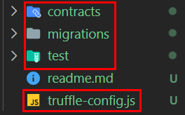
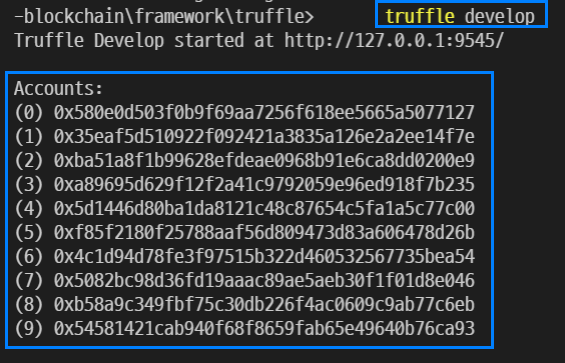
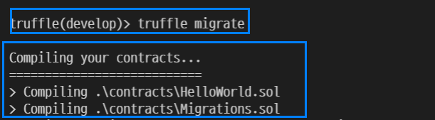
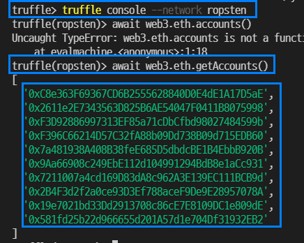
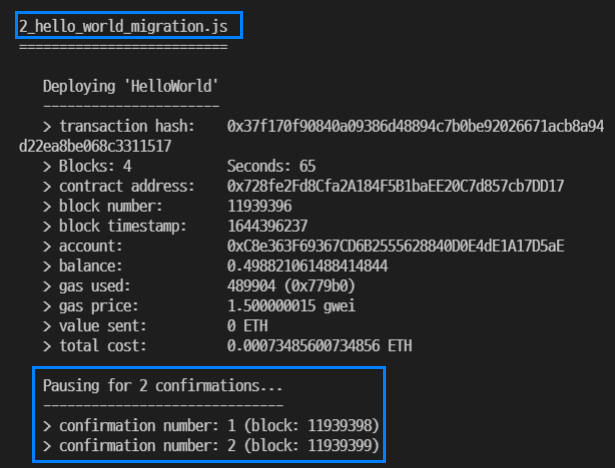
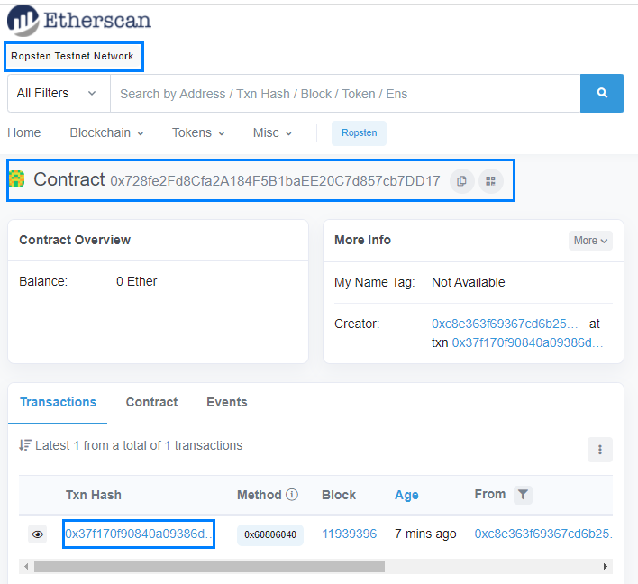

# Learning Truffle essentials
## Truffle
> A world class development environment, testing framework and asset pipeline for blockchains using the Ethereum Virtual Machine (EVM), aiming to make life as a developer easier. With Truffle, you get:

1. Built-in smart contract compilation, linking, deployment and binary management.
1. Automated contract testing for rapid development.
1. Scriptable, extensible deployment & migrations framework.
1. Network management for deploying to any number of public & private networks.
1. Package management with EthPM & NPM, using the ERC190 standard.
1. Interactive console for direct contract communication.
1. Configurable build pipeline with support for tight integration.
1. External script runner that executes scripts within a Truffle environment.

### Install and setup
Install truffle and check version like below.

```shell
$npm install -g truffle
$truffle --version
```

And then initialize your truffle project like below.

```shell
$truffle init
```

Truffle provides boilerplate codes.



Adjust truffle-compile.js file for compiler setting, 

```js
  compilers: {
      solc: {
      version: "^0.8.10",    // Fetch exact version from solc-bin (default: truffle's version)
      // docker: true,        // Use "0.5.1" you've installed locally with docker (default: false)
      // settings: {          // See the solidity docs for advice about optimization and evmVersion
      optimizer: {
        enabled: true,
        runs: 200
      },
      //  evmVersion: "byzantium"
      // }
    }
  },
```

> Truffle comes bundled with a local development blockchain server that launches automatically when you invoke the commands above. If you'd like to configure a more advanced development environment we recommend you install the blockchain server separately by running npm install -g ganache-cli at the command line.

### Compile
Complie your contract with truffle like below. If compiles fine, it will generate build/contracts/~.json files. 

```shell
$truffle compile
```

The json files can be used for later Ethereum blockchain deployment. 

### Deploy and migrate to Truffle local node
Once compilation is done, the next thing to do is to deploy the smart contract to blockchain. 


Remember to follow naming convention in the directory and 1_initial_migration.js needs to be migrated first. 

```js : 2_hello_world_migration.js
const HelloWorld = artifacts.require("HelloWorld");

module.exports = function (deployer) {
  deployer.deploy(HelloWorld);
};
```

If none of external blockchain is connected, local Ethereum nodes will be used for deployment.

```shell
# get local Ethereum node
$truffle develop 

# deploy to the node
$truffle migrate
```

Check local dummy Ethereum nodes. 



Check migration.



### Test
> Truffle uses the **Mocha testing framework and Chai** for assertions to provide you with a solid framework from which to write your JavaScript tests.

```shell
$truffle test [<test_file>] [--compile-all[-debug]] [--network <name>] [--verbose-rpc] [--show-events] [--debug] [--debug-global <identifier>] [--bail] [--stacktrace[-extra]]
```

Check command details [here](https://trufflesuite.com/docs/truffle/reference/truffle-commands#test).

#### Use contract() instead of describe()¶
> Structurally, your tests should remain largely unchanged from that of Mocha: Your tests should exist in the ./test directory, they should end with a .js extension, and they should contain code that Mocha will recognize as an automated test. 

> What makes Truffle tests different from that of Mocha is the contract() function: This function works exactly like describe() except it enables Truffle's clean-room features. It works like this:

> Before each contract() function is run, your contracts are redeployed to the running Ethereum client so the tests within it run with a clean contract state.

> The contract() function provides a list of accounts made available by your Ethereum client which you can use to write tests.
Since Truffle uses Mocha under the hood, you can still use describe() to run normal Mocha tests whenever Truffle clean-room features are unnecessary.

#### Use contract abstractions within your tests¶
> Contract abstractions are the basis for making contract interaction possible from JavaScript (they're basically our flux capacitor). Because Truffle has no way of detecting which contracts you'll need to interact with within your tests, you'll need to ask for those contracts explicitly. 

> You do this by using the artifacts.require() method, a method provided by Truffle that allows you to request a usable contract abstraction for a specific Solidity contract. As you'll see in the example below, you can then use this abstraction to make sure your contracts are working properly.

#### Using web3¶
A web3 instance is available in each test file, configured to the correct provider. So calling web3.eth.getBalance just works!

```js
it('should return 1 ether', async () => {
  let instance = await HelloWorld.deployed()
    assert.equal(web3.utils.fromWei('1000000000000000000', 'ether'), '1')
})
```

### Deploy to Mainnet/Testnet
In order to deploy your contract to Mainnet, what is needed is a blockchain node so that Mainnet node can update transactions when your node emits the transaction. 

Install your Ethereum node at [Moralis](https://moralis.io/)

When deploying the contract to Mainnet, it requires gas fee. 

1. Create a dummy mnemonics like below. 

```shell
# create dummy mnemonics
# e.g wink cream attack roof guitar balcony memory panel print cause aim warrior
$npx mnemonics 
```

2. Install @truffle/hdwallet-provider. 

```shell
$npm i @truffle/hdwallet-provider
```

3. Access Ropsten testnet by Truffle console and get fake accounts.  

```shell
$truffle console --network ropsten
```



4. Charge fake ether from [faucet](https://faucet.egorfine.com/)

And then adjust a few options in truffle-config.js file. 

```js
const HDWalletProvider = require('@truffle/hdwallet-provider');

// secerts.json contains blockchain node api url and mnemonics. 
const mnemonic = require('./secrets.json').mnemonics
const moralisEthNode = require('./secrets.json').moralisEthNode

const networksOption = {
  // some other options

      ropsten: {
        provider: () => new HDWalletProvider(mnemonic, moralisEthNode),
      network_id: 3,       // Ropsten's id
      gas: 5500000,        // Ropsten has a lower block limit than mainnet
      confirmations: 2,    // # of confs to wait between deployments. (default: 0)
      timeoutBlocks: 200,  // # of blocks before a deployment times out  (minimum/default: 50)
      skipDryRun: true     // Skip dry run before migrations? (default: false for public nets )
    },
}

```

Once all configured, run migrate command in Truffle console. Each migration will be paused as much as your confirmations options in truffle-config.js.  

```shell
$truffle migrate 
```

Note that the migration takes some time with the confirmations. 



Check the result [ropsten etherscan](https://ropsten.etherscan.io/).



## Getting started with Truffle
A directory of truffle project is as follows : 

1. contracts/: Directory for Solidity contracts
1. migrations/: Directory for scriptable deployment files
1. test/: Directory for test files for testing your application and contracts
1. truffle-config.js: Truffle configuration file

> Truffle also requires that you have a running Ethereum client which supports the standard JSON RPC API (which is nearly all of them). There are many to choose from, and some better than others for development

### Compiling contracts
> With a bare Truffle project (created through truffle init), you're given a single Migrations.sol file that helps in the deployment process. If you're using a Truffle Box, you will have multiple files here.

```shell
$truffle init
```

> To compile a Truffle project, change to the root of the directory where the project is located and then type the following into a terminal:

```shell
$truffle compile # only compiles changed contracts since last compile
$truffle compile --all # compile all contracts 
```

### Build artifacts
> The name of the generated artifact .json files do not reflect the name of the source file but of the name of the contract definition. This means that changing the contract name string in the artifacts.require method to match that of the source file may lead to a Error: Could not find artifacts for {yourContract} from any sources if the contained smart contract definition is named differently.

> You should not edit these artifacts files.

### Interacting with your contracts
> The Ethereum network makes a distinction between writing data to the network and reading data from it, and this distinction plays a significant part in how you write your application. In general, writing data is called a transaction whereas reading data is called a call. Transactions and calls are treated very differently, and have the following characteristics.

#### Transaction
> Transactions fundamentally change the state of the network. ... The defining characteristic of a transaction is that it writes (or changes) data. Transactions cost Ether to run, known as "gas", and transactions take time to process. 

> When you execute a contract's function via a transaction, you cannot receive that function's return value because the transaction isn't processed immediately. 

> In general, functions meant to be executed via a transaction will not return a value; they will return a transaction id instead. So in summary, transactions:

#### Call
> Calls are free to run(not costing gas), and their defining characteristic is that they read data. When you execute a contract function via a call you will receive the return value immediately.

### Contract abstraction
> Contract abstractions are the bread and butter of interacting with Ethereum contracts from Javascript. In short, contract abstractions are wrapper code that makes interaction with your contracts easy, in a way that lets you forget about the many engines and gears executing under the hood. 

> Truffle uses its own contract abstraction via the @truffle/contract module.

```js 
// in truffle console, 
truffle(develop)> let instance = await MetaCoin.deployed()
truffle(develop)> instance

// outputs:
// Contract
// - address: "0xa9f441a487754e6b27ba044a5a8eb2eec77f6b92"
// - allEvents: ()
// - getBalance: ()
// - getBalanceInEth: ()
// - sendCoin: ()
```

> Notice that the abstraction contains the exact same functions that exist within our contract. It also contains an address which points to the deployed version of the MetaCoin contract.

### Preserving Files and Content to Storage Platforms¶
> The truffle preserve command comes preconfigured with the ability to preserve files to IPFS, Filecoin or Textile Buckets.

#### IPFS
> To preserve your files to IPFS use the --ipfs flag.

```shell
$truffle preserve ./path --ipfs [--environment <name>]
```

> By default, the connection to IPFS is done with a local node presumed to be running at http://localhost:5001. This is the default for an ipfs daemon and also for ganache filecoin. It is possible to point to a different IPFS node by configuing a different URL in a truffle-config.js environment.

```js 
module.exports = {
  /* ... rest of truffle-config */

  environments: {
    /* ... other environments */

    production: {
      ipfs: {
        address: 'https://ipfs.infura.io:5001'
      }
    }
  }
}
```

### Running migrations
> Migrations are JavaScript files that help you deploy contracts to the Ethereum network. These files are responsible for staging your deployment tasks, and they're written under the assumption that your deployment needs will change over time. 

> As your project evolves, you'll create new migration scripts to further this evolution on the blockchain. A history of previously run migrations is recorded on-chain through a special Migrations contract, detailed below.

#### How migration works
> Truffle requires you to have a Migrations contract in order to use the Migrations feature. This contract must contain a specific interface, but you're free to edit this contract at will. For most projects, this contract will be deployed initially as the first migration and won't be updated again. You will also receive this contract by default when creating a new project with truffle init.

```solidity : Migration.sol
pragma solidity ^0.4.8;
contract Migrations {
  // pre-defined logic here
}
```

> You must deploy this contract inside your first migration in order to take advantage of the migrations feature.

> For local testing, make sure to have a test blockchain such as Ganache configured and running before executing truffle migrate. You can also use truffle develop and run your migrations.

```shell
$truffle migrate
```

> This will run all migrations located within your project's migrations directory. At their simplest, migrations are simply a set of managed deployment scripts. 

> If your migrations were previously run successfully, truffle migrate will start execution from the last migration that was run, running only newly created migrations. 

> If no new migrations exists, truffle migrate won't perform any action at all. You can use the --reset option to run all your migrations from the beginning.

#### Understand Migration file
> Note that the filename is prefixed with a number and is suffixed by a description. The numbered prefix is required in order to record whether the migration ran successfully. The suffix is purely for human readability and comprehension.

```js : 2_my_contract_migration.js
// artifacts.require : The name specified should match the name of the contract definition within that source file.
const MyContract = artifacts.require('MyContract')

module.exports = function(deployed) {
  // The deployer object is your main interface for staging deployment tasks
  deployer.deploy(MyContract)
}
```

> All migrations must export a function via the module.exports syntax. The function exported by each migration should accept a deployer object as its first parameter.

##### Setting directory
> The default directory for uncompiled contracts is ./contracts relative to the project root. If you wish to keep your contracts in a different directory you may specify a contracts_directory property.

> The default output directory for compiled contracts is ./build/contracts relative to the project root. This can be changed with the contracts_build_directory key.

```js 
module.exports = {
  contracts_directory: "./allMyStuff/someStuff/theContractFolder",
  contracts_build_directory: "./allMyBuildStuff/someStuff",
  migrations_directory:"./allMyMigrationStuff/thatStuff",
  networks: {
    development: {
      host: "127.0.0.1",
      port: 8545,
      network_id: "*",
    }
  }
};
```

#### Network consideration
> Even the smallest project will interact with at the very least two blockchain nodes: One on the developer's machine, like Ganache or Truffle Develop, and the other representing the network where the developer will eventually deploy their application (such as the main public Ethereum network or a private consortium network, for instance). 

> Truffle provides a system for managing the compilation and deployment artifacts for each network, and does so in a way that simplifies final application deployment.

> The networks object, shown below, is keyed by network names and each name contains a corresponding object that defines the parameters of the network. You will most likely want to provide your own network names and configurations to tell Truffle what networks to connect to for deployments and testing.

```js : truffle-config.js
networks: {
  development: {
    host: "127.0.0.1",
    port: 8545,
    network_id: "*", // match any network
    websockets: true
  },
  live: {
    host: "178.25.19.88", // Random IP for example purposes (do not use)
    port: 80,
    network_id: 1,        // Ethereum public network
    // optional config values:
    // gas                  -
    // gasPrice             - use gas and gasPrice if creating type 0 transactions
    // maxFeePerGas         -
    // maxPriorityFeePerGas - use maxFeePerGas and maxPriorityFeePerGas if creating type 2 transactions (https://eips.ethereum.org/EIPS/eip-1559)
    // from - default address to use for any transaction Truffle makes during migrations
    // provider - web3 provider instance Truffle should use to talk to the Ethereum network.
    //          - function that returns a web3 provider instance (see below.)
    //          - if specified, host and port are ignored.
    // skipDryRun: - true if you don't want to test run the migration locally before the actual migration (default is false)
    // confirmations: - number of confirmations to wait between deployments (default: 0)
    // timeoutBlocks: - if a transaction is not mined, keep waiting for this number of blocks (default is 50)
    // deploymentPollingInterval: - duration between checks for completion of deployment transactions
    // disableConfirmationListener: - true to disable web3's confirmation listener
  }
}
```

> Once you have defined your networks, you can provide the names as an option for certain commands; this is possible during testing or running migrations. 

```shell
$truffle migrate --network live
```

> Note that if no --network option is provided when using commands that require a network, Truffle will by default look for a network named "development" in your truffle-config.js

```js 
module.exports = function(deployer, network) {
  if (network == "live") {
    // Do something specific to the network named "live".
  } else {
    // Perform a different step otherwise.
  }
}
```

## Reference
- [Moralis Web3 : Truffle Programming Tutorial for Beginners](https://www.youtube.com/watch?v=ZaqAwOzEiQ8&list=PLFPZ8ai7J-iQAtjGbmgcQWfAB53dZvn1y&index=1)
- [Truffle suite](https://trufflesuite.com/docs/truffle/)
- [Truffle suite : getting started](https://trufflesuite.com/docs/truffle/getting-started/installation.html)
- [Writing Tests in Javascript](https://trufflesuite.com/docs/truffle/testing/writing-tests-in-javascript.html)