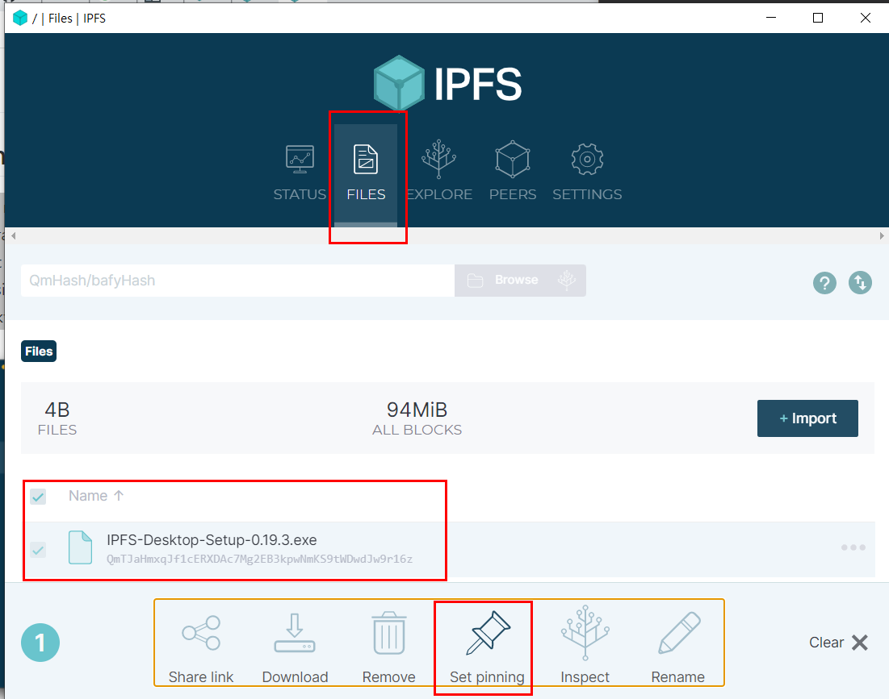

# Learning IPFS essentials
## What is IPFS? 
> IPFS is a distributed system for storing and accessing files, websites, applications, and data.

Let's assume you want to search one little cute animal, Aardvark in Wikipedia. Normally, you would visit below URL. 

```
https://en.wikipedia.org/wiki/Aardvark
```

Based on ipfs offical docs, you can also visit this, which is the mirror wikipedia webpage using ipfs. 

> However, that's not the only option for meeting your aardvark needs! There's a mirror of Wikipedia stored on IPFS, and you could use that instead. If you use IPFS, your computer asks to get the aardvark page like this:

```
https://ipfs.io/ipfs/QmXoypizjW3WknFiJnKLwHCnL72vedxjQkDDP1mXWo6uco/wiki/Aardvark.html
```

> The IPFS-ified version of the aardvark info is represented by that string of numbers in the middle of the URL (QmXo…), and instead of asking one of Wikipedia's computers for the page, your computer uses IPFS to ask lots of computers around the world to share the page with you. It can get your aardvark info from anyone who has it, not just Wikipedia.

> And, when you use IPFS, you don't just download files from someone else — your computer also helps distribute them. When your friend a few blocks away needs the same Wikipedia page, they might be as likely to get it from you as they would from your neighbor or anyone else using IPFS.

> IPFS makes this possible for not only web pages but also any kind of file a computer might store, whether it's a document, an email, or even a database record.

## Advantage over previous web
> Can speed up the web when you're far away or disconnected. If you can retrieve a file from someone nearby instead of hundreds or thousands of miles away, you can often get it faster. This is especially valuable if your community is networked locally but doesn't have a good connection to the wider internet. (Well-funded organizations with technical expertise do this today by using multiple data centers or CDNs — content distribution networks (opens new window). IPFS hopes to make this possible for everyone.)

## Content addressing
> Traditional URLs and file paths such as…

1. https://en.wikipedia.org/wiki/Aardvark
1. /Users/Alice/Documents/term_paper.doc
1. C:\Users\Joe\My Documents\project_sprint_presentation.ppt

> …identify a file by where it's located — what computer it's on and where on that computer's hard drive it is. That doesn't work if the file is in many places, though, like your neighbor's computer and your friend's across town.

> Instead of being location-based, IPFS addresses a file by what's in it, or by its content. The content identifier above is a cryptographic hash of the content at that address. The hash is unique to the content that it came from, even though it may look short compared to the original content. 

> It also allows you to verify that you got what you asked for — bad actors can't just hand you content that doesn't match. (If hashes are new to you, check out the concept guide on hashes for an introduction.)

> Why do we say "content" instead of "files" or "web pages" here? Because a content identifier can point to many different types of data, such as a single small file, a piece of a larger file, or metadata. (In case you don't know, metadata is "data about the data." You use metadata when you access the date, location, or file size of your digital pictures, for example.) So, an individual IPFS address can refer to the metadata of just a single piece of a file, a whole file, a directory, a whole website, or any other kind of content. 

## Characteristics
> Because the address of a file in IPFS is created from the content itself, links in IPFS can't be changed. For example ...

1. If the text on a web page is changed, the new version gets a new, different address.
1. Content can't be moved to a different address. On today's internet, a company could reorganize content on their website and move a page at http://mycompany.com/what_we_do to http://mycompany.com/services. In IPFS, the old link you have would still point to the same old content.

> using IPFS is participatory and collaborative. If nobody using IPFS has the content identified by a given address available for others to access, you won't be able to get it. 

> On the other hand, content can't be removed from IPFS as long as someone is interested enough to make it available, whether that person is the original author or not. 

> Note that this is similar to the current web, where it is also impossible to remove content that's been copied across an unknowable number of websites; the difference with IPFS is that you are always able to find those copies.

## Pinning
> IPFS nodes treat the data they store like a cache, meaning that there is no guarantee the data will continue to be stored. Pinning a file tells an IPFS node to treat the data as essential and not throw it away. You should pin any content you consider important to ensure that data is retained over the long term. IPFS Desktop allows you to pin files straight from the Files tab.



>  You can also make content available more permanently by pinning it, which saves it to your computer and makes it available on the IPFS network until you decide to unpin it.

> IPFS only works well when people are actively participating. If you use your computer to share files using IPFS, but then you turn your computer off, other people won't be able to get those files from you anymore.

> If you want to make sure one of your own files is permanently shared on the internet today, you might use a for-pay file-sharing service like Dropbox. Some people have begun offering similar services based on IPFS called pinning services. But since IPFS makes this kind of sharing a built-in feature, you can also collaborate with friends or partner with institutions (for example, museums and libraries might work together) to share each others' files.

### Pinning service 
> An easy way to make sure important data is retained is to use a pinning service. These services run lots of IPFS nodes and will pin your data for you! This way, you don't have to run and maintain your own IPFS node. Check out the Persistence page for more information on pinning services. In this tutorial, we're going to use Pinata (opens new window)since it gives new users 1GB of storage for free, and has a very simple interface:


## Reference
- [IPFS official](https://docs.ipfs.io/concepts/what-is-ipfs/#decentralization)
- [HashLips NFT - Upload 10000 NFTs to IPFS](https://www.youtube.com/watch?v=3jizwk6_m1s)
- [Pinata - Best-in-class NFT media management](https://www.pinata.cloud/)