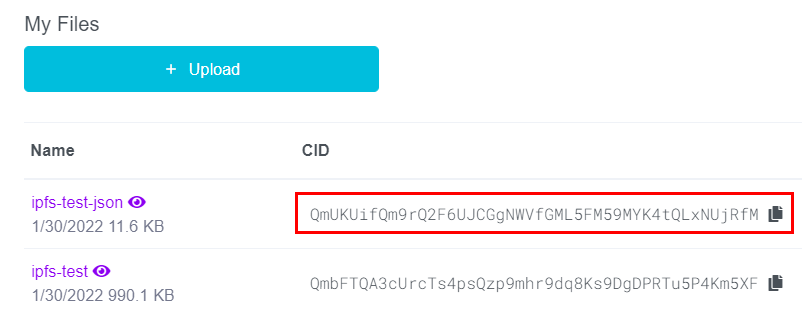
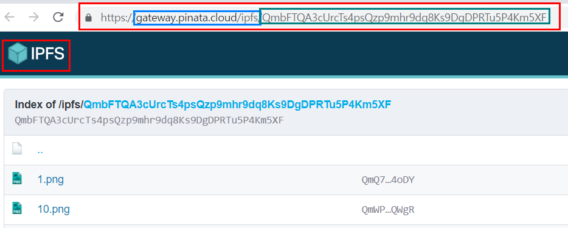
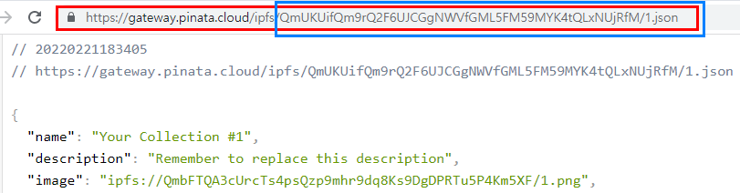

# Learning IPFS essentials

## What is IPFS?

> IPFS is a distributed system for storing and accessing files, websites, applications, and data.

Let's assume you want to search one little cute animal, Aardvark in Wikipedia. Normally, you would visit below URL.

```
https://en.wikipedia.org/wiki/Aardvark
```

Based on ipfs offical docs, you can also visit this, which is the mirror wikipedia webpage using ipfs.

> However, that's not the only option for meeting your aardvark needs! There's a mirror of Wikipedia stored on IPFS, and you could use that instead. If you use IPFS, your computer asks to get the aardvark page like this:

```
https://ipfs.io/ipfs/QmXoypizjW3WknFiJnKLwHCnL72vedxjQkDDP1mXWo6uco/wiki/Aardvark.html
```

> The IPFS-ified version of the aardvark info is represented by that string of numbers in the middle of the URL (QmXo…), and instead of asking one of Wikipedia's computers for the page, your computer uses IPFS to ask lots of computers around the world to share the page with you. It can get your aardvark info from anyone who has it, not just Wikipedia.

> And, when you use IPFS, you don't just download files from someone else — your computer also helps distribute them. When your friend a few blocks away needs the same Wikipedia page, they might be as likely to get it from you as they would from your neighbor or anyone else using IPFS.

> IPFS makes this possible for not only web pages but also any kind of file a computer might store, whether it's a document, an email, or even a database record.

## Installation

You can install [IPFS desktop](https://docs.ipfs.io/install/ipfs-desktop/#windows) to run your own IPFS node or use external service such as [Pinata](https://www.pinata.cloud/)

## Address IPFS on the web

> Browsers that support IPFS can redirect these requests to your local IPFS node, while those that don't can fetch the resource from the ipfs.io gateway.

```
https://ipfs.io/ipfs/<CID>
# e.g
https://ipfs.io/ipfs/Qme7ss3ARVgxv6rXqVPiikMJ8u2NLgmgszg13pYrDKEoiu
```

> You can swap out ipfs.io for your own http-to-ipfs gateway, but you are then obliged to keep that gateway running forever. If your gateway goes down, users with IPFS aware tools will still be able to fetch the content from the IPFS network as long as any node still hosts it, but for those without, the link will be broken. Don't do that.

## Advantage over previous web

> Can speed up the web when you're far away or disconnected. If you can retrieve a file from someone nearby instead of hundreds or thousands of miles away, you can often get it faster. This is especially valuable if your community is networked locally but doesn't have a good connection to the wider internet. (Well-funded organizations with technical expertise do this today by using multiple data centers or CDNs — content distribution networks (opens new window). IPFS hopes to make this possible for everyone.)

## Content addressing

> Traditional URLs and file paths such as…

1. https://en.wikipedia.org/wiki/Aardvark
1. /Users/Alice/Documents/term_paper.doc
1. C:\Users\Joe\My Documents\project_sprint_presentation.ppt

> …identify a file by where it's located — what computer it's on and where on that computer's hard drive it is. That doesn't work if the file is in many places, though, like your neighbor's computer and your friend's across town.

> Instead of being location-based, IPFS addresses a file by what's in it, or by its content. The content identifier(CID) above is a cryptographic hash of the content at that address. The hash is unique to the content that it came from, even though it may look short compared to the original content.

> It also allows you to verify that you got what you asked for — bad actors can't just hand you content that doesn't match. (If hashes are new to you, check out the concept guide on hashes for an introduction.)

> Why do we say "content" instead of "files" or "web pages" here? Because a content identifier can point to many different types of data, such as a single small file, a piece of a larger file, or metadata. (In case you don't know, metadata is "data about the data." You use metadata when you access the date, location, or file size of your digital pictures, for example.) So, an individual IPFS address can refer to the metadata of just a single piece of a file, a whole file, a directory, a whole website, or any other kind of content.

## Characteristics

> Because the address of a file in IPFS is created from the content itself, links in IPFS can't be changed. For example ...

1. If the text on a web page is changed, the new version gets a new, different address.
1. Content can't be moved to a different address. On today's internet, a company could reorganize content on their website and move a page at http://mycompany.com/what_we_do to http://mycompany.com/services. In IPFS, the old link you have would still point to the same old content.

> using IPFS is participatory and collaborative. If nobody using IPFS has the content identified by a given address available for others to access, you won't be able to get it.

> On the other hand, content can't be removed from IPFS as long as someone is interested enough to make it available, whether that person is the original author or not.

> Note that this is similar to the current web, where it is also impossible to remove content that's been copied across an unknowable number of websites; the difference with IPFS is that you are always able to find those copies.

## Pinning

> IPFS nodes treat the data they store like a cache, meaning that there is no guarantee the data will continue to be stored. Pinning a file tells an IPFS node to treat the data as essential and not throw it away. You should pin any content you consider important to ensure that data is retained over the long term. IPFS Desktop allows you to pin files straight from the Files tab.


> You can also make content available more permanently by pinning it, which saves it to your computer and makes it available on the IPFS network until you decide to unpin it.

> IPFS only works well when people are actively participating. If you use your computer to share files using IPFS, but then you turn your computer off, other people won't be able to get those files from you anymore.

> If you want to make sure one of your own files is permanently shared on the internet today, you might use a for-pay file-sharing service like Dropbox. Some people have begun offering similar services based on IPFS called pinning services. But since IPFS makes this kind of sharing a built-in feature, you can also collaborate with friends or partner with institutions (for example, museums and libraries might work together) to share each others' files.

### Pinning service

> An easy way to make sure important data is retained is to use a pinning service. These services run lots of IPFS nodes and will pin your data for you! This way, you don't have to run and maintain your own IPFS node. Check out the Persistence page for more information on pinning services. In this tutorial, we're going to use Pinata (opens new window)since it gives new users 1GB of storage for free, and has a very simple interface:

## CID and smart contract

Contents uploaded to IPFS will get CID(content identifier) and this CID can be used for NFT media management in smart contract.

> A content identifier, or CID, is a label used to point to material in IPFS. It doesn't indicate where the content is stored, but it forms a kind of address based on the content itself.

For example, you can upload files to Pinata and check its CID like below.



Note that total IPFS address is defined : gateway/ipfs/CID as explained above. For example,



Thus, each file in IPFS is available in the form of : gateway/ipfs/CID/file name. Note that the gateway varies.



## Command-line quick start

> If you're command-line savvy and just want to get up and running with IPFS right away, follow this quick-start guide. Please note that this guide assumes that you'll be installing go-ipfs, the reference implementation written in Go.

> Don’t want to use the command line right now? Give the desktop-app implementation of IPFS a try. It also does all the steps listed on this page automatically, so you can run IPFS from the terminal later whenever you want

### Command-line

> Installing IPFS through the command-line is handy if you plan on building applications and services on top of an IPFS node. This method is also useful if you're setting up a node without a user interface, usually the case with remote servers or virtual machines. Using IPFS through the command-line allows you to do everything that IPFS Desktop can do, but at a more granular level since you can specify which commands to run.

> IPFS requires 512MiB of memory and can run an IPFS node on a Raspberry Pi. However, how much disk space your IPFS installation takes up depends on how much data you're sharing. A base installation takes up about 12MB of disk space. One can enable automatic garbage collection via --enable-gc and adjust the default maximum disk storage (opens new window)for data retrieved from other peers.

#### Windows

1. Download the Windows binary from dist.ipfs.io

```sh
wget https://dist.ipfs.io/go-ipfs/v0.13.0/go-ipfs_v0.13.0_windows-amd64.zip -Outfile go-ipfs_v0.13.0.zip

```

1. Unzip the file and move it somewhere handy.

```
Expand-Archive -Path go-ipfs_v0.13.0.zip -DestinationPath ~\Apps\go-ipfs_v0.13.0
```

1. Move into the go-ipfs_v0.13.0 folder and check that the ipfs.exe works:

```sh
cd ~\Apps\go-ipfs_v0.13.0\go-ipfs
.\ipfs.exe --version

> ipfs version 0.13.0
```

1. Save the current working directory into a temporary variable:

```
$GO_IPFS_LOCATION = pwd
```

1. Create a powershell profile:

```
if (!(Test-Path -Path $PROFILE)) { New-Item -ItemType File -Path $PROFILE -Force }
```

> This command first checks to see if you have a profile set. If you do, it leaves it there and doesn't create a new one. You can view the contents of your profile by opening it in Notepad:

```
notepad $PROFILE
```

1. Add the location of your Go-IPFS daemon and add it to PowerShell's PATH by truncating it to the end of your PowerShell profile:

```
Add-Content $PROFILE "`n[System.Environment]::SetEnvironmentVariable('PATH',`$Env:PATH+';;$GO_IPFS_LOCATION')"
```

1. Load your $PROFILE:

```
& $profile
```

1. Test that your IPFS path is set correctly by going to your home folder and asking IPFS for the version:

```sh
ipfs --version
```

## Which node should you use with the command line

> The command line can detect and use any node that's running, unless it's configured to use an external binary file. Here's which node to use for the local daemon or a remote client:

### Local daemon

> The local daemon process is automatically started in the CLI with the command ipfs daemon. It creates an $IPFS_PATH/api file with an RPC API address.

### Remote client

> You can install the standalone IPFS CLI client independently and use it to talk to an IPFS Desktop node or a Brave node. Use the RPC API to talk to the ipfs daemon.

> When an IPFS command is executed without parameters, the CLI client checks whether the $IPFS_PATH/api file exists and connects to the address listed there.

> If an $IPFS_PATH is in the default location (for example, ~/.ipfs on Linux), then it works automatically and the IPFS CLI client talks to the locally running ipfs daemon without any additional configuration.

> If an $IPFS_PATH is not in the default location, use the --api <rpc-api-addr> command-line argument. Alternatively, you can set the environment variable to IPFS_PATH. IPFS_PATH will point to a directory with the api file with the existing ipfs daemon instance.

## Command-line quick start

### Initialize the repository

> ipfs stores all its settings and internal data in a directory called the repository. Before using IPFS for the first time, you’ll need to initialize the repository with the ipfs init command:

> Be careful with sudo on Unix platforms (including macOS)! If you run sudo ipfs init, the repository will be created for the root user instead of your local user account. IPFS doesn't need root privileges, so it's best to run all ipfs commands as a regular user!

```sh
# close IPFS
ipfs shutdown
```

```sh
ipfs init

> initializing ipfs node at /Users/jbenet/.ipfs
> generating 2048-bit RSA keypair...done
> peer identity: Qmcpo2iLBikrdf1d6QU6vXuNb6P7hwrbNPW9kLAH8eG67z
> to get started, enter:
>
>   ipfs cat /ipfs/QmYwAPJzv5CZsnA625s3Xf2nemtYgPpHdWEz79ojWnPbdG/readme
```

> If you are running on a server in a data center, you should initialize IPFS with the server profile. Doing so will prevent IPFS from creating a lot of data center-internal traffic trying to discover local nodes:

```sh
ipfs init --profile server
```

> There are a whole host of other configuration options you may want to set — check the full reference (opens new window)for more.

> The hash after peer identity: is your node’s ID and will be different from the one shown in the above output. Other nodes on the network use it to find and connect to you. You can run ipfs id at any time to get it again if you need it.

> Now, try running the command suggested to you in the output of ipfs init. The one that looks like ipfs cat /ipfs/<HASH>/readme.

## Take your node online

> Once you're ready to join your node to the public network, run the ipfs daemon in another terminal and wait for all three lines below to appear to know that your node is ready:

```sh
# ipfs daemon - Run a network-connected IPFS node.
ipfs daemon

> Initializing daemon...
> API server listening on /ip4/127.0.0.1/tcp/5001
> Gateway server listening on /ip4/127.0.0.1/tcp/8080
```

> Make a note of the TCP ports you receive. If they are different, use yours in the commands below.

> NEVER EXPOSE THE RPC API TO THE PUBLIC INTERNET. The API port provides admin-level access to your IPFS node. See RPC API docs for more information.

> Now, switch back to your original terminal. If you’re connected to the network, you should be able to see the IPFS addresses of your peers when you run:

```sh
ipfs swarm peers

> /ip4/104.131.131.82/tcp/4001/p2p/QmaCpDMGvV2BGHeYERUEnRQAwe3N8SzbUtfsmvsqQLuvuJ
> /ip4/104.236.151.122/tcp/4001/p2p/QmSoLju6m7xTh3DuokvT3886QRYqxAzb1kShaanJgW36yx
> /ip4/134.121.64.93/tcp/1035/p2p/QmWHyrPWQnsz1wxHR219ooJDYTvxJPyZuDUPSDpdsAovN5
> /ip4/178.62.8.190/tcp/4002/p2p/QmdXzZ25cyzSF99csCQmmPZ1NTbWTe8qtKFaZKpZQPdTFB
```

> These are a combination of <transport address>/p2p/<hash-of-public-key>.

Now, you should be able to get objects from the network. Try:

```sh
ipfs cat /ipfs/QmSgvgwxZGaBLqkGyWemEDqikCqU52XxsYLKtdy3vGZ8uq > ~/Desktop/spaceship-launch.jpg
```

> Using the above command, IPFS searches the network for the CID QmSgv... and writes the data into a file called spaceship-launch.jpg on your Desktop.

> Next, try sending objects to the network, and then viewing it.

```sh
# returns CID
echo "I <3 IPFS -$(whoami)" | ipfs add -q
# read the file writte with CID
ipfs cat (cid-here)
# get the file from one's own computer(Download IPFS objects)
ipfs get (cid-here)
> I <3 IPFS -<your username>
```

> Cool, huh? The gateway served a file from your computer. The gateway queried the Distributed hash table (DHT), found your machine, requested the file, your computer sent it to the gateway, and the gateway sent it to your browser.

>

## Reference

- [IPFS official](https://docs.ipfs.io/concepts/what-is-ipfs/#decentralization)
- [HashLips NFT - Upload 10000 NFTs to IPFS](https://www.youtube.com/watch?v=3jizwk6_m1s)
- [Pinata - Best-in-class NFT media management](https://www.pinata.cloud/)
