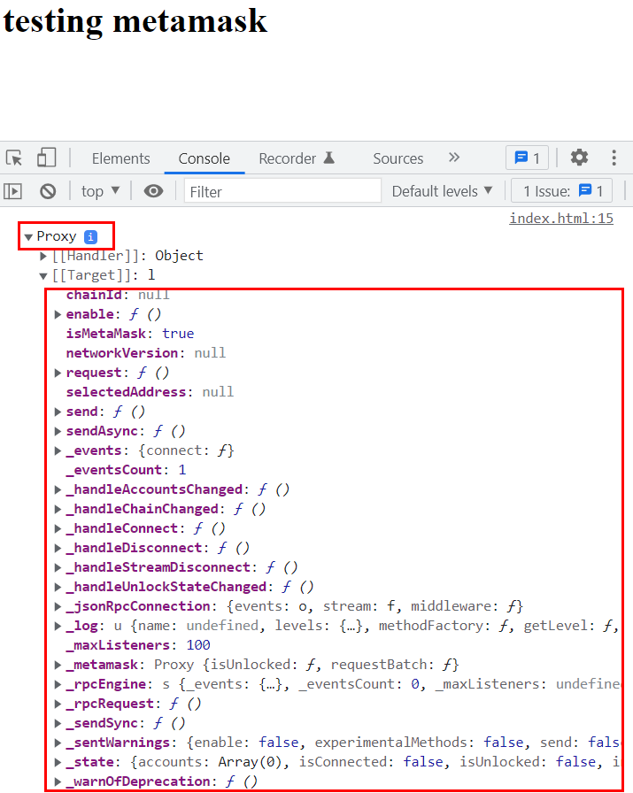

# Learning Metamask essentials
> MetaMask was created to meet the needs of secure and usable Ethereum-based web sites. In particular, it handles account management and connecting the user to the blockchain.

## Account management
> MetaMask allows users to manage accounts and their keys in a variety of ways, including hardware wallets, while isolating them from the site context. This is a great security improvement over storing the user keys on a single central server, or even in local storage, which can allow for mass account thefts

> This security feature also comes with developer convenience: For developers, you simply interact with the globally available ethereum API that identifies the users of web3-compatible browsers (like MetaMask users), and whenever you request a transaction signature (like eth_sendTransaction, eth_signTypedData, or others), MetaMask will prompt the user in as comprehensible a way as possible. This keeps users informed, and leaves attackers only the option of trying to phish individual users, rather than performing mass hacks

## Blockchain connection
> MetaMask comes pre-loaded with fast connections to the Ethereum blockchain and several test networks via our friends at Infura (opens new window). This allows you to get started without synchronizing a full node, while still providing the option to upgrade your security and use the blockchain provider of your choice.

> Today, MetaMask is compatible with any blockchain that exposes an Ethereum-compatible JSON RPC API (opens new window), including custom and private blockchains. For development, we recommend running a test blockchain like Ganache (opens new window).

> We are aware that there are constantly new private blockchains being created. If you are interested in integrating MetaMask with your own custom network, we have an API that has already enabled a number of networks to do the same

## Getting started
> Once MetaMask is installed and running (make sure you back up your Secret Recovery Phrase), you should find that new browser tabs have a window.ethereum object available in the developer console. This is how your website will interact with MetaMask.



> You can review the full API for that object [here](https://docs.metamask.io/guide/ethereum-provider.html#ethereum-provider-api). Note that over the course of 2020, we introduced significant changes to this API, and we recommend that you refer to its documentation.

### Connecting to Metamask
"Connecting" or "logging in" to MetaMask effectively means "to access the user's Ethereum account(s)".

You should only initiate a connection request in response to direct user action, such as clicking a button. You should always disable the "connect" button while the connection request is pending. You should never initiate a connection request on page load.

We recommend that you provide a button to allow the user to connect MetaMask to your dapp.

## Initializing dapps
> If you aren't connected to the right network, you aren't going to have any luck sending transactions to your contract, so make sure you have this right! Many dapp developers choose to deploy their contract to a testnet first, in order to avoid potentially disastrous fees if something goes wrong during development and testing on mainnet.

> No matter which network you deploy your final dapp on, your user will need to be able to access it. MetaMask makes available wallet_switchEthereumChain (opens new window), as well as wallet_addEthereumChain (opens new window), which allows you to prompt the user to add a chain that you suggest, and switch to it using a confirmation dialogue. 

> Every account in Ethereum has an address, whether it's an external key-pair account, or a smart contract. In order for any smart contract library to communicate with your contracts, they'll need to know its exact address. If you deployed a contract, you probably know how to find the address.

## Sending transaction
> **Transactions** are a formal action on a blockchain. They are always **initiated in MetaMask with a call to the eth_sendTransaction method**. They can involve a simple sending of ether, may result in sending tokens, creating a new smart contract, or changing state on the blockchain in any number of ways. They are always initiated by a signature from an external account, or a simple key pair.

## Transaction parameter
### Nonce : ignored
> This field is ignored by MetaMask. In Ethereum every transaction has a nonce. This is so that each transaction can only be processed by the blockchain once. Additionally, to be a valid transaction, the nonce must either be 0, or a transaction with the previous number must have already been processed.

> That means that transactions are always processed in order for a given account, and so incrementing nonces is a very sensitive matter that is easy to mess up, especially when a user is interacting with multiple applications with pending transactions using the same account, potentially across multiple devices.

> For these reasons, MetaMask currently does not provide application developers any way to customize the nonce of transactions it suggests. Instead, MetaMask assists the user in managing their transaction queue themselves

### Gas price : optional
> Gas Price : Optional parameter - best used on private blockchains.

> In Ethereum, every transaction specifies a price for the gas that it will consume. To maximize their profit, block producers will pick pending transactions with higher gas prices first when creating the next block. This means that a high gas price will usually cause your transaction to be processed faster, at the cost of greater transaction fees. Note that this may not be true for e.g. Layer 2 networks, which may have a constant gas price or no gas price at all.

> In other words, while you can ignore this parameter on MetaMask's default networks, you may want to include it in situations where your application knows more about the target network than we do. On our default networks, MetaMask allows users to choose between "slow," "medium," and "fast" options for their gas price. To learn how to use advanced gas controls

### Gas limit : optional 
> Optional parameter. Rarely useful to Dapp developers. Gas limit is a highly optional parameter, and we automatically calculate a reasonable price for it. You will probably know that your smart contract benefits from a custom gas limit if it ever does for some reason

## Ethereum Provider API
> MetaMask **injects a global API into websites** visited by its users at window.ethereum. This API allows websites to **request users' Ethereum accounts, read data from blockchains** the user is connected to, and suggest that the user **sign messages and transactions**. The presence of the provider object indicates an Ethereum user. We recommend using @metamask/detect-provider (opens new window)to detect our provider, on any platform or browser.

## Dealing with legacy API 
> You should never rely on any of these methods, properties, or events in practice.

> This section documents our legacy provider API. MetaMask only supported this API before the provider API was standardized via EIP-1193 (opens new window)in 2020. Because of this, you may find web3 sites that use this API, or other providers that implement it.

Avoid this, 
```js
    if(window.ethereum !== undefined) {
        console.log("metamask installed")
        console.log(window.ethereum) // legacy
    }
```

instead use this. 

```js
    if(window.ethereum !== undefined) {
        console.log("metamask installed")
        window.ethereum.request( { method : 'eth_requestAccounts' }) // correct
    }
```

## Provider migration guide
> In January of 2021, we made a number of breaking changes to our provider API, and removed our injected window.web3. These changes are live on all platforms as of version:

1. 9.0.2 of the MetaMask browser extension
1. 1.0.9 of MetaMask Mobile

> This guide describes how to migrate to the new provider API, and how to replace our window.web3

### Window.web3 removal
> As part of the breaking changes, we stopped injecting web3.js version 0.20.7 as window.web3 into web pages. MetaMask still injects a dummy object at window.web3, in order to issue warnings when websites attempt to access window.web3

### Window.ethereum API changes
> We made the following breaking changes to the window.ethereum API:

> Deprecate the web3.currentProvider method : Use @metamask/detect-provider (opens new window)to detect the current provider

> Ensure that chain IDs returned by eth_chainId are not 0-padded
For example, instead of 0x01, we always return 0x1, wherever the chain ID is returned or accessible. Note that this only affects the default Ethereum chains, except Kovan, whose chain ID is formatted correctly (0x2a).

> Stop emitting chainIdChanged, and instead emit chainChanged

> Remove the following experimental methods: ethereum._metamask.isEnabled, ethereum._metamask.isApproved


## Reference 
- [Metamask : docs](https://docs.metamask.io/guide/#why-metamask)