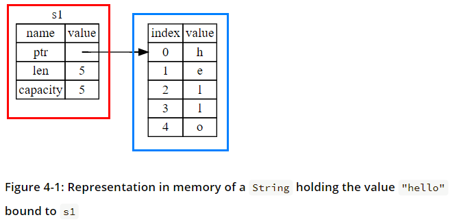
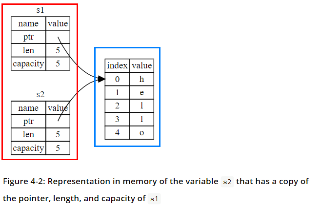
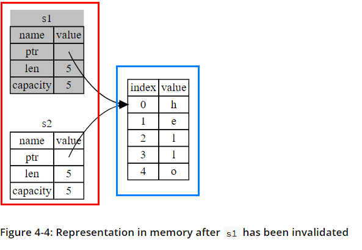
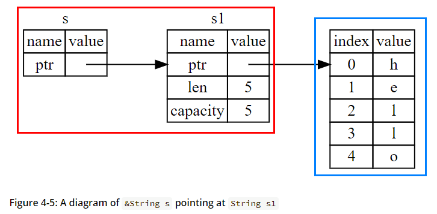
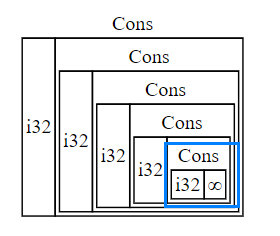
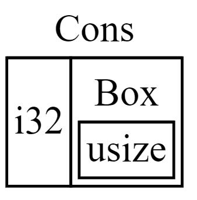

# Learning Rust Essentials
Watch [this short video](https://www.youtube.com/watch?v=5C_HPTJg5ek) to get the rough grasp of Rust lang.

> Rust is a statically typed language.

> Rust is a multi-paradigm programming language focused on performance and safety, especially **safe concurrency**. It is syntactically similar to C++ but provides memory safety **without using garbage collection**. Rust programming language was developed by Mozilla with the aim of creating a better tool for developing their browser Mozilla Firefox. 

> The language appeared to be so effective, that many programmers are now opting to use it for software development instead of using C++. Rust is syntactically similar to C++, but it provides increased speed and better memory safety.

## Installation
> The first step is to install Rust. We’ll download Rust through rustup, a command line tool for managing Rust versions and associated tools. 

For Mac OS, Linux user, run bellow command. 
```shell
$ curl --proto '=https' --tlsv1.2 https://sh.rustup.rs -sSf | sh
```

For Windows user, follow below link.
> It looks like you’re running Windows. To start using Rust, download the installer, then run the program and follow the onscreen instructions. You may need to install the Visual Studio C++ Build tools when prompted to do so. If you are not on Windows see "Other Installation Methods".

- [install Rust](https://www.rust-lang.org/tools/install)

### Toolchain management with rustup
> Rust is installed and managed by the rustup tool. Rust has a 6-week rapid release process and supports a great number of platforms, so there are many builds of Rust available at any time. rustup manages these builds in a consistent way on every platform that Rust supports, enabling installation of Rust from the beta and nightly release channels as well as support for additional cross-compilation targets.

### Configuring the PATH environment variable
> In the Rust development environment, all tools are installed to the ~/.cargo/bin directory, and this is where you will find the Rust toolchain, including rustc, cargo, and rustup.

> Accordingly, it is customary for Rust developers to include this directory in their PATH environment variable. During installation rustup will attempt to configure the PATH. Because of differences between platforms, command shells, and bugs in rustup, the modifications to PATH may not take effect until the console is restarted, or the user is logged out, or it may not succeed at all.

> If, after installation, running rustc --version in the console fails, this is the most likely reason.

### Updating and uninstalling
To update Rust, 
```shell
$rustup update
```

to uninstall, 
```shell 
$rustup self uninstall
```

to check version, 
```shell
$rustup --version
$rustc --version
$cargo --version
```

## Cargo
> Cargo is **Rust’s build system and package manager**. Most Rustaceans use this tool to manage their Rust projects because Cargo handles a lot of tasks for you, such as building your code, downloading the libraries your code depends on, and building those libraries. (We call the libraries that your code needs dependencies.)

> Because the vast majority of Rust projects use Cargo, the rest of this book assumes that you’re using Cargo too. Cargo comes installed with Rust if you used the official installers discussed in the “Installation” section. If you installed Rust through some other means, check whether Cargo is installed by entering the following into your terminal:

### First project with cargo 
Run below command to create your first Rust project. 

```shell
$cargo new (project-name) --bin
```

And then write your first Rust function. 

```rs
fn main() {
    println!("hello rust");
}
```

And run below command at your project directory to run the function. 

```shell
$cargo run # running executable
```

Refer below commands for cargo. 
1. build, b    Compile the current package
1. check, c    Analyze the current package and report errors, but don't build object files
1. clean       Remove the target directory
1. doc, d      Build this package's and its dependencies' documentation
1. new         Create a new cargo package
1. init        Create a new cargo package in an existing directory
1. run, r      Run a binary or example of the local package
1. test, t     Run the tests
1. bench       Run the benchmarks
1. update      Update dependencies listed in Cargo.lock
1. search      Search registry for crates
1. publish     Package and upload this package to the registry
1. install     Install a Rust binary. Default location is $HOME/.cargo/bin
1. uninstall   Uninstall a Rust binary

See 'cargo help <command>' for more information on a specific command.

### Cargo.toml
> Open Cargo.toml(Tom's Obvious Minimal Language) in your text editor of choice. It should look similar to the code in Listing 1-2.

```toml
[package]
name = "hello_cargo"
version = "0.1.0"
edition = "2021"

[dependencies]
```

1. package : The first line, [package], is a section heading that indicates that the following statements are configuring a package. As we add more information to this file, we’ll add other sections.

1. dependencies : The last line, [dependencies], is the start of a section for you to list any of your project’s dependencies. In Rust, packages of code are referred to as crates. 

> Cargo expects your source files to live inside the src directory. The top-level project directory is just for README files, license information, configuration files, and anything else not related to your code. Using Cargo helps you organize your projects. There’s a place for everything, and everything is in its place.

### Cargo.lock
> Running cargo build for the first time also causes Cargo to create a new file at the top level: Cargo.lock. This file keeps track of the exact versions of dependencies in your project.

> You won’t ever need to change this file manually; Cargo manages its contents for you.

### Cargo check
> Cargo also provides a command called cargo check. This command quickly checks your code to make sure it compiles but doesn’t produce an executable:

```shell 
$cargo check
Checking hello_cargo v0.1.0 (file:///projects/hello_cargo)
Finished dev [unoptimized + debuginfo] target(s) in 0.32 secs
```

> Why would you not want an executable? Often, cargo check is much faster than cargo build, because it skips the step of producing an executable. If you’re continually checking your work while writing the code, using cargo check will speed up the process! As such, many Rustaceans run cargo check periodically as they write their program to make sure it compiles. Then they run cargo build when they’re ready to use the executable.

To sum up, cargo commands we can use is as follows : 

1. We can build a project using cargo build.
1. We can build and run a project in one step using cargo run.
1. We can build a project without producing a binary to check for errors using cargo check.
1. Instead of saving the result of the build in the same directory as our code, Cargo stores it in the target/debug directory.

> An additional advantage of using Cargo is that the commands are the same no matter which operating system you’re working on. 

## Building for release
Cargo provides two ways to build your code base by cargo build(compile) command.

```shell 
$cargo build # for development
$cargo build --release # for release
```

### Production
> When your project is finally ready for release, you can use cargo build --release to compile it with optimizations. This command will create an executable in target/release instead of target/debug. The optimizations make your Rust code run faster, but turning them on lengthens the time it takes for your program to compile. 

> This is why there are two different profiles: one for development, when you want to rebuild quickly and often, and another for building the final program you’ll give to a user that won’t be rebuilt repeatedly and that will run as fast as possible. If you’re benchmarking your code’s running time, be sure to run cargo build --release and benchmark with the executable in target/release.

## Adding dependency
> Let’s add a dependency to our application. You can find all sorts of libraries on crates.io, the package registry for Rust. In Rust, we often refer to packages as “crates.” If your Cargo.toml doesn't already have a [dependencies] section, add that, then list the crate name and version that you would like to use.

> In this project, we’ll use a crate called ferris-says. In our Cargo.toml file we’ll add this information (that we got from the crate page):

```toml
[package]
name = "hello_world"
version = "0.1.0"
edition = "2021"

[dependencies]
ferris-says = "0.1"
```

> Now we can run cargo build command and then Cargo will install our dependency for us. Cargo will fetch the new dependencies and all of their dependencies, compile them all, and update the Cargo.lock

```shell
$cargo build
```

Note that the installed dependency is located below directories. 

- target/debug/deps
- target/release/deps

> To use this dependency, we can open main.rs, remove everything that’s in there (it’s just another example), and add this line to it:
```rust
use ferris_says::say;
```

> This line means that we can now use the say function that the ferris-says crate exports for us.

## Compile time error
> It’s important that we get compile-time errors when we attempt to change a value that’s designated as immutable because this very situation can lead to bugs. If one part of our code operates on the assumption that a value will never change and another part of our code changes that value, it’s possible that the first part of the code won’t do what it was designed to do. 

> The cause of this kind of bug can be difficult to track down after the fact, especially when the second piece of code changes the value only sometimes.

> The Rust compiler guarantees that when you state a value won’t change, it really won’t change, so you don’t have to keep track of it yourself. Your code is thus easier to reason through.

> In cases where you’re using large data structures, mutating an instance in place may be faster than copying and returning newly allocated instances. With smaller data structures, creating new instances and writing in a more functional programming style may be easier to think through, so lower performance might be a worthwhile penalty for gaining that clarity.

## Shadowing
> You can declare a new variable with the same name as a previous variable. Rustaceans say that the first variable is shadowed by the second, which **means that the second variable’s value is what the program sees when the variable is used**. We can shadow a variable by using **the same variable’s name** and repeating the use of the **let keyword** as follows:

```rust
fn main() {
    let x = 5; // x : 5 

    let x = x + 1; // x : 6

    {
        let x = x * 2;
        println!("The value of x in the inner scope is: {}", x); // x : 12
    }

    println!("The value of x is: {}", x); // x : 6
}
```

> Shadowing is different from marking a variable as mut, because we’ll get a compile-time error if we accidentally try to reassign to this variable without using the let keyword. By using let, we can perform a few transformations on a value but have the variable be immutable after those transformations have been completed.

> The other difference between mut and shadowing is that because we’re effectively creating a new variable when we use the let keyword again, we can change the type of the value but reuse the same name. For example, say our program asks a user to show how many spaces they want between some text by inputting space characters, and then we want to store that input as a number:

```rust
// Shadowing thus spares us from having to come up with different names
let space = "space"; // string type 
let space = space.len(); // number type 
```

## Data type
> Keep in mind that Rust is a statically typed language, which means that it must know the types of all variables at compile time. The compiler can usually infer what type we want to use based on the value and how we use it. 

### Scalar Types
A scalar type represents a single value. Rust has four primary scalar types: integers, floating-point numbers, Booleans, and characters. You may recognize these from other programming languages. Let’s jump into how they work in Rust.

#### Integer Types
Below shows  the built-in integer types in Rust. 

1. 8-bit : i8 u8
1. 16-bit : i16	u16
1. 32-bit : i32	u32
1. 64-bit : i64	u64
1. 128-bit : i128 u128
1. arch	: isize	usize

> how do you know which type of integer to use? If you’re unsure, Rust’s defaults are generally good places to start: integer types default to i32. The primary situation in which you’d use isize or usize is when indexing some sort of collection.

> Additionally, the isize and usize types depend on the architecture of the computer your program is running on, which is denoted in the table as “arch”: 64 bits if you’re on a 64-bit architecture and 32 bits if you’re on a 32-bit architecture.

<details>
<summary>Integer overflow</summary>

> Let’s say you have a variable of type u8 that can hold values between 0 and 255. If you try to change the variable to a value outside of that range, such as 256, integer overflow will occur, which can result in one of two behaviors. When you’re compiling in debug mode, Rust includes checks for integer overflow that cause your program to panic at runtime if this behavior occurs. Rust uses the term panicking when a program exits with an error; we’ll discuss panics in more depth in the “Unrecoverable Errors with panic!” 

> When you’re compiling in release mode with the --release flag, Rust does not include checks for integer overflow that cause panics. Instead, if overflow occurs, Rust performs two’s complement wrapping. In short, values greater than the maximum value the type can hold “wrap around” to the minimum of the values the type can hold. In the case of a u8, the value 256 becomes 0, the value 257 becomes 1, and so on. The program won’t panic, but the variable will have a value that probably isn’t what you were expecting it to have. Relying on integer overflow’s wrapping behavior is considered an error.
</details>

#### Floating-Point Types
> Rust also has two primitive types for floating-point numbers, which are numbers with decimal points. Rust’s floating-point types are f32 and f64, which are 32 bits and 64 bits in size, respectively. The default type is f64 because on modern CPUs it’s roughly the same speed as f32 but is capable of more precision. All floating-point types are signed.

#### Boolean Type
> As in most other programming languages, a Boolean type in Rust has two possible values: true and false

#### The Character Type
> Rust’s char type is the language’s most primitive alphabetic type. Here’s some examples of declaring char values:

```rust
fn main() {
    let c = 'z';
    let z = 'ℤ';
    let heart_eyed_cat = '😻';
}
```

> Note that we specify char literals with single quotes, as opposed to string literals, which use double quotes. Rust’s char type is four bytes in size and represents a Unicode Scalar Value, which means it can represent a lot more than just ASCII. Accented letters; Chinese, Japanese, and Korean characters;

## Ownership
> The main purpose of ownership is to manage heap data.

> Ownership is a set of rules that governs how a Rust program manages memory. All programs have to manage the way they use a computer’s memory while running. Some languages have garbage collection that constantly looks for no-longer used memory as the program runs; in other languages, the programmer must explicitly allocate and free the memory. 

> Rust uses a third approach: memory is managed through a system of ownership with a set of rules that the compiler checks. If any of the rules are violated, the program won’t compile. None of the features of ownership will slow down your program while it’s running.

> Because ownership is a new concept for many programmers, it does take some time to get used to. The good news is that the more experienced you become with Rust and the rules of the ownership system, the easier you’ll find it to naturally develop code that is safe and efficient. Keep at it!

> When you understand ownership, you’ll have a solid foundation for understanding the features that make Rust unique. 

### Stack and heap
> Many programming languages don’t require you to think about the stack and the heap very often. But in a systems programming language like Rust, whether a value is on the stack or the heap affects how the language behaves and why you have to make certain decisions.

#### Stack 
> Both the stack and the heap are parts of memory available to your code to use at runtime, but they are structured in different ways. The stack stores values in the order it gets them and removes the values in the opposite order. This is referred to as last in, first out. Think of a stack of plates: when you add more plates, you put them on top of the pile, and when you need a plate, you take one off the top. Adding or removing plates from the middle or bottom wouldn’t work as well! 

> Adding data is called pushing onto the stack, and removing data is called popping off the stack. **All data stored on the stack must have a known, fixed size. Data with an unknown size at compile time or a size that might change must be stored on the heap instead**.

#### Heap
> The heap is less organized: when you put data on the heap, you request a certain amount of space. The memory allocator finds an empty spot in the heap that is big enough, marks it as being in use, and returns a pointer, which is the address of that location. This process is called allocating on the heap and is sometimes abbreviated as just allocating. Pushing values onto the stack is not considered allocating. Because the pointer to the heap is a known, fixed size, you can store the pointer on the stack, but when you want the actual data, you must follow the pointer.

#### Difference
> Pushing to the stack is faster than allocating on the heap because the allocator never has to search for a place to store new data; that location is always at the top of the stack. Comparatively, allocating space on the heap requires more work, because the allocator must first find a big enough space to hold the data and then perform bookkeeping to prepare for the next allocation.

> Accessing data in the heap is slower than accessing data on the stack because you have to follow a pointer to get there. Contemporary processors are faster if they jump around less in memory. Continuing the analogy, consider a server at a restaurant taking orders from many tables. It’s most efficient to get all the orders at one table before moving on to the next table. Taking an order from table A, then an order from table B, then one from A again, and then one from B again would be a much slower process. 

> By the same token, a processor can do its job better if it works on data that’s close to other data (as it is on the stack) rather than farther away (as it can be on the heap). Allocating a large amount of space on the heap can also take time.

> When your code calls a function, the values passed into the function (including, potentially, pointers to data on the heap) and the function’s local variables get pushed onto the stack. When the function is over, those values get popped off the stack.

> Keeping track of what parts of code are using what data on the heap, minimizing the amount of duplicate data on the heap, and cleaning up unused data on the heap so you don’t run out of space are all problems that ownership addresses. Once you understand ownership, you won’t need to think about the stack and the heap very often, but **knowing that the main purpose of ownership is to manage heap data can help explain why it works the way it does**.

### Ownership rules
> First, let’s take a look at the ownership rules. Keep these rules in mind as we work through the examples that illustrate them:

- Each value in Rust has a variable that’s called its owner.
- There can only be one owner at a time.
- When the owner goes out of scope, the value will be dropped.

#### The String type
> To illustrate the rules of ownership, we need a data type that is more complex than those we covered in the “Data Types” section of Chapter 3. The types covered previously are all a known size, can be stored on the stack and popped off the stack when their scope is over, and can be quickly and trivially copied to make a new, independent instance if another part of code needs to use the same value in a different scope. But we want to look at data that is stored on the heap and explore how Rust knows when to clean up that data, and the String type is a great example.

> String literals are convenient, but they aren’t suitable for every situation in which we may want to use text. One reason is that they’re immutable. Another is that not every string value can be known when we write our code: for example, what if we want to take user input and store it? For these situations, Rust has a second string type, String. This type manages data allocated on the heap and as such is able to store an amount of text that is unknown to us at compile time. You can create a String from a string literal using the from function, like so:

```rust
let s = String::from("hello!");
```

The value "hello" has a String type, which works like below. Note that red rectangle means it is stored in stack while blue one means heap. 



> So, what’s the difference here? Why can String be mutated but literals cannot? The difference is how these two types deal with memory.

#### Memory and allocation
> In the case of a string literal, we know the contents at compile time, so the text is hardcoded directly into the final executable. This is why string literals are fast and efficient. But these properties only come from the string literal’s immutability. Unfortunately, we can’t put a blob of memory into the binary for each piece of text whose size is unknown at compile time and whose size might change while running the program.

> With the String type, in order to support a mutable, growable piece of text, we need to allocate an amount of memory on the heap, unknown at compile time, to hold the contents. This means:

- The memory must be requested from the memory allocator at runtime.
- We need a way of returning this memory to the allocator when we’re done with our String.

> That first part is done by us: when we call String::from, its implementation requests the memory it needs. This is pretty much universal in programming languages.

> However, the second part is different. In languages with a garbage collector (GC), the GC keeps track of and cleans up memory that isn’t being used anymore, and we don’t need to think about it. In most languages without a GC, it’s our responsibility to identify when memory is no longer being used and call code to explicitly return it, just as we did to request it.

> **Doing this correctly has historically been a difficult programming problem**. If we forget, we’ll waste memory. If we do it too early, we’ll have an invalid variable. If we do it twice, that’s a bug too. We need to pair exactly one allocate with exactly one free.

> Rust takes a different path: **the memory is automatically returned once the variable that owns it goes out of scope**. Here’s a version of our scope example from Listing 4-1 using a String instead of a string literal:

> There is a natural point at which we can return the memory our String needs to the allocator: when s goes out of scope. **When a variable goes out of scope, Rust calls a special function for us. This function is called drop**, and it’s where the author of String can put the code to **return the memory**. Rust calls drop automatically at the closing curly bracket.

<details>
<summary>RAII pattern in C++</summary>

> Note: In C++, this pattern of deallocating resources at the end of an item’s lifetime is sometimes called Resource Acquisition Is Initialization (RAII). The drop function in Rust will be familiar to you if you’ve used RAII patterns.
</details>

> This pattern has a profound impact on the way Rust code is written. It may seem simple right now, but the behavior of code can be unexpected in more complicated situations when we want to have multiple variables use the data we’ve allocated on the heap.

##### Ways Variables and Data Interact: Move
> Now let’s look at the String version:

```rust
fn main() {
    let s1 = String::from("hello");
    let s2 = s1;
}
```

What happens is that s1 pointer is stored in stack and the pointer points to heap data.  


And since Rust does not copy heap data, only assigning the same pointer to variable s2, it is illustrated like below. 



> If Rust copied the heap data as well, the operation s2 = s1 could be very expensive in terms of runtime performance if the data on the heap were large.

And Rust invalidates the first s1 pointer to prevent double free error. 



> Earlier, we said that when a variable goes out of scope, Rust automatically calls the drop function and cleans up the heap memory for that variable. But Figure 4-2 shows both data pointers pointing to the same location. This is a problem: when s2 and s1 go out of scope, they will both try to free the same memory. This is known as a double free error and is one of the memory safety bugs we mentioned previously. Freeing memory twice can lead to memory corruption, which can potentially lead to security vulnerabilities.

> To ensure memory safety, after the line let s2 = s1, Rust considers s1 as no longer valid. Therefore, Rust doesn’t need to free anything when s1 goes out of scope. Check out what happens when you try to use s1 after s2 is created; it won’t work:

```rust
fn main() {
    let s1 = String::from("hello");
    let s2 = s1;

    println!("{}, world!", s1); // cause error
}
```

> If you’ve heard the terms shallow copy and deep copy while working with other languages, the concept of copying the pointer, length, and capacity without copying the data probably sounds like making a shallow copy. But because Rust also invalidates the first variable, instead of calling it a shallow copy, it’s known as a move. In this example, we would say that s1 was moved into s2.

> Rust will never automatically create “deep” copies of your data. Therefore, any automatic copying can be assumed to be inexpensive in terms of runtime performance.

##### Ways Variables and Data Interact: Clone
> If we do want to deeply copy the heap data of the String, not just the stack data, we can use a common method called clone. We’ll discuss method syntax in Chapter 5, but because methods are a common feature in many programming languages, you’ve probably seen them before.

```rust
    let s1 = String::from("hello");
    let s2 = s1.clone();

    println!("s1 = {}, s2 = {}", s1, s2);
```

> This works just fine and explicitly produces the behavior shown in Figure 4-3, where the heap data does get copied. When you see a call to clone, you know that some arbitrary code is being executed and that code may be expensive. It’s a visual indicator that something different is going on.

#### Stack-Only data : Copy
> Below code seems to contradict what we just learned: we don’t have a call to clone, but x is still valid and wasn’t moved into y.

```rust
fn main() {
    let x = 5;
    let y = x;

    println!("x = {}, y = {}", x, y);
}
```

> The reason is that types such as integers that have a known size at compile time are stored entirely on the stack, so copies of the actual values are quick to make. That means there’s no reason we would want to prevent x from being valid after we create the variable y. In other words, there’s no difference between deep and shallow copying here, so calling clone wouldn’t do anything different from the usual shallow copying and we can leave it out.

> So what types implement the Copy trait? You can check the documentation for the given type to be sure, but as a general rule, any group of simple scalar values can implement Copy, and nothing that requires allocation or is some form of resource can implement Copy. Here are some of the types that implement Copy:

1. All the integer types, such as u32.
1. The Boolean type, bool, with values true and false.
1. All the floating point types, such as f64.
1. The character type, char.
1. Tuples, if they only contain types that also implement Copy. For example, (i32, i32) implements Copy, but (i32, String) does not.

#### Ownership and Functions
> If we tried to use s after the call to takes_ownership, Rust would throw a compile-time error. These static checks protect us from mistakes. Try adding code to main that uses s and x to see where you can use them and where the ownership rules prevent you from doing so.

```rust
fn main() {
    let s = String::from("hello");  // s comes into scope

    takes_ownership(s);             // s's value moves into the function...
                                    // ... and so is no longer valid here

    let x = 5;                      // x comes into scope

    makes_copy(x);                  // x would move into the function,
                                    // but i32 is Copy, so it's okay to still
                                    // use x afterward

} // Here, x goes out of scope, then s. But because s's value was moved, nothing
  // special happens.

fn takes_ownership(some_string: String) { // some_string comes into scope
    println!("{}", some_string);
} // Here, some_string goes out of scope and `drop` is called. The backing
  // memory is freed.

fn makes_copy(some_integer: i32) { // some_integer comes into scope
    println!("{}", some_integer);
} // Here, some_integer goes out of scope. Nothing special happens.
```

#### Return value and scope
> Returning values can also transfer ownership. 

```rust 
fn main() {
    let s1 = gives_ownership();         // gives_ownership moves its return
                                        // value into s1

    let s2 = String::from("hello");     // s2 comes into scope

    let s3 = takes_and_gives_back(s2);  // s2 is moved into
                                        // takes_and_gives_back, which also
                                        // moves its return value into s3
} // Here, s3 goes out of scope and is dropped. s2 was moved, so nothing
  // happens. s1 goes out of scope and is dropped.

fn gives_ownership() -> String {             // gives_ownership will move its
                                             // return value into the function
                                             // that calls it

    let some_string = String::from("yours"); // some_string comes into scope

    some_string                              // some_string is returned and
                                             // moves out to the calling
                                             // function
}

// This function takes a String and returns one
fn takes_and_gives_back(a_string: String) -> String { // a_string comes into
                                                      // scope

    a_string  // a_string is returned and moves out to the calling function
}
```

> The ownership of a variable follows the same pattern every time: assigning a value to another variable moves it. When a variable that includes data on the heap goes out of scope, the value will be cleaned up by drop unless ownership of the data has been moved to another variable.

> Rust does let us return multiple values using a tuple, as shown in Listing 4-5.

```rust
fn main() {
    let s1 = String::from("hello");

    let (s2, len) = calculate_length(s1);

    println!("The length of '{}' is {}.", s2, len);
}

fn calculate_length(s: String) -> (String, usize) {
    let length = s.len(); // len() returns the length of a String

    (s, length)
}
```

## References and Borrowing
Reference allows you to refer some value without taking ownership of it.

- referencing : &
- dereferencing : *
- creating a reference : borrowing

> The issue with the tuple code in Listing 4-5 is that we have to return the String to the calling function so we can still use the String after the call to calculate_length, because the String was moved into calculate_length. Instead, we can provide a reference to the String value. 

> A reference is like a pointer in that it’s an address we can follow to access data stored at that address that is owned by some other variable. **Unlike a pointer, a reference is guaranteed to point to a valid value of a particular type.** Here is how you would define and use a calculate_length function that has a reference to an object as a parameter instead of taking ownership of the value:

```rust
fn main() {
    let s1 = String::from("hello");

    let len = calculate_length(&s1);

    println!("The length of '{}' is {}.", s1, len);
}

fn calculate_length(s: &String) -> usize {
    s.len()
}
```

> Figure 4-5 depicts this concept.



> The below &s1 syntax lets us create a reference that refers to the value of s1 but does not own it. Because it does not own it, the value it points to will not be dropped when the reference stops being used.

```rust
let s1 = String::from("hello");

let len = calculate_length(&s1);

fn calculate_length(s: &String) -> usize { // s is a reference to a String
    s.len()
} // Here, s goes out of scope. But because it does not have ownership of what
  // it refers to, nothing happens.
```

> The scope in which the variable s is valid is the same as any function parameter’s scope, but the value pointed to by the reference is not dropped when s stops being used because s doesn’t have ownership. When functions have references as parameters instead of the actual values, we won’t need to return the values in order to give back ownership, because we never had ownership.

### Borrow
> We call the action of creating a reference borrowing. As in real life, if a person owns something, you can borrow it from them. When you’re done, you have to give it back. You don’t own it. So what happens if we try to modify something we’re borrowing? Try the code in Listing 4-6. Spoiler alert: it doesn’t work!

```rust
fn main() {
    let s = String::from("hello");

    change(&s);
}

fn change(some_string: &String) {
    some_string.push_str(", world"); // can't change a borrowed value since reference is immutable by default.
}
```

To modify a borrowed value, add a mut keyword like below. 
```rust
fn main() {
    let mut s = String::from("hello");

    change(&mut s);
}

fn change(some_string: &mut String) {
    some_string.push_str(", world");
}
```

Note that mutable references have one big restriction: you can have only one mutable reference to a particular piece of data at a time. This code that attempts to create two mutable references to s will fail:

```rust
    let mut s = String::from("hello");

    let r1 = &mut s;
    let r2 = &mut s; // not accepted, will throw error

    println!("{}, {}", r1, r2); 
```

> The restriction preventing multiple mutable references to the same data at the same time allows for mutation but in a very controlled fashion. It’s something that new Rustaceans struggle with, because most languages let you mutate whenever you’d like. The benefit of having this restriction is that Rust can prevent data races at compile time. 

You can create a new scope to use multiple mutable references, though. 

> As always, we can use curly brackets to create a new scope, allowing for multiple mutable references, just not simultaneous ones:

```rust
    let mut s = String::from("hello");

    {
        let r1 = &mut s;
    } // r1 goes out of scope here, so we can make a new reference with no problems.

    let r2 = &mut s;
```

> Rust enforces a similar rule for combining mutable and immutable references. This code results in an error:

```rust
fn main() {
    let mut s = String::from("hello");

    let r1 = &s; // no problem
    let r2 = &s; // no problem
    let r3 = &mut s; // BIG PROBLEM

    println!("{}, {}, and {}", r1, r2, r3);
}
```

> We also cannot have a mutable reference while we have an immutable one to the same value. Users of an immutable reference don’t expect the value to suddenly change out from under them! However, multiple immutable references are allowed because no one who is just reading the data has the ability to affect anyone else’s reading of the data.

#### Borrow scope
> Note that a reference’s scope starts from where it is introduced and continues through the last time that reference is used. For instance, this code will compile because the last usage of the immutable references, the println!, occurs before the mutable reference is introduced:

```rust
fn main() {
    let mut s = String::from("hello");

    let r1 = &s; // no problem
    let r2 = &s; // no problem
    println!("{} and {}", r1, r2);
    // variables r1 and r2 will not be used after this point

    let r3 = &mut s; // no problem
    println!("{}", r3);
}
```

> The scopes of the immutable references r1 and r2 end after the println! where they are last used, which is before the mutable reference r3 is created. These scopes don’t overlap, so this code is allowed. The ability of the compiler to tell that a reference is no longer being used at a point before the end of the scope is called Non-Lexical Lifetimes (NLL for short),

> Even though borrowing errors may be frustrating at times, remember that it’s the Rust compiler pointing out a potential bug early (at compile time rather than at runtime) and showing you exactly where the problem is. Then you don’t have to track down why your data isn’t what you thought it was.

### Data race
> A data race is similar to a race condition and happens when these three behaviors occur:

1. Two or more pointers access the same data at the same time.
1. At least one of the pointers is being used to write to the data.
1. There’s no mechanism being used to synchronize access to the data.

> Data races cause undefined behavior and can be difficult to diagnose and fix when you’re trying to track them down at runtime; Rust prevents this problem by refusing to compile code with data races!

### Slice type
> Slices let you reference a contiguous sequence of elements in a collection rather than the whole collection. A slice is a kind of reference, so it does not have ownership.

> Here’s a small programming problem: write a function that takes a string and returns the first word it finds in that string. If the function doesn’t find a space in the string, the whole string must be one word, so the entire string should be returned.

> Because we need to go through the String element by element and check whether a value is a space, we’ll convert our String to an array of bytes using the as_bytes method.

```rust
fn first_word(s: &String) -> usize {
    let bytes = s.as_bytes();

    // Next, we create an iterator over the array of bytes using the iter method. Inside the for loop, we search for the byte that represents the space by using the byte literal syntax.
    for (i, &item) in bytes.iter().enumerate() {
        if item == b' ' {
            return i;
        }
    }

    // if there is no whitespace in the String, it is one word.
    s.len()
}
```

> We now have a way to find out the index of the end of the first word in the string, but there’s a problem. We’re returning a usize on its own, but it’s only a meaningful number in the context of the &String. In other words, because it’s a separate value from the String, there’s no guarantee that it will still be valid in the future.

```rust 
fn main() {
    let mut s = String::from("hello world");

    let word = first_word(&s); // word will get the value 5

    s.clear(); // this empties the String, making it equal to ""

    // word still has the value 5 here, but there's no more string that
    // we could meaningfully use the value 5 with. word is now totally invalid!
}
```

> Having to worry about the index in word getting out of sync with the data in s is tedious and error prone. Rust has a solution to this problem: string slices.

```rust
fn main() {
    let s = String::from("hello world");

    let hello = &s[0..5];
    let world = &s[6..11];
}
```

> Rather than a reference to the entire String, hello is a reference to a portion of the String, specified in the extra [0..5] bit. We create slices using a range within brackets by specifying [starting_index..ending_index]. Note that the last element is excluded just like other programming languages' slice would do.

## Struct
> Structs are similar to tuples, discussed in “The Tuple Type” section, in that both hold multiple related values. To use a struct after we’ve defined it, we create an instance of that struct by specifying concrete values for each of the fields.

### Method
> Methods are similar to functions: we declare them with the fn keyword and a name, they can have parameters and a return value, and they contain some code that’s run when the method is called from somewhere else. Unlike functions, methods are defined within the context of a struct or an enum or a trait object. 

> Note that **the first parameter when implementing struct is always self**, which represents the instance of the struct the method is being called on.

> To define the function within the context of Rectangle, we start an impl (implementation) block for Rectangle. Everything within this impl block will be associated with the Rectangle type. 

```rust
struct Rectangle {
    width: u32,
    height: u32,
}

// implement the struct
impl Rectangle {
    fn area(&self) -> u32 {
        self.width * self.height
    }
}
```

> In the signature for area, we use &self instead of rectangle: &Rectangle. The &self is actually short for self: &Self. Within an impl block, the type Self is an alias for the type that the impl block is for.

> Note that we still need to use the & in front of the self shorthand to indicate this method borrows the Self instance.

> We’ve chosen &self here for the same reason we used &Rectangle in the function version: we don’t want to take ownership, and we just want to read the data in the struct, not write to it.

## Error handling
> Sometimes, bad things happen in your code, and there’s nothing you can do about it. In these cases, Rust has the panic! macro. When the panic! macro executes, your program will print a failure message, unwind and clean up the stack, and then quit. This most commonly occurs when a bug of some kind has been detected and it’s not clear to the programmer how to handle the error.

> By default, when a panic occurs, the program starts unwinding, which means Rust walks back up the stack and cleans up the data from each function it encounters. But this walking back and cleanup is a lot of work. The alternative is to immediately abort, which ends the program without cleaning up. Memory that the program was using will then need to be cleaned up by the operating system. If in your project you need to make the resulting binary as small as possible, you can switch from unwinding to aborting upon a panic by adding panic = 'abort' to the appropriate [profile] sections in your Cargo.toml file. For example, if you want to abort on panic in release mode, add this:

```toml
[profile.release]
panic = 'abort'
```

### Recoverable Errors with Result
> Rust has a number of types named Result in its standard library: a generic Result as well as specific versions for submodules, such as io::Result. The Result types are enumerations, often referred to as enums, which can have a fixed set of possibilities known as variants. Enums are often used with match, a conditional that makes it convenient to execute different code based on which variant an enum value is when the conditional is evaluated.

> Result’s variants are Ok or Err. The Ok variant indicates the operation was successful, and inside Ok is the successfully generated value. The Err variant means the operation failed, and Err contains information about how or why the operation failed.

```rust
enum Result<T,E> {
    Ok(T), 
    Err(E)
}
```

> Values of the Result type, like values of any type, have methods defined on them. An instance of io::Result has an expect method that you can call. If this instance of io::Result is an Err value, expect will cause the program to crash and display the message that you passed as an argument to expect.

> Let’s call a function that returns a Result value because the function could fail. In Listing 9-3 we try to open a file.

```rust
use std::fs::File;

fn main() {
    let f = File::open("hello.txt");
}
```

> Call to File::open might succeed and return a file handle that we can read from or write to. The function call also might fail: for example, the file might not exist, or we might not have permission to access the file. The File::open function needs to have a way to tell us whether it succeeded or failed and at the same time give us either the file handle or error information. This information is exactly what the Result enum conveys.

> In the case where File::open succeeds, the value in the variable f will be an instance of Ok that contains a file handle. In the case where it fails, the value in f will be an instance of Err that contains more information about the kind of error that happened.

```rust
use std::fs::File;

fn main() {
    let f = File::open("hello.txt");
    let f = matchf {
        Ok(file) => file, 
        Err(error) => panic!("Problem opening the file {:?}", error)
    }
}
```

### Matching on different errors
> What we want to do instead is take different actions for different failure reasons: if File::open failed because the file doesn’t exist, we want to create the file and return the handle to the new file. If File::open failed for any other reason—for example, because we didn’t have permission to open the file—we still want the code to panic!

```rust
use std::fs::File;
use std::io::ErrorKind;

fn main() {
    let f = File::open("hello.txt");

    let f = match f {
        Ok(file) => file,
        Err(error) => match error.kind() {
            ErrorKind::NotFound => match File::create("hello.txt") {
                Ok(fc) => fc,
                Err(e) => panic!("Problem creating the file: {:?}", e),
            },
            other_error => {
                panic!("Problem opening the file: {:?}", other_error)
            }
        },
    };
}

```

> Using match works well enough, but it can be a bit verbose and doesn’t always communicate intent well. The Result<T, E> type has many helper methods defined on it to do various tasks. One of those methods, called unwrap, is a shortcut method that is implemented just like the match expression we wrote in Listing 9-4. If the Result value is the Ok variant, unwrap will return the value inside the Ok. If the Result is the Err variant, unwrap will call the panic! macro for us.

```rust
use std::fs::File;

fn main() {
    let f = File::open("hello.txt").unwrap();
}
```

### Propagating Errors
> When you’re writing a function whose implementation calls something that might fail, instead of handling the error within this function, you can return the error to the calling code so that it can decide what to do. This is known as propagating the error and gives more control to the calling code, where there might be more information or logic that dictates how the error should be handled than what you have available in the context of your code.

```rust
use std::fs::File;
use std::io::{self, Read};

fn read_username_from_file() -> Result<String, io::Error> {
    let f = File::open("hello.txt");

    let mut f = match f {
        Ok(file) => file,
        Err(e) => return Err(e),
    };

    let mut s = String::new();

    match f.read_to_string(&mut s) {
        Ok(_) => Ok(s),
        Err(e) => Err(e),
    }
}
```

> This function can be written in a much shorter way, but we’re going to start by doing a lot of it manually in order to explore error handling; at the end, we’ll show the shorter way. Let’s look at the return type of the function first: Result<String, io::Error>. This means the function is returning a value of the type Result<T, E> where the generic parameter T has been filled in with the concrete type String and the generic type E has been filled in with the concrete type io::Error. 

> If this function succeeds without any problems, the code that calls this function will receive an Ok value that holds a String—the username that this function read from the file. 

> If this function encounters any problems, the code that calls this function will receive an Err value that holds an instance of io::Error that contains more information about what the problems were. We chose io::Error as the return type of this function because that happens to be the type of the error value returned from both of the operations we’re calling in this function’s body that might fail: the File::open function and the read_to_string method.

## Storing Lists of Values with Vectors
> The first collection type we’ll look at is Vec<T>, also known as a vector. Vectors allow you to store more than one value in a single data structure that puts all the values next to each other in memory. **Vectors can only store values of the same type**. They are useful when you have a list of items, such as the lines of text in a file or the prices of items in a shopping cart.

> Vector is a module in Rust that provides the container space to store values. It is **a contiguous resizable array type**, with heap-allocated contents. It is denoted by Vec<T>. Vectors in Rust have O(1) indexing and push and pop operations in vector also take  O(1) complexity. Vectors ensure they never allocate more than isize::MAX bytes.

> To create a new, empty vector, we can call the Vec::new function

```rust
let v : Vec<i32> = Vec::new();
```

> Note that we added a type annotation here. Because we aren’t inserting any values into this vector, Rust doesn’t know what kind of elements we intend to store. This is an important point. Vectors are implemented using generics.

> It’s more common to create a Vec<T> that has initial values, and Rust provides the vec! macro for convenience.

```rust
let v = vec![1,2,3];
```

### Updating a Vector
> To create a vector and then add elements to it, we can use the push method, as shown in Listing 8-3.

```rust
{
    let mut v = Vec::new();

    v.push(5);
    v.push(6);
    v.push(7);
    v.push(8);
} // Like any other struct, a vector is freed when it goes out of scope
```

### Reading a Vector
> Below code shows both methods of accessing a value in a vector, either with indexing syntax or the get method.

```rust
fn main() {
    let v = vec![1, 2, 3, 4, 5];

    let third: &i32 = &v[2];
    println!("The third element is {}", third);

    match v.get(2) {
        Some(third) => println!("The third element is {}", third),
        None => println!("There is no third element."),
    }
}
```

> Note two details here. First, we use the index value of 2 to get the third element: vectors are indexed by number, starting at zero. Second, the two ways to get the third element are by using & and [], which gives us a reference, or by using the get method with the index passed as an argument, which gives us an Option<&T>.

> When the get method is passed an index that is outside the vector, it returns None without panicking. You would use this method if accessing an element beyond the range of the vector happens occasionally under normal circumstances. Your code will then have logic to handle having either Some(&element) or None, as discussed in Chapter 6. For example, the index could be coming from a person entering a number. If they accidentally enter a number that’s too large and the program gets a None value, you could tell the user how many items are in the current vector and give them another chance to enter a valid value. That would be more user-friendly than crashing the program due to a typo!

### Vector and reference
> Recall the rule that states you can’t have mutable and immutable references in the same scope. That rule applies in Listing 8-7, where we hold an immutable reference to the first element in a vector and try to add an element to the end, which won’t work.

```rust
fn main() {
    let mut v = vec![1, 2, 3, 4, 5];

    let first = &v[0];

    v.push(6);

    println!("The first element is: {}", first);
}
```

> Why should a reference to the first element care about what changes at the end of the vector? This error is due to the way vectors work: adding a new element onto the end of the vector might require allocating new memory and copying the old elements to the new space, if there isn’t enough room to put all the elements next to each other where the vector currently is.

### Iterate a Vector
> If we want to access each element in a vector in turn, we can iterate through all of the elements rather than use indices to access one at a time. 

```rust
fn main() {
    let v = vec![100, 32, 57];
    for i in &v {
        println!("{}", i);
    }
}
```

### Using an Enum to Store Multiple Types
> At the beginning of this chapter, we said that vectors can only store values that are the same type. This can be inconvenient; there are definitely use cases for needing to store a list of items of different types. Fortunately, the variants of an enum are defined under the same enum type, so when we need to store elements of a different type in a vector, we can define and use an enum!

```rust
fn main() {
    enum SpreadsheetCell {
        Int(i32),
        Float(f64),
        Text(String),
    }

    let row = vec![
        SpreadsheetCell::Int(3),
        SpreadsheetCell::Text(String::from("blue")),
        SpreadsheetCell::Float(10.12),
    ];
}
```

> Rust needs to know what types will be in the vector at compile time so it knows exactly how much memory on the heap will be needed to store each element. A secondary advantage is that we can be explicit about what types are allowed in this vector. If Rust allowed a vector to hold any type, there would be a chance that one or more of the types would cause errors with the operations performed on the elements of the vector. Using an enum plus a match expression means that Rust will ensure at compile time that every possible case is handled, as discussed in Chapter 6.

## Generic
> We can use generics to create definitions for items like function signatures or structs, which we can then use with many different concrete data types. Let’s first look at how to define functions, structs, enums, and methods using generics. Then we’ll discuss how generics affect code performance.

Generic can be used in 

- function 
- struct
- enum 
- method

```rust
struct Point<T> {
    x : T, 
    y : T,
}

impl<T> Point<T> {
    fn printX(&self) -> &T {
        &self.x
    }
}

fn main() {
    let p = Point { x : 5, y : 10 }; 
    println!("p.x = {}", p.printX());
}

```

> Note that we have to declare T just after impl so we can use it to specify that we’re implementing methods on the type Point<T>. By declaring T as a generic type after impl, Rust can identify that the type in the angle brackets in Point is a generic type rather than a concrete type.

> The other option we have is defining methods on the type with some constraint on the generic type. We could, for example, implement methods only on Point<f32> instances rather than on Point<T> instances with any generic type. In Listing 10-10 we use the concrete type f32, meaning we don’t declare any types after impl.

```rust
impl Point<f32> {
    fn distance_from_origin(&self) -> f32 {
        (self.x.powi(2) + self.y.powi(2)).sqrt()
    }
}
```

> This code means the type Point<f32> will have a method named distance_from_origin.

### Performance of Code Using Generics
> You might be wondering whether there is a runtime cost when you’re using generic type parameters. The good news is that Rust implements generics in such a way that your code doesn’t run any slower using generic types than it would with concrete types.

> Rust accomplishes this by performing monomorphization of the code that is using generics at compile time. Monomorphization is the process of turning generic code into specific code by filling in the concrete types that are used when compiled.

> In this process, the compiler does the opposite of the steps we used to create the generic function.

## Smart pointer
> The most straightforward smart pointer is a box, whose type is written Box<T>. Boxes allow you to store data on the heap rather than the stack. What remains on the stack is the pointer to the heap data. Refer to Chapter 4 to review the difference between the stack and the heap.

> Boxes don’t have performance overhead, other than storing their data on the heap instead of on the stack. But they don’t have many extra capabilities either. You’ll use them most often in these situations:

1. When you have a type whose size can’t be known at compile time and you want to use a value of that type in a context that requires an exact size

1. When you have a large amount of data and you want to transfer ownership but ensure the data won’t be copied when you do so

1. When you want to own a value and you care only that it’s a type that implements a particular trait rather than being of a specific type.

> We’ll demonstrate the first situation in the “Enabling Recursive Types with Boxes” section. In the second case, transferring ownership of a large amount of data can take a long time because the data is copied around on the stack. To improve performance in this situation, we can store the large amount of data on the heap in a box. Then, only the small amount of pointer data is copied around on the stack, while the data it references stays in one place on the heap. 

> The third case is known as a trait object, and Chapter 17 devotes an entire section, “Using Trait Objects That Allow for Values of Different Types,” just to that topic. So what you learn here you’ll apply again in Chapter 17!

### Using a Box<T> to Store Data on the Heap
> Before we discuss this use case for Box<T>, we’ll cover the syntax and how to interact with values stored within a Box<T>.

```rust
fn main() {
    // Box : A pointer type for heap allocation(box is a struct)
    let b = Box::new(5);
    println!("b = {}", b);
}
```

> We define the variable b to have the value of a Box that points to the value 5, which is allocated on the heap. This program will print b = 5; in this case, we can access the data in the box similar to how we would if this data were on the stack. Just like any owned value, when a box goes out of scope, as b does at the end of main, it will be deallocated. **The deallocation happens for the box (stored on the stack) and the data it points to (stored on the heap)**.

> Putting a single value on the heap isn’t very useful, so you won’t use boxes by themselves in this way very often. Having values like a single i32 on the stack, where they’re stored by default, is more appropriate in the majority of situations. Let’s look at a case where boxes allow us to define types that we wouldn’t be allowed to if we didn’t have boxes.

### Enabling Recursive Types with Boxes
> At compile time, Rust needs to know how much space a type takes up. One type whose size can’t be known at compile time is a recursive type, where **a value can have as part of itself another value of the same type**. Because **this nesting of values** could theoretically continue infinitely, Rust doesn’t know how much space a value of a recursive type needs. However, boxes have a known size, so by inserting a box in a recursive type definition, you can have recursive types.

- recursive type : a value having a part of itself as another value + box

> Let’s explore the cons list, which is a data type common in functional programming languages, as an example of a recursive type. The cons list type we’ll define is straightforward except for the recursion; therefore, the concepts in the example we’ll work with will be useful any time you get into more complex situations involving recursive types.

### More Information About the Cons List
> A cons list is a data structure that comes from the Lisp programming language and its dialects. In Lisp, the cons function (short for “construct function”) constructs a new pair from its two arguments, which usually are a single value and another pair. These pairs containing pairs form a list.

> The cons function concept has made its way into more general functional programming jargon: “to cons x onto y” informally means to construct a new container instance by putting the element x at the start of this new container, followed by the container y.

> Each item in a cons list contains two elements: the value of the current item and the next item. The last item in the list contains only a value called Nil without a next item. A cons list is produced by recursively calling the cons function. The canonical name to denote the base case of the recursion is Nil. Note that this is not the same as the “null” or “nil” concept in Chapter 6, which is an invalid or absent value.

> Although functional programming languages use cons lists frequently, the cons list isn’t a commonly used data structure in Rust. Most of the time when you have a list of items in Rust, Vec<T> is a better choice to use. Other, more complex recursive data types are useful in various situations, but by starting with the cons list, we can explore how boxes let us define a recursive data type without much distraction.

> Listing 15-2 contains an enum definition for a cons list. Note that this code won’t compile yet because the List type doesn’t have a known size, which we’ll demonstrate.

```rust
enum List {
    Cons(i32, List),
    Nil,
}
```

> If we try to compile the code above, we get following the error.

```
recursive type `List` has infinite size
```

> The error shows this type “has infinite size.” The reason is that we’ve defined List with a variant that is recursive: it holds another value of itself directly. As a result, Rust can’t figure out how much space it needs to store a List value. 

### Computing the Size of a Non-Recursive Type
> let’s look at how Rust decides how much space it needs to store a value of a non-recursive type.

```rust
enum Message {
    Quit,
    Move { x: i32, y: i32 },
    Write(String),
    ChangeColor(i32, i32, i32),
}
```

> To determine how much space to allocate for a Message value, Rust goes through each of the variants to see which variant needs the most space. Rust sees that Message::Quit doesn’t need any space, Message::Move needs enough space to store two i32 values, and so forth. Because only one variant will be used, the most space a Message value will need is the space it would take to store the largest of its variants.

> Contrast this with what happens when Rust tries to determine how much space a recursive type like the List enum in Listing 15-2 needs. The compiler starts by looking at the Cons variant, which holds a value of type i32 and a value of type List. Therefore, Cons needs an amount of space equal to the size of an i32 plus the size of a List. 

> To figure out how much memory the List type needs, the compiler looks at the variants, starting with the Cons variant. The Cons variant holds a value of type i32 and a value of type List, and this process continues infinitely, as shown in Figure 15-1.



### Using Box<T> to Get a Recursive Type with a Known Size
> Rust can’t figure out how much space to allocate for recursively defined types, so the compiler gives the error in Listing 15-4. But the error does include this helpful suggestion:

> In this suggestion, “indirection” means that instead of storing a value directly, we’ll change the data structure to store the value indirectly by storing a pointer to the value instead.

> Because a Box<T> is a pointer, Rust always knows how much space a Box<T> needs: a pointer’s size doesn’t change based on the amount of data it’s pointing to.

> This means we can put a Box<T> inside the Cons variant instead of another List value directly. The Box<T> will point to the next List value that will be on the heap rather than inside the Cons variant. Conceptually, we still have a list, created with lists “holding” other lists, but this implementation is now more like placing the items next to one another rather than inside one another.

> We can change the definition of the List enum in Listing 15-2 and the usage of the List in Listing 15-3 to the code in Listing 15-5, which will compile:

```rust
enum List {
    Cons(i32, Box<List>),
    Nil,
}

use crate::List::{Cons, Nil};

fn main() {
    let list = Cons(1, Box::new(Cons(2, Box::new(Cons(3, Box::new(Nil))))));
}
```

> The Cons variant will need the size of an i32 plus the space to store the box’s pointer data. The Nil variant stores no values, so it needs less space than the Cons variant. We now know that any List value will take up the size of an i32 plus the size of a box’s pointer data. By using a box, we’ve broken the infinite, recursive chain, so the compiler can figure out the size it needs to store a List value. Figure 15-2 shows what the Cons variant looks like now.



> Boxes provide only the indirection and heap allocation; they don’t have any other special capabilities, like those we’ll see with the other smart pointer types. They also don’t have any performance overhead that these special capabilities incur, so they can be useful in cases like the cons list where the indirection is the only feature we need. 

> The Box<T> type is a smart pointer because it implements the Deref trait, which allows Box<T> values to be treated like references. When a Box<T> value goes out of scope, the heap data that the box is pointing to is cleaned up as well because of the Drop trait implementation. Let’s explore these two traits in more detail. These two traits will be even more important to the functionality provided by the other smart pointer types we’ll discuss in the rest of this chapter.

### Treating Smart Pointers Like Regular References with the Deref Trait
> Implementing the Deref trait allows you to customize the behavior of the dereference operator, * (as opposed to the multiplication or glob operator). By implementing Deref in such a way that a smart pointer can be treated like a regular reference, you can write code that operates on references and use that code with smart pointers too.

> Let’s first look at how the dereference operator works with regular references. Then we’ll try to define a custom type that behaves like Box<T>, and see why the dereference operator doesn’t work like a reference on our newly defined type. We’ll explore how implementing the Deref trait makes it possible for smart pointers to work in ways similar to references. Then we’ll look at Rust’s deref coercion feature and how it lets us work with either references or smart pointers.

### Following the Pointer to the Value with the Dereference Operator
> A regular reference is a type of pointer, and one way to think of a pointer is as an arrow to a value stored somewhere else. In Listing 15-6, we create a reference to an i32 value and then use the dereference operator to follow the reference to the data:

```rust
fn main() {
    // Listing 15-6
    let x = 5;
    let y = &x;

    assert_eq!(5, x);
    assert_eq!(5, *y);
}
```

> The variable x holds an i32 value, 5. We set y equal to a reference to x. We can assert that x is equal to 5. However, if we want to make an assertion about the value in y, we have to use *y to follow the reference to the value it’s pointing to (hence dereference). Once we dereference y, we have access to the integer value y is pointing to that we can compare with 5.

> If we tried to write assert_eq!(5, y); instead, we would get this compilation error:

```
error[E0277]: can't compare `{integer}` with `&{integer}`
```

> Comparing a number and a reference to a number isn’t allowed because they’re different types. We must use the dereference operator to follow the reference to the value it’s pointing to.

### Using Box<T> Like a Reference
> We can rewrite the code in Listing 15-6 to use a Box<T> instead of a reference; the dereference operator will work as shown in Listing 15-7:

```rust
fn main() {
    // Listing 15-7
    let x = 5;
    let y = Box::new(x);

    assert_eq!(5, x);
    assert_eq!(5, *y);
}
```

> The only difference between Listing 15-7 and Listing 15-6 is that here we set y to be an instance of a box pointing to a copied value of x rather than a reference pointing to the value of x. In the last assertion, we can use the dereference operator to follow the box’s pointer in the same way that we did when y was a reference.

### Defining Our Own Smart Pointer
> Let’s build a smart pointer similar to the Box<T> type provided by the standard library to experience how smart pointers behave differently from references by default. Then we’ll look at how to add the ability to use the dereference operator.

> The Box<T> type is ultimately defined as a tuple struct with one element, so Listing 15-8 defines a MyBox<T> type in the same way. We’ll also define a new function to match the new function defined on Box<T>.

```rust
struct MyBox<T>(T);

impl<T> MyBox<T> {
    fn new(x: T) -> MyBox<T> {
        MyBox(x)
    }
}
```

> We define a struct named MyBox and declare a generic parameter T, because we want our type to hold values of any type. The MyBox type is a tuple struct with one element of type T. The MyBox::new function takes one parameter of type T and returns a MyBox instance that holds the value passed in.

> Let’s try adding the main function in Listing 15-7 to Listing 15-8 and changing it to use the MyBox<T> type we’ve defined instead of Box<T>. The code in Listing 15-9 won’t compile because Rust doesn’t know how to dereference MyBox.

```rust
struct MyBox<T>(T);

impl<T> MyBox<T> {
    fn new(x: T) -> MyBox<T> {
        MyBox(x)
    }
}

fn main() {
    let x = 5;
    let y = MyBox::new(x);

    assert_eq!(5, x);
    assert_eq!(5, *y);
}
```

> Our MyBox<T> type can’t be dereferenced because we haven’t implemented that ability on our type. To enable dereferencing with the * operator, we implement the Deref trait.

### Treating a Type Like a Reference by Implementing the Deref Trait
> As discussed in Chapter 10, to implement a trait, we need to provide implementations for the trait’s required methods. The Deref trait, provided by the standard library, requires us to implement one method named **deref that borrows self and returns a reference to the inner data**. Listing 15-10 contains an implementation of Deref to add to the definition of MyBox:

```rust
use std::ops::Deref;

impl<T> Deref for MyBox<T> {
    type Target = T;

    fn deref(&self) -> &Self::Target {
        &self.0
    }
}
```

> The type Target = T; syntax defines an associated type for the Deref trait to use. Associated types are a slightly different way of declaring a generic parameter, but you don’t need to worry about them for now; we’ll cover them in more detail in Chapter 19.

> We fill in the body of the deref method with &self.0 so deref returns a reference to the value we want to access with the * operator. The main function in Listing 15-9 that calls * on the MyBox<T> value now compiles, and the assertions pass!

> Without the Deref trait, the compiler can only dereference & references. The deref method gives the compiler the ability to take a value of any type that implements Deref and call the deref method to get a & reference that it knows how to dereference.

> When we entered *y in Listing 15-9, behind the scenes Rust actually ran this code:

```rust
*(y.deref())
```

> Rust substitutes the * operator with a call to the deref method and then a plain dereference so we don’t have to think about whether or not we need to call the deref method. This Rust feature lets us write code that functions identically whether we have a regular reference or a type that implements Deref.

> The reason the deref method returns a reference to a value, and that the plain dereference outside the parentheses in *(y.deref()) is still necessary, is the ownership system. If the deref method returned the value directly instead of a reference to the value, the value would be moved out of self. We don’t want to take ownership of the inner value inside MyBox<T> in this case or in most cases where we use the dereference operator.

> Note that the * operator is replaced with a call to the deref method and then a call to the * operator just once, each time we use a * in our code. Because the substitution of the * operator does not recurse infinitely, we end up with data of type i32, which matches the 5 in assert_eq! in Listing 15-9.

### Implicit Deref Coercions with Functions and Methods
> Deref coercion is a convenience that Rust performs on arguments to functions and methods. Deref coercion works only on types that implement the Deref trait. Deref coercion converts such a type into a reference to another type. For example, deref coercion can convert &String to &str because String implements the Deref trait such that it returns &str. Deref coercion happens automatically when we pass a reference to a particular type’s value as an argument to a function or method that doesn’t match the parameter type in the function or method definition. A sequence of calls to the deref method converts the type we provided into the type the parameter needs.

> Deref coercion was added to Rust so that programmers writing function and method calls don’t need to add as many explicit references and dereferences with & and *. The deref coercion feature also lets us write more code that can work for either references or smart pointers.

> To see deref coercion in action, let’s use the MyBox<T> type we defined in Listing 15-8 as well as the implementation of Deref that we added in Listing 15-10. Listing 15-11 shows the definition of a function that has a string slice parameter:

```rust
fn hello(name: &str) {
    println!("Hello, {}!", name);
}
```

> We can call the hello function with a string slice as an argument, such as hello("Rust"); for example. Deref coercion makes it possible to call hello with a reference to a value of type MyBox<String>, as shown in Listing 15-12:

```rust
fn main() {
    let m = MyBox::new(String::from("Rust"));
    hello(&m);
}
```

> Here we’re calling the hello function with the argument &m, which is a reference to a MyBox<String> value. Because we implemented the Deref trait on MyBox<T> in Listing 15-10, Rust can turn &MyBox<String> into &String by calling deref. The standard library provides an implementation of Deref on String that returns a string slice, and this is in the API documentation for Deref. Rust calls deref again to turn the &String into &str, which matches the hello function’s definition.

> If Rust didn’t implement deref coercion, we would have to write the code in Listing 15-13 instead of the code in Listing 15-12 to call hello with a value of type &MyBox<String>.

```rust
fn main() {
    let m = MyBox::new(String::from("Rust"));
    hello(&(*m)[..]);
}
```

> The (*m) dereferences the MyBox<String> into a String. Then the & and [..] take a string slice of the String that is equal to the whole string to match the signature of hello. The code without deref coercions is harder to read, write, and understand with all of these symbols involved. Deref coercion allows Rust to handle these conversions for us automatically.

> When the Deref trait is defined for the types involved, Rust will analyze the types and use Deref::deref as many times as necessary to get a reference to match the parameter’s type. The number of times that Deref::deref needs to be inserted is resolved at compile time, so there is no runtime penalty for taking advantage of deref coercion!

### How Deref Coercion Interacts with Mutability
> Similar to how you use the Deref trait to override the * operator on immutable references, you can use the DerefMut trait to override the * operator on mutable references.

> The first two cases are the same except for mutability. The first case states that if you have a &T, and T implements Deref to some type U, you can get a &U transparently. The second case states that the same deref coercion happens for mutable references.

1. From &T to &U when T: Deref<Target=U>
1. From &mut T to &mut U when T: DerefMut<Target=U>
1. From &mut T to &U when T: Deref<Target=U>

> The first two cases are the same except for mutability. The first case states that if you have a &T, and T implements Deref to some type U, you can get a &U transparently. The second case states that the same deref coercion happens for mutable references.

> The third case is trickier: Rust will also coerce a mutable reference to an immutable one. But the reverse is not possible: immutable references will never coerce to mutable references. Because of the borrowing rules, if you have a mutable reference, that mutable reference must be the only reference to that data (otherwise, the program wouldn’t compile). 

> Converting one mutable reference to one immutable reference will never break the borrowing rules. **Converting an immutable reference to a mutable reference would require that the initial immutable reference is the only immutable reference to that data**, but the borrowing rules don’t guarantee that. Therefore, Rust can’t make the assumption that converting an immutable reference to a mutable reference is possible.

## Clousure
> The closure definition comes after the = to assign it to the variable expensive_closure. To define a closure, we start with a pair of vertical pipes (|), inside which we specify the parameters to the closure; this syntax was chosen because of its similarity to closure definitions in Smalltalk and Ruby. This closure has one parameter named num: if we had more than one parameter, we would separate them with commas, like |param1, param2|.

```rust
let expensive_closure = |num| {
    println!("calculating slowly...");
        thread::sleep(Duration::from_secs(2));
        num
    };
```

> After the parameters, we place curly brackets that hold the body of the closure—these are optional if the closure body is a single expression. The end of the closure, after the curly brackets, needs a semicolon to complete the let statement. The value returned from the last line in the closure body (num) will be the value returned from the closure when it’s called, because that line doesn’t end in a semicolon; just as in function bodies.

> Note that this let statement means expensive_closure contains the definition of an anonymous function, not the resulting value of calling the anonymous function. Recall that we’re using a closure because we want to define the code to call at one point, store that code, and call it at a later point; the code we want to call is now stored in expensive_closure.

> With the closure defined, we can change the code in the if blocks to call the closure to execute the code and get the resulting value. We call a closure like we do a function: we specify the variable name that holds the closure definition and follow it with parentheses containing the argument values we want to use, as shown in Listing 13-6.

```rust 
fn generate_workout(intensity: u32, random_number: u32) {
    let expensive_closure = |num| {
        println!("calculating slowly...");
        thread::sleep(Duration::from_secs(2));
        num
    };

    if intensity < 25 {
        println!("Today, do {} pushups!", expensive_closure(intensity));
        println!("Next, do {} situps!", expensive_closure(intensity));
    } else {
        if random_number == 3 {
            println!("Take a break today! Remember to stay hydrated!");
        } else {
            println!(
                "Today, run for {} minutes!",
                expensive_closure(intensity)
            );
        }
    }
}
```

## Thread
> In most current operating systems, an executed program’s code is run in a process, and the operating system manages multiple processes at once. Within your program, you can also have independent parts that run simultaneously. The features that run these independent parts are called threads.

> Splitting the computation in your program into multiple threads can improve performance because the program does multiple tasks at the same time, but it also adds complexity. Because threads can run simultaneously, there’s no inherent guarantee about the order in which parts of your code on different threads will run. This can lead to problems, such as:

1. Race conditions, where threads are accessing data or resources in an inconsistent order
1. Deadlocks, where two threads are waiting for each other to finish using a resource the other thread has, preventing both threads from continuing
1. Bugs that happen only in certain situations and are hard to reproduce and fix reliably

> Rust attempts to mitigate the negative effects of using threads, but programming in a multithreaded context still takes careful thought and requires a code structure that is different from that in programs running in a single thread.

### Green thread and M:N model
> Programming languages implement threads in a few different ways. Many operating systems provide an API for creating new threads. This model where a language calls the operating system APIs to create threads is sometimes called 1:1, meaning one operating system thread per one language thread.

> Many programming languages provide their own special implementation of threads. Programming language-provided threads are known as green threads, and languages that use these green threads will execute them in the context of a different number of operating system threads. For this reason, the green-threaded model is called the M:N model: there are M green threads per N operating system threads, where M and N are not necessarily the same number.

> The green-threading M:N model requires a larger language runtime to manage threads. As such, the Rust standard library only provides an implementation of 1:1 threading. Because Rust is such a low-level language, there are crates that implement M:N threading if you would rather trade overhead for aspects such as more control over which threads run when and lower costs of context switching, for example.

### Creating a New Thread with spawn
> To create a new thread, we call the thread::spawn function and pass it a closure (we talked about closures in Chapter 13) containing the code we want to run in the new thread. The example in Listing 16-1 prints some text from a main thread and other text from a new thread:

```rust
use std::thread;
use std::time::Duration;

fn main() {
    thread::spawn(|| {
        for i in 1..10 {
            println!("hi number {} from the spawned thread!", i);
            thread::sleep(Duration::from_millis(1));
        }
    });

    for i in 1..5 {
        println!("hi number {} from the main thread!", i);
        thread::sleep(Duration::from_millis(1));
    }
}
```

> Note that with this function, the new thread will be stopped when the main thread ends, whether or not it has finished running. The output from this program might be a little different every time.

> The calls to thread::sleep force a thread to stop its execution for a short duration, allowing a different thread to run. The threads will probably take turns, but that isn’t guaranteed: it depends on how your operating system schedules the threads.

> The code in Listing 16-1 not only stops the spawned thread prematurely most of the time due to the main thread ending, but also can’t guarantee that the spawned thread will get to run at all. The reason is that there is no guarantee on the order in which threads run!

> We can fix the problem of the spawned thread not getting to run, or not getting to run completely, by saving the return value of thread::spawn in a variable. The return type of thread::spawn is JoinHandle. A JoinHandle is an owned value that, when we call the join method on it, will wait for its thread to finish. Listing 16-2 shows how to use the JoinHandle of the thread we created in Listing 16-1 and call join to make sure the spawned thread finishes before main exits:

```rust
use std::thread;
use std::time::Duration;

fn main() {
    let handle = thread::spawn(|| {
        for i in 1..10 {
            println!("hi number {} from the spawned thread!", i);
            thread::sleep(Duration::from_millis(1));
        }
    });

    for i in 1..5 {
        println!("hi number {} from the main thread!", i);
        thread::sleep(Duration::from_millis(1));
    }

    handle.join().unwrap();
}
```

> Calling join on the handle blocks the thread currently running until the thread represented by the handle terminates. Blocking a thread means that thread is prevented from performing work or exiting.

> The two threads continue alternating, but the main thread waits because of the call to handle.join() and does not end until the spawned thread is finished.

### Using move Closures with Threads
> The move closure is often used alongside thread::spawn because it allows you to use data from one thread in another thread.

> In Chapter 13, we mentioned we can use the move keyword before the parameter list of a closure to force the closure to take ownership of the values it uses in the environment. This technique is especially useful when creating new threads in order to transfer ownership of values from one thread to another.

> Notice in Listing 16-1 that the closure we pass to thread::spawn takes no arguments: we’re not using any data from the main thread in the spawned thread’s code. To use data from the main thread in the spawned thread, the spawned thread’s closure must capture the values it needs. Listing 16-3 shows an attempt to create a vector in the main thread and use it in the spawned thread. However, this won’t yet work, as you’ll see in a moment.

> By adding the move keyword before the closure, we force the closure to take ownership of the values it’s using rather than allowing Rust to infer that it should borrow the values. 

```rust
use std::thread;

fn main() {
    let v = vec![1, 2, 3];

    let handle = thread::spawn(move || {
        println!("Here's a vector: {:?}", v);
    });

    handle.join().unwrap();
}
```

> What would happen to the code in Listing 16-4 where the main thread called drop if we use a move closure? Would move fix that case? Unfortunately, no; we would get a different error because what Listing 16-4 is trying to do isn’t allowed for a different reason. If we added move to the closure, we would move v into the closure’s environment, and we could no longer call drop on it in the main thread. We would get this compiler error instead:

```shell
$ cargo run
   Compiling threads v0.1.0 (file:///projects/threads)
error[E0382]: use of moved value: `v`
  --> src/main.rs:10:10
   |
4  |     let v = vec![1, 2, 3];
   |         - move occurs because `v` has type `Vec<i32>`, which does not implement the `Copy` trait
5  | 
6  |     let handle = thread::spawn(move || {
   |                                ------- value moved into closure here
7  |         println!("Here's a vector: {:?}", v);
   |                                           - variable moved due to use in closure
...
10 |     drop(v); // oh no!
   |          ^ value used here after move

For more information about this error, try `rustc --explain E0382`.
error: could not compile `threads` due to previous error
```

> Rust’s ownership rules have saved us again! We got an error from the code in Listing 16-3 because Rust was being conservative and only borrowing v for the thread, which meant the main thread could theoretically invalidate the spawned thread’s reference. By telling Rust to move ownership of v to the spawned thread, we’re guaranteeing Rust that the main thread won’t use v anymore. If we change Listing 16-4 in the same way, we’re then violating the ownership rules when we try to use v in the main thread. The move keyword overrides Rust’s conservative default of borrowing; it doesn’t let us violate the ownership rules.

## Using Message Passing to Transfer Data Between Threads
> One increasingly popular approach to ensuring safe concurrency is message passing, where threads or actors communicate by sending each other messages containing data. Here’s the idea in a slogan from the Go language documentation: “Do not communicate by sharing memory; instead, share memory by communicating.”

> One major tool Rust has for accomplishing message-sending concurrency is the channel, a programming concept that Rust’s standard library provides an implementation of. You can imagine a channel in programming as being like a channel of water, such as a stream or a river. If you put something like a rubber duck or boat into a stream, it will travel downstream to the end of the waterway.


> A channel in programming has two halves: a transmitter and a receiver. The transmitter half is the upstream location where you put rubber ducks into the river, and the receiver half is where the rubber duck ends up downstream. One part of your code calls methods on the transmitter with the data you want to send, and another part checks the receiving end for arriving messages. A channel is said to be closed if either the transmitter or receiver half is dropped.

### Channel exercise
> Here, we’ll work up to a program that has one thread to generate values and send them down a channel, and another thread that will receive the values and print them out. We’ll be sending simple values between threads using a channel to illustrate the feature. Once you’re familiar with the technique, you could use channels to implement a chat system or a system where many threads perform parts of a calculation and send the parts to one thread that aggregates the results.

> First, in Listing 16-6, we’ll create a channel but not do anything with it. Note that this won’t compile yet because Rust can’t tell what type of values we want to send over the channel.

```rust
use std::sync::mpsc; // short for multiple producer, single consumer

fn main() {
    // tx : channel transmitter
    // rx : channel receiver
    let (tx, rx) = mpsc::channel();
}
```

> We create a new channel using the mpsc::channel function; mpsc stands for multiple producer, single consumer. In short, the way Rust’s standard library implements channels means a channel can have multiple sending ends that produce values but only one receiving end that consumes those values. Imagine multiple streams flowing together into one big river: everything sent down any of the streams will end up in one river at the end. We’ll start with a single producer for now, but we’ll add multiple producers when we get this example working.

> The mpsc::channel function returns a tuple, the first element of which is the sending end and the second element is the receiving end. The abbreviations tx and rx are traditionally used in many fields for transmitter and receiver respectively, so we name our variables as such to indicate each end. We’re using a let statement with a pattern that destructures the tuples; we’ll discuss the use of patterns in let statements and destructuring in Chapter 18. Using a let statement this way is a convenient approach to extract the pieces of the tuple returned by mpsc::channel.

> Let’s move the transmitting end into a spawned thread and have it send one string so the spawned thread is communicating with the main thread, as shown in Listing 16-7. This is like putting a rubber duck in the river upstream or sending a chat message from one thread to another.

```rust
use std::sync::mpsc;
use std::thread;

fn main() {
    let (tx, rx) = mpsc::channel();

    thread::spawn(move || {
        let val = String::from("hi");
        tx.send(val).unwrap();
    });
}
```

> Again, we’re using thread::spawn to create a new thread and then using move to move tx into the closure so the spawned thread owns tx. The spawned thread needs to own the transmitting end of the channel to be able to send messages through the channel

> The transmitting end has a send method that takes the value we want to send. The send method returns a Result<T, E> type, so if the receiving end has already been dropped and there’s nowhere to send a value, the send operation will return an error. In this example, we’re calling unwrap to panic in case of an error. But in a real application, we would handle it properly: return to Chapter 9 to review strategies for proper error handling.

> In Listing 16-8, we’ll get the value from the receiving end of the channel in the main thread. This is like retrieving the rubber duck from the water at the end of the river or like getting a chat message.

```rust
use std::sync::mpsc;
use std::thread;

fn main() {
    let (tx, rx) = mpsc::channel();

    thread::spawn(move || {
        let val = String::from("hi");
        tx.send(val).unwrap();
    });

    let received = rx.recv().unwrap();
    println!("Got: {}", received);
}
```

> The receiving end of a channel has two useful methods: recv and try_recv. We’re using recv, short for receive, which will block the main thread’s execution and wait until a value is sent down the channel. Once a value is sent, recv will return it in a Result<T, E>. When the sending end of the channel closes, recv will return an error to signal that no more values will be coming.

> The try_recv method doesn’t block, but will instead return a Result<T, E> immediately: an Ok value holding a message if one is available and an Err value if there aren’t any messages this time. Using try_recv is useful if this thread has other work to do while waiting for messages: we could write a loop that calls try_recv every so often, handles a message if one is available, and otherwise does other work for a little while until checking again.

> We’ve used recv in this example for simplicity; we don’t have any other work for the main thread to do other than wait for messages, so blocking the main thread is appropriate.

### Channels and Ownership Transference
> The ownership rules play a vital role in message sending because they help you write safe, concurrent code. Preventing errors in concurrent programming is the advantage of thinking about ownership throughout your Rust programs. Let’s do an experiment to show how channels and ownership work together to prevent problems: we’ll try to use a val value in the spawned thread after we’ve sent it down the channel. Try compiling the code in Listing 16-9 to see why this code isn’t allowed:

```rust
use std::sync::mpsc;
use std::thread;

fn main() {
    let (tx, rx) = mpsc::channel();

    thread::spawn(move || {
        let val = String::from("hi");
        tx.send(val).unwrap();
        println!("val is {}", val); // concurrency mistake. the 'val' has moved.
    });

    let received = rx.recv().unwrap();
    println!("Got: {}", received);
}
```

> Here, we try to print val after we’ve sent it down the channel via tx.send. Allowing this would be a bad idea: once the value has been sent to another thread, that thread could modify or drop it before we try to use the value again. Potentially, the other thread’s modifications could cause errors or unexpected results due to inconsistent or nonexistent data. However, Rust gives us an error if we try to compile the code in Listing 16-9:

### Sending Multiple Values and Seeing the Receiver Waiting
> The code in Listing 16-8 compiled and ran, but it didn’t clearly show us that two separate threads were talking to each other over the channel. In Listing 16-10 we’ve made some modifications that will prove the code in Listing 16-8 is running concurrently: the spawned thread will now send multiple messages and pause for a second between each message.

```rust
use std::sync::mpsc;
use std::thread;
use std::time::Duration;

fn main() {
    let (tx, rx) = mpsc::channel();

    thread::spawn(move || {
        let vals = vec![
            String::from("hi"),
            String::from("from"),
            String::from("the"),
            String::from("thread"),
        ];

        // sending multiple messages
        for val in vals {
            tx.send(val).unwrap();
            thread::sleep(Duration::from_secs(1));
        }
    });

    // receiving multiple messages
    for received in rx {
        println!("Got: {}", received);
    }
}
```

> This time, the spawned thread has a vector of strings that we want to send to the main thread. We iterate over them, sending each individually, and pause between each by calling the thread::sleep function with a Duration value of 1 second.

> This time, the spawned thread has a vector of strings that we want to send to the main thread. We iterate over them, sending each individually, and pause between each by calling the thread::sleep function with a Duration value of 1 second.

> In the main thread, we’re not calling the recv function explicitly anymore: instead, we’re treating rx as an iterator. For each value received, we’re printing it. When the channel is closed, iteration will end.

### Creating Multiple Producers by Cloning the Transmitter
> Earlier we mentioned that mpsc was an acronym for multiple producer, single consumer. Let’s put mpsc to use and expand the code in Listing 16-10 to create multiple threads that all send values to the same receiver. We can do so by cloning the transmitting half of the channel, as shown in Listing 16-11:

```rust
use std::sync::mpsc;
use std::thread;
use std::time::Duration;

fn main() {
    // --snip--

    let (tx, rx) = mpsc::channel();

    let tx1 = tx.clone();
    thread::spawn(move || {
        let vals = vec![
            String::from("hi"),
            String::from("from"),
            String::from("the"),
            String::from("thread"),
        ];

        for val in vals {
            // cloned transmitter
            tx1.send(val).unwrap();
            thread::sleep(Duration::from_secs(1));
        }
    });

    thread::spawn(move || {
        let vals = vec![
            String::from("more"),
            String::from("messages"),
            String::from("for"),
            String::from("you"),
        ];

        for val in vals {
            // transmitter
            tx.send(val).unwrap();
            thread::sleep(Duration::from_secs(1));
        }
    });

    for received in rx {
        println!("Got: {}", received);
    }

    // --snip--
}
```

> This time, before we create the first spawned thread, we call clone on the sending end of the channel. This will give us a new sending handle we can pass to the first spawned thread. We pass the original sending end of the channel to a second spawned thread. This gives us two threads, each sending different messages to the receiving end of the channel.

> You might see the values in another order; it depends on your system. This is what makes concurrency interesting as well as difficult. If you experiment with thread::sleep, giving it various values in the different threads, each run will be more nondeterministic and create different output each time.

### Shared-State Concurrency
> Message passing is a fine way of handling concurrency, but it’s not the only one. Consider this part of the slogan from the Go language documentation again: “do not communicate by sharing memory.”

> What would communicating by sharing memory look like? In addition, why would message-passing enthusiasts not use it and do the opposite instead?

> In a way, channels in any programming language are similar to single ownership, because once you transfer a value down a channel, you should no longer use that value. Shared memory concurrency is like multiple ownership: multiple threads can access the same memory location at the same time. 

> As you saw in Chapter 15, where smart pointers made multiple ownership possible, multiple ownership can add complexity because these different owners need managing. Rust’s type system and ownership rules greatly assist in getting this management correct. For an example, let’s look at mutexes, one of the more common concurrency primitives for shared memory.


## Reference 
- [Rust official docs](https://doc.rust-lang.org/book/ch01-03-hello-cargo.html)
- [dcode : Rust programming tutorial](https://youtube.com/playlist?list=PLVvjrrRCBy2JSHf9tGxGKJ-bYAN_uDCUL)
- [Fireship : Rust in 100 Seconds](https://www.youtube.com/watch?v=5C_HPTJg5ek)
- [Rust – Vectors](https://www.geeksforgeeks.org/rust-vectors/#:~:text=Vector%20is%20a%20module%20in,take%20O(1)%20complexity.)