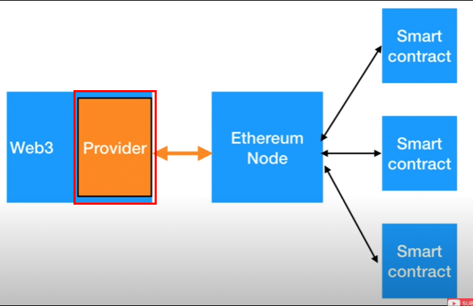
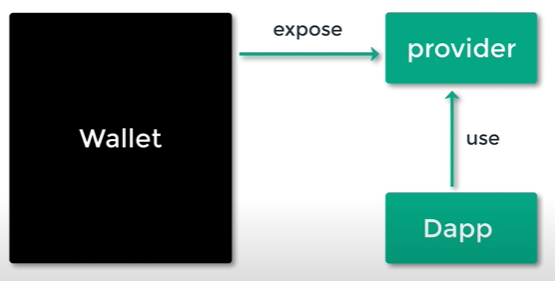
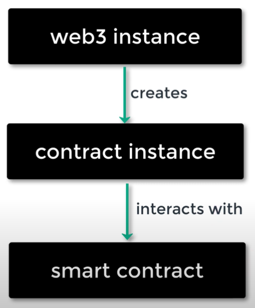
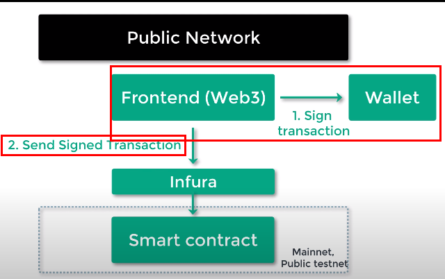
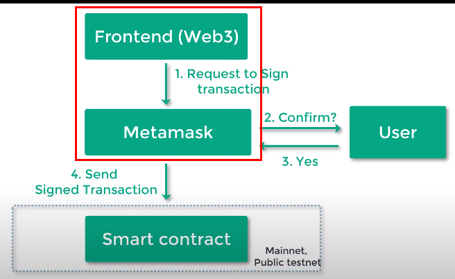

# Learning web 3 essentials
## What is Web3?
> The web3.js library is a collection of modules that contain functionality for the ethereum ecosystem. 

1. web3-eth is for the ethereum blockchain and smart contracts.
1. web3-shh is for the whisper protocol, to communicate p2p and broadcast.
1. web3-bzz is for the swarm protocol, the decentralized file storage.
1. web3-utils contains useful helper functions for Dapp developers.

> This is the Ethereum **JavaScript API** which connects to the Generic **JSON-RPC** spec. You need to run a local or remote Ethereum node to use this library.

## Architecture
Overall structure for web3.js to communicate with Ethereum blockchain is as follows : 

 

Web3 needs a Provider, which is responsible for sending actual API calls to Ethereum blockchain on behalf of Web3.

 

By having a separate provider, user can choose whatever wallet they would like to use. 

 

## Provider
1. Infura
Infura is a **blockchain toolkit platform** that connect you to blockchain(in this tutorial case, Ethereum) node over **JSON-RPC**. Sign up and create a project to network API key to access blockchain.

```js
import web3 from 'web3'
console.dir(web3)

const infuraAPI = 'API_KEY_HERE'
const myWeb3 = new web3(infuraAPI)

console.log(myWeb3)
```

2. Ganache
You can use a local Ethereum blockchain using Ganache. 

> **Ganache is a personal blockchain** for rapid Ethereum and Corda distributed application development. You can use Ganache across the entire development cycle; enabling you to develop, deploy, and test your dApps in a safe and deterministic environment.
> The command-line tool, ganache-cli (formerly known as the **TestRPC**), is available for Ethereum development.

## Adding web3
Install Web3 with following command. 

```shell
$npm i web3
$yarn add web3
```

> After that you need to create a web3 instance and set a provider. **Most Ethereum-supported browsers** like MetaMask have an EIP-1193 compliant provider available at window.ethereum.

## Callback promise event
> To help web3 integrate into all kinds of projects with different standards we provide multiple ways to act on asynchronous functions.

> Most web3.js objects allow a callback as the last parameter, as well as returning promises to chain functions.

> Ethereum as a blockchain has different levels of finality and therefore needs to return multiple “stages” of an action. To cope with this requirement we return a “promiEvent” for functions like web3.eth.sendTransaction or contract methods. This “promiEvent” is a promise combined with an event emitter to allow acting on different stages of action on the blockchain, like a transaction.

> PromiEvents work like a normal promises with added on, once and off functions. This way developers can watch for additional events like on “receipt” or “transactionHash”.

```js
web3.eth.sendTransaction({from: '0x123...', data: '0x432...'})
.once('sending', function(payload){ ... })
.once('sent', function(payload){ ... })
.once('transactionHash', function(hash){ ... })
.once('receipt', function(receipt){ ... })
.on('confirmation', function(confNumber, receipt, latestBlockHash){ ... })
.on('error', function(error){ ... })
.then(function(receipt){
    // will be fired once the receipt is mined
});
```

## json interface
> The json interface is a json object describing the Application Binary Interface (ABI) for an Ethereum smart contract. Using this json interface web3.js is **able to create JavaScript object representing the smart contract** and its methods and events using the **web3.eth.Contract** object.

## Web3 umbrella package
> This is the main (or ‘umbrella’) class of the web3.js library.

```js
const Web3 = require('web3');

Web3.utils
Web3.version
Web3.givenProvider
Web3.providers
// Web.modules : Will return an object with the classes of all major sub modules, to be able to instantiate them manually.
Web3.modules
```

> When called on the umbrella package web3 it will also set the provider for all sub modules web3.eth, web3.shh, etc. EXCEPT **web3.bzz which needs a separate provider at all times**.

### GivenProvider
> When using web3.js in an Ethereum compatible browser, it will set with the current native provider by that browser. Will return the given provider by the (browser) environment, otherwise null.

> returns an object(the given provider set) or null

### SetProvider
> Will change the provider for its module, which was set when web3 instance initialization.

```js
web3.setProvider(myProvider)
web3.eth.setProvider(myProvider)
web3.shh.setProvider(myProvider)
web3.bzz.setProvider(myProvider)
```

### Web3.eth.subscribe
> The web3.eth.subscribe function lets you subscribe to specific events in the blockchain.

```js 
web3.eth.subscribe(type [, options] [, callback]);
```

1. String - The subscription you want to subscribe to.
1. Mixed - (optional) Optional additional parameters, depending on the subscription type.
1. Function - (optional) Optional callback, returns an error object as first parameter and the result as second. Will be called for each incoming subscription, and the subscription itself as the 3rd parameter.

```js
const subscription = web3.eth.subscribe('pendingTransactions', function(error, result){
    if (!error)
        console.log(result);
})
.on("data", function(transaction){
    console.log(transaction);
});

// unsubscribes the subscription
subscription.unsubscribe(function(error, success){
    if(success)
        console.log('Successfully unsubscribed!');
});
```

### Web3.eth.Contract
> The web3.eth.Contract object makes it easy to interact with smart contracts on the ethereum blockchain. 

> When you create a new contract object you give it the json interface of the respective smart contract and **web3 will auto convert all calls into low level ABI calls over RPC** for you. This allows you to interact with smart contracts as if they were JavaScript objects.

```js 
// Creates a new contract instance with all its methods and events defined in its json interface object.
const myContract = new web3.eth.Contract(abi, address, callback)
```

1. jsonInterface(abi) - Object: The json interface for the contract to instantiate
1. address - String (optional): The address of the smart contract to call.
1. options - Object (optional): The options of the contract. Some are used as fallbacks for calls and transactions:

- from - String: The address transactions should be made from.
- gasPrice - String: The gas price in wei to use for transactions.
- gas - Number: The maximum gas provided for a transaction (gas limit).
- data - String: The byte code of the contract. Used when the contract gets deployed.

### Web3.eth.accounts
> The web3.eth.accounts contains functions to generate Ethereum accounts and sign transactions and data.

> This package has NOT been audited and might potentially be unsafe. Take precautions to clear memory properly, store the private keys safely, and test transaction receiving and sending functionality properly before using in production!

```js 
web3.eth.accounts.create();
> {
    address: "0xb8CE9ab6943e0eCED004cDe8e3bBed6568B2Fa01",
    privateKey: "0x348ce564d427a3311b6536bbcff9390d69395b06ed6c486954e971d960fe8709",
    signTransaction: function(tx){...},
    sign: function(data){...},
    encrypt: function(password){...}
}
```

## Interact with smart contract
In order to interact with smart contract in dapp, Web3 instance needs to know what contract it interacts with. 

 

Thus, you should provide 

1. contract address
1. contract ABI(JSON document describing smart contract interface)

## ABI
Applicaiton Binary Interface is explained like below.

> The Contract Application Binary Interface (ABI) is the **standard way to interact with contracts in the Ethereum ecosystem**, both from outside the blockchain and for contract-to-contract interaction. **Data is encoded according to its type, as described in this specification**. The encoding is not self describing and thus requires a schema in order to decode.

Code example of ABI is as follows. It's from Etherscan MekaApes Game contract. 

```json
[{"inputs":[{"internalType":"address","name":"_logic","type":"address"},{"internalType":"address","name":"admin_","type":"address"},{"internalType":"bytes","name":"_data","type":"bytes"}],"stateMutability":"nonpayable","type":"constructor"},{"anonymous":false,"inputs":[{"indexed":false,"internalType":"address","name":"previousAdmin","type":"address"},{"indexed":false,"internalType":"address","name":"newAdmin","type":"address"}],"name":"AdminChanged","type":"event"},{"anonymous":false,"inputs":[{"indexed":true,"internalType":"address","name":"beacon","type":"address"}],"name":"BeaconUpgraded","type":"event"},{"anonymous":false,"inputs":[{"indexed":true,"internalType":"address","name":"implementation","type":"address"}],"name":"Upgraded","type":"event"},{"stateMutability":"payable","type":"fallback"},{"inputs":[],"name":"admin","outputs":[{"internalType":"address","name":"admin_","type":"address"}],"stateMutability":"nonpayable","type":"function"},{"inputs":[{"internalType":"address","name":"newAdmin","type":"address"}],"name":"changeAdmin","outputs":[],"stateMutability":"nonpayable","type":"function"},{"inputs":[],"name":"implementation","outputs":[{"internalType":"address","name":"implementation_","type":"address"}],"stateMutability":"nonpayable","type":"function"},{"inputs":[{"internalType":"address","name":"newImplementation","type":"address"}],"name":"upgradeTo","outputs":[],"stateMutability":"nonpayable","type":"function"},{"inputs":[{"internalType":"address","name":"newImplementation","type":"address"},{"internalType":"bytes","name":"data","type":"bytes"}],"name":"upgradeToAndCall","outputs":[],"stateMutability":"payable","type":"function"},{"stateMutability":"payable","type":"receive"}]
```

## Web3.eth.Contract
> The web3.eth.Contract object makes it easy to interact with smart contracts on the ethereum blockchain. When you create a new contract object you give it the json interface of the respective smart contract and web3 will auto convert all calls into low level ABI calls over RPC for you. This allows you to interact with smart contracts as if they were JavaScript objects.

> To use it standalone:
```js 
new web3.eth.Contract(jsonInterface[, address][, options])
```

> [Parameters](https://web3js.readthedocs.io/en/v1.2.0/web3-eth-contract.html#parameters)

1. jsonInterface(ABI) - Object: The json interface for the contract to instantiate
1. address - String (optional): The address of the smart contract to call, can be added later using myContract.options.address = '0x1234..'
1. options - Object (optional): The options of the contract. Some are used as fallbacks for calls and transactions:

- from - String: The address transactions should be made from.
- gasPrice - String: The gas price in wei to use for transactions.
- gas - Number: The maximum gas provided for a transaction (gas limit).
- data - String: The byte code of the contract. Used when the contract gets [deployed](https://web3js.readthedocs.io/en/v1.2.0/web3-eth-contract.html#contract-deploy)[](https://web3js.readthedocs.io/en/v1.2.0/web3-eth-contract.html#returns).

>Returns : Object: The contract instance with all its methods and events.

## Transaction
Anything that uses **data in Ethereum triggers a transaction, which costs a gas fee**. Once transaction gets triggered, it will broadcast to entire ethereum blockchain.

### Local development
All transactions in **development kit**(e.g Ganache), accounts are **unlocked**(no sign, no private key required). Sending transactions in local development does not require user to sign the transaction.

```js
// account 1 : send 5 ethers to account 2
web3.eth.sendTransaction( { 
    from : account1, 
    to : account2, 
    value : web3.utils.toWei('5', 'ether')
})
```

Compared to sending transaction in public network, local development is much simpler since it requires no user sign and no blockchain node API such as Infura and Moralis.

 

### Public network
In real blockchain, transaction should be **_signed_** before broadcasting unlike that of local development.

 


### Preparation
1. Prepare a fake ether. Use websites like below
- [Ropsten testnet faucet](https://faucet.egorfine.com/)

2. Create a fake account to test. Set address and private key. Use web3.eth method to create dummy account like below. 

```js
web3.eth.accounts.create()
```

### Broadcasting
1. Set transaction details.
2. Broadcast the transaction.

```js
// create a transaction object to set transaction details
const txObject = {
    to : account2,
    // value needs to be in wei, which is the smallest Ethereum unit
    value : web3.utils.toWei('0.01', 'ether'),  // send 0.01 ETH

    // transaction commission threshold
    gas : '21000', 
    gasPrice : web3.utils.toWei('10', 'gwei')
}

// sign the transaction
const signedTransaction = web3.eth.accounts.signTransaction(txObject, PK1)

// broadcast the transaction
signedTransaction.then(signedTx => {
    const sentTx = web3.eth.sendSignedTransaction(signedTx.rawTransaction)
    
    sentTx.on("receipt", receipt => {
        console.log("receipt : ", receipt)
    })
    
    sentTx.on("error", error => {
        console.log("error : ", error)
    })
})
```

3. check result in terminal and ropsten etherscan. 
 <br/>

 

## Metamask integration
Metamask will act as a public blockchain node API, delivering user request to actual blockchain just like other providers do. 

 

Once Metamask is installed, it injects Ethereum into window global object in browser. 

```js 
// modern dapp browser
if (window.ethereum) {
    const web3 = new Web3(window.ethereum);
    window.ethereum.enable();
    } else  {
    // legacy browser
    const web3 = window.web3;
    console.log("Injected web3 detected.");
    }
```

Access to smart contract from front end, using web3 with Metamask.

```js
// get network id & deployedNetwork
const networkId = web3.eth.net.getId();
const deployedNetwork = MyContract.networks[networkId];

// create a contract instance
const instance = new web3.eth.Contract(
MyContract.abi,
deployedNetwork && deployedNetwork.address,
);

// add the deployed contract address
// check deployed contract address in truffle migrate
instance.options.address = "0x1c26879ef00Ee67A83bB4d3091eCAbaC38338A6b"
```

Set the instance as a state in React application and use it to interact with smart contract. 

```js 
// call 'set' method in the contract 
await contract.methods.set(5).send({ from: accounts[0] });
```

Note that Metamask is used in client-side to check user sign while HDWalletProvider is used in server-side. 

```js : serverSide.js
// HDWalletProvider is used to send a signed transaction, which 
// requires a private key. HDWalletProvider is used in server-side
// In client-side, metamask is used to check user sign.
const provider = new HDWalletProvider(PRIVATE_KEY, PROVIDER.INFURA.TESTNET)
const web3 = new Web3(provider)
```


## Reference
- [Web3.js - Readme](https://github.com/ChainSafe/web3.js/blob/1.x/README.md)
- [web3.js - Ethereum JavaScript API](https://web3js.readthedocs.io/en/v1.7.0/)
- [Dappuniversity - Web3.js · Ethereum Blockchain Developer Crash Course](https://www.youtube.com/playlist?list=PLS5SEs8ZftgXlCGXNfzKdq7nGBcIaVOdN)
- [Eat the block - web3 tutorial](https://youtube.com/playlist?list=PLbbtODcOYIoFs0PDlTdxpEsZiyDR2q9aA)